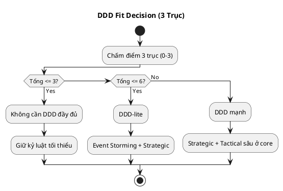

# Chương 2 — DDD không phải là gì (Myths & Anti-patterns)

Ở chương 1, ta đã nhìn DDD như một cách giảm rủi ro domain — đặc biệt rõ trong ADLP: “submit ≠ accepted”, lock TTL là rule của marketplace, quality gate quyết định business value. Nhưng trước khi đi sâu vào Event Storming và Strategic Design, chúng ta cần dọn đường: **phá những ngộ nhận** và nhận diện **anti-patterns** khiến DDD biến thành nghi thức hoặc over-engineering.

Chương này có một mục tiêu rất thực dụng: sau khi đọc xong, bạn phải trả lời được câu hỏi:

> “Ở dự án này, mình nên dùng DDD đến mức nào, và phải tránh những bẫy nào?”

---

## Bạn sẽ nhận được gì sau chương này?

1) Một “bảng phân loại” các hiểu lầm phổ biến về DDD và vì sao chúng nguy hiểm.  
2) Heuristics để quyết định: DDD mạnh, DDD-lite, hoặc không DDD (nhưng vẫn giữ kỷ luật tối thiểu).  
3) Các anti-patterns thường gặp khi áp dụng DDD trong microservices và event-driven.  
4) Bộ best practices giúp bạn tránh over-engineering mà vẫn giữ đúng phần “đắt tiền”.  
5) Một exercise có hướng dẫn để tự đánh giá dự án của bạn (và áp vào ADLP).

---

## 1) Myth #1: “DDD = microservices”

### Sự thật
DDD là **thiết kế theo domain**, còn microservices là **lựa chọn triển khai**. Bạn có thể làm DDD rất tốt trong modular monolith, và bạn cũng có thể làm microservices rất tệ nếu không có DDD.

Vấn đề nằm ở chỗ: microservices làm chi phí tích hợp tăng mạnh (distributed transactions, schema evolution, tracing). Nếu bạn tách service trước khi chốt language/boundaries, bạn sẽ tạo ra **distributed monolith**.

Nói cách khác: **DDD quyết định ranh giới ngôn ngữ và trách nhiệm**, còn microservices quyết định **ranh giới deploy**. Khi bạn đảo thứ tự, bạn sẽ thấy hệ thống tách ra nhưng không giảm coupling thật.

### Ví dụ ADLP
Strategic Design v0.2 định hướng “microservices per bounded context” (9 contexts). Điều đó có thể đúng khi tổ chức và scaling phù hợp. Nhưng nếu MVP team nhỏ, bạn vẫn có thể bắt đầu với modular monolith:
- boundaries là module (Identity, Ingestion, Prelabeling, Assignment, Labeling, Quality, Export),
- contracts là interface nội bộ + domain events internal,
- đến khi scaling/ownership tách thì mới tách deploy.

**Trade-off**
- Microservices sớm: scale độc lập nhưng tăng chi phí vận hành, debugging, contract versioning.
- Monolith có boundaries: ship nhanh hơn, dễ refactor; nhưng cần kỷ luật để không “xuyên tường” và để sẵn đường tách.

> **BEST PRACTICE**  
> Nếu chưa chắc, hãy làm “DDD boundaries trước, microservices sau”. Bounded Context là ranh giới ngôn ngữ; microservice là ranh giới deploy.

---

## 2) Myth #2: “DDD = nhiều class / nhiều layer”

### Sự thật
DDD không đo bằng số class. DDD đo bằng việc bạn có:
- ngôn ngữ đúng (glossary sống),
- ranh giới đúng (bounded contexts),
- quy tắc được bảo vệ (invariants),
- tiến hóa có kiểm soát (contracts/versioning).

Bạn có thể có 10 class nhưng đúng, và 100 class nhưng sai (anemic model).

### Dấu hiệu bạn đang “DDD hóa” sai hướng
Bạn tạo ra:
- `*Service`, `*Manager`, `*Helper` khắp nơi,
- “Domain layer” chỉ là DTO,
- business rules nằm trong controller hoặc stored procedure,
- mọi thứ đều là entity dù đáng ra là value object.

Nếu chỉ dừng ở danh sách này, team rất dễ biện minh “chúng ta đã tách layer rồi”. Điều quan trọng là **tầng domain phải mang ý nghĩa nghiệp vụ**: có invariants, có ngôn ngữ đúng, có quyết định rõ. Nếu không, bạn đang xây kiến trúc vỏ ngoài.

> **WARNING — Anti-pattern: Class Explosion**  
> Nếu bạn không thể trả lời “class này bảo vệ rule gì?”, nhiều khả năng nó là noise.

**Best practice**
Tập trung vào 3 thứ trước:
1) invariants quan trọng nhất,
2) aggregate boundaries tối thiểu để bảo vệ invariants,
3) ubiquitous language trong code (tên class/field/method phản ánh domain).

---

## 3) Myth #3: “DDD = Event Sourcing”

### Sự thật
Event sourcing là một kỹ thuật lưu trữ lịch sử bằng events. DDD thì lớn hơn nhiều. Bạn hoàn toàn có thể làm DDD mà không event sourcing.

Trong ADLP, bạn có thể muốn audit trail mạnh (ai sửa gì, khi nào, vì sao batch accept/reject). Nhưng audit trail không bắt buộc phải là event sourcing. Bạn có thể bắt đầu với:
- domain events cho integration,
- audit log append-only,
- versioning cho transcript,
…rồi mới cân nhắc event sourcing nếu có lợi ích rõ (temporal queries, replay, compliance).

**Trade-off**
- Event sourcing: audit/replay mạnh, nhưng tăng độ phức tạp (schema evolution, projections, rehydration, tooling).
- Audit log + versioning: đơn giản hơn, đủ cho MVP, dễ vận hành; nhưng replay hạn chế.

> **BEST PRACTICE**  
> Đừng chọn event sourcing vì “nghe đúng DDD”. Chọn vì có use case cụ thể (replay, temporal queries, compliance) và bạn chấp nhận cost.

Một cách kiểm tra nhanh: nếu bạn chưa trả lời được “consumer nào sẽ replay, để làm gì, và bao lâu một lần?”, thì event sourcing chưa phải nhu cầu thực.

---

## 4) Myth #4: “DDD chỉ dành cho hệ thống cực lớn”

### Sự thật
DDD tạo giá trị khi **domain phức tạp** và sai domain đắt. Quy mô code chỉ là hệ quả.

Một MVP có thể rất đáng làm DDD-lite nếu:
- workflow phức tạp (human-in-the-loop),
- có quality gate,
- có payout/penalty,
- có compliance.

ADLP MVP audio STT nhìn bề ngoài có thể “chỉ là CRUD”, nhưng core domain thực sự nằm ở assignment + quality, nên DDD-lite ngay từ đầu là hợp lý.

Điểm cốt lõi: **đắt hay rẻ nằm ở rủi ro sai domain**, không nằm ở số lượng service hay số dòng code.

---

## 5) Myth #5: “DDD đảm bảo mình không sai domain”

### Sự thật
DDD không đảm bảo bạn đúng. DDD tạo ra cơ chế để bạn **sai sớm, sai rẻ**:
- Event Storming để lộ mâu thuẫn,
- glossary để chốt nghĩa,
- bounded contexts để giảm xung đột,
- ADR để ghi lại trade-off và lý do.

Nếu bạn không làm discovery mà chỉ làm “tactical patterns” (aggregate, repository) thì bạn vẫn có thể sai domain như thường — chỉ là sai có tổ chức hơn.

Đây là lý do chương 3–6 đặt nặng Event Storming: nó làm lộ sai trước khi bạn đổ công code.

---

## 6) Anti-patterns phổ biến (và cách nhận diện)

Phần này đi thẳng vào “bẫy” thường gặp khi áp dụng DDD. Mỗi anti-pattern có 3 phần: triệu chứng → hậu quả → cách tránh.

### 6.1 Anemic Domain Model

**Triệu chứng**
- Entity chỉ có field + getter/setter.
- Business logic nằm trong service lớp ngoài (application/service), controller, hoặc SQL.

**Hậu quả**
- Invariants không được bảo vệ ở một nơi rõ ràng.
- Thay đổi rule gây ripple effects.

**Cách tránh**
- Đưa rule vào aggregate root (trong ranh giới transaction).
- Nếu rule liên quan nhiều aggregates, dùng domain service nhưng vẫn phải có invariants rõ.

### 6.2 “Chia bounded context theo database”

**Triệu chứng**
- “Context A là vì nó có DB A”.
- Một bảng bị share bởi nhiều service vì “tiện join”.

**Hậu quả**
- Coupling tăng; schema change phá nhiều team.
- Bounded context boundaries bị vô hiệu.

**Cách tránh**
- Chia theo language + ownership + lifecycle dữ liệu.
- Dùng event/read model thay vì join xuyên context.

### 6.3 “Event-driven nhưng event chỉ là log”

**Triệu chứng**
- Event tên kiểu `entity.updated`, `record.changed`.
- Payload chứa toàn bộ row DB; consumer phụ thuộc schema nội bộ.
- Không versioning, không idempotency, không correlation_id.

**Hậu quả**
- Consumer vỡ âm thầm; debug cực khó.
- Event stream biến thành distributed coupling.

**Cách tránh**
- Event phải là domain concept (BatchAccepted).
- Có envelope + versioning rules.
- Consumer tolerate unknown fields; producer không remove fields ở minor.

### 6.4 “Shared Kernel phình to”

**Triệu chứng**
- Mọi thứ đều đưa vào shared module “common”.
- Nhiều team cùng sửa shared kernel.

**Hậu quả**
- Coordinated release, coupling chặt.

**Cách tránh**
- Shared kernel cực nhỏ, chỉ value objects ổn định.
- Khi team tách, ưu tiên published language + ACL.

### 6.5 “Over-modeling sớm”

**Triệu chứng**
- Vẽ domain model cực chi tiết trước khi có discovery/workshop.
- Tạo 10 aggregates cho MVP mà chưa có dữ liệu thật.

**Hậu quả**
- Ship chậm, nhưng vẫn sai domain vì model dựa trên suy đoán.

**Cách tránh**
- Làm DDD theo vòng lặp: discovery → implement slice nhỏ → feedback → refine.
- Chỉ model sâu ở core domain/high-risk.

---

## 7) Khi nào nên dùng DDD mạnh, DDD-lite, hay không DDD?

### 7.1 Một khung quyết định thực dụng (3 trục)

Hãy chấm dự án theo 3 trục (0–3):
1) **Domain complexity:** rule phức tạp, nhiều trạng thái, nhiều ngoại lệ?
2) **Cost of being wrong:** sai domain có gây mất tiền/uy tín/pháp lý?
3) **Rate of change:** business thay đổi thường xuyên?

Nếu tổng điểm:
- **0–3:** không cần DDD đầy đủ; giữ kỷ luật tối thiểu (naming, invariants cơ bản).
- **4–6:** DDD-lite: Event Storming + Strategic boundaries + vài aggregate quan trọng nhất.
- **7–9:** DDD mạnh: strategic + tactical sâu ở core domains, governance cho events/contracts.

### 7.2 Áp vào ADLP
ADLP thường cao ở cả 3 trục (đặc biệt assignment + quality + payout), nên tối thiểu phải DDD-lite, và với mục tiêu enterprise-grade thì nên DDD mạnh ở core domains.

---

## 8) Best practices để “DDD đúng chỗ” (tránh nghi thức)

### 8.1 Chỉ “DDD sâu” ở core domain
Trong ADLP, core domain nằm ở Prelabeling, Task Assignment, Quality Assurance. Các phần như Identity/Auth có thể dùng giải pháp chuẩn, không cần domain model phức tạp.

Như vậy, “DDD đúng chỗ” nghĩa là **đầu tư vào nơi tạo lợi thế**, còn generic giữ đơn giản để giảm cost vận hành và learning curve.

### 8.2 Luôn bắt đầu bằng “ngôn ngữ” và “events”
Nếu team chưa chốt được 10–20 domain events cấp business, đừng vội vẽ microservices hay database.

### 8.3 Ghi ADR cho quyết định đắt tiền
Ví dụ trong ADLP:
- sync vs async giữa Prelabeling → Assignment,
- threshold quality gate,
- lock TTL policy,
- payout trigger (Accepted vs Submitted).

### 8.4 Event schema là API public
Sử dụng envelope + semver + compatibility rules ngay từ đầu (dù đơn giản).

### 8.5 Đặt “Definition of Done” theo domain
Ví dụ: “Export Done” không phải zip xong, mà là export **chỉ** từ dữ liệu accepted, có audit, có version, có signed URL TTL.

---

## 9) Exercise có hướng dẫn: “Chẩn đoán DDD-fit” cho dự án của bạn

Mục tiêu: bạn tự quyết được mức DDD cho dự án (và tránh các bẫy).

### Bước 1: Chọn một workflow “đắt tiền nhất”
Không chọn nhiều. Chọn 1. Với ADLP, chọn “premium order 48h”.

### Bước 2: Chấm điểm 3 trục (0–3)
- Complexity: __/3  
- Cost of being wrong: __/3  
- Rate of change: __/3  
Tổng: __/9

### Bước 3: Liệt kê 5 thuật ngữ dễ mơ hồ nhất
Gợi ý ADLP: `Batch`, `Task`, `Accepted`, `Approved`, `Confidence`.

### Bước 4: Viết 8 domain events cho workflow (ở thì quá khứ)
Không viết command. Viết “đã xảy ra”. Ví dụ: `BatchSubmitted`, `QualityEvaluated`.

### Bước 5: Liệt kê 3 invariants “nếu sai là toang”
Ví dụ ADLP:
1) Export chỉ lấy dữ liệu accepted.  
2) Batch chỉ assign cho một labeler tại một thời điểm (lock TTL).  
3) Payout chỉ khi batch accepted.  

### Đáp án tham khảo (áp cho ADLP)
- Complexity: 3/3  
- Cost of being wrong: 3/3  
- Rate of change: 2/3  
- Tổng: 8/9 → DDD mạnh ở core domains, DDD-lite ở generic domains.

**Câu hỏi tự kiểm**
1) Thuật ngữ nào nếu không chốt nghĩa sẽ gây tranh cãi nhất?  
2) Event nào đang “trá hình command”?  
3) Invariant nào hiện tại chưa có nơi “bảo vệ”? (gợi mở aggregate boundary)  

---

## 10) Artefacts/Deliverables sau chương này

- “DDD-fit assessment” 1 trang: 3 trục điểm + quyết định mức DDD.
- Danh sách 5–10 thuật ngữ mơ hồ (đưa vào glossary seed).
- Danh sách 8–12 domain events cho workflow chính.
- Danh sách 3 invariants “đắt nhất”.
- 1 ADR nháp cho 1 trade-off lớn nhất.

---

## Checklist (dùng ngay)

> **CHECKLIST**
> - [ ] Bạn đã chọn 1 workflow “đắt tiền” để làm trục (VD: premium 48h)  
> - [ ] Bạn đã quyết định “mức DDD” theo rủi ro domain (core vs generic)  
> - [ ] Bạn đã viết ra 3 dấu hiệu “không nên over-engineer” cho dự án này  
> - [ ] Bạn đã liệt kê 5 thuật ngữ mơ hồ nhất và đặt owner để chốt nghĩa  
> - [ ] Bạn đã chốt 2–3 anti-pattern cần chặn ngay từ PR review (CRUD core domain, shared DB, event như log)  
