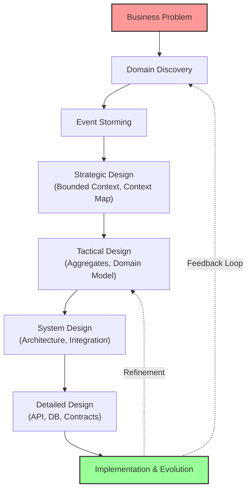
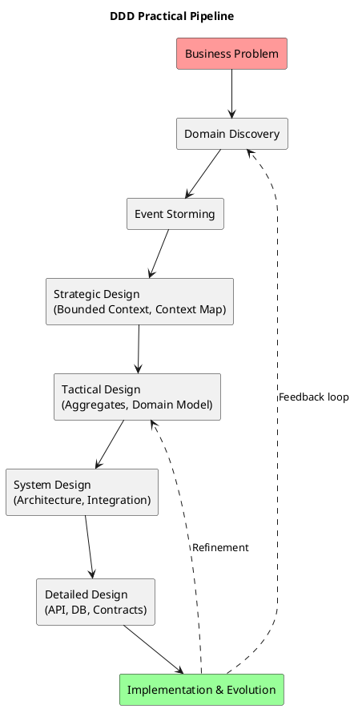

# Chương 3 — Bản đồ toàn cảnh quy trình DDD thực hành (từ Zero đến Production)

Nếu chương 1 trả lời “vì sao DDD”, chương 2 dọn đường bằng cách phá ngộ nhận, thì chương 3 trả lời câu hỏi quan trọng nhất khi bắt đầu dự án:

> “Vậy mình phải làm gì trước, làm theo thứ tự nào, và mỗi bước phải tạo ra cái gì?”

Một sai lầm phổ biến là học DDD như học một danh sách khái niệm (aggregate, entity, VO, repository…), rồi áp dụng như một bộ pattern. Cách đó dễ dẫn đến **DDD nửa mùa**: có thuật ngữ, có sơ đồ, có nhiều class, nhưng không tạo được shared understanding và vẫn sai domain.

Chương này đóng vai trò như **kim chỉ nam** cho toàn bộ handbook. Mình sẽ đưa ra:
- Một pipeline end-to-end (discovery → workshop → strategic → tactical → system → detailed → implementation → evolution).
- Mục tiêu, đầu vào, đầu ra (artefacts) của mỗi bước.
- Vai trò nào cần tham gia và vì sao.
- Trade-offs: khi nào nên dừng ở mức DDD-lite và khi nào cần đi sâu.
- Cách áp pipeline này vào ADLP theo Strategic Design v0.2.

---

## Bạn sẽ nhận được gì sau chương này?

Sau chương 3, bạn có thể làm ngay 3 việc:

1) **Lập kế hoạch khởi động dự án** theo pipeline DDD (không mơ hồ “bắt đầu từ đâu”).  
2) **Biết output của từng giai đoạn** (glossary, event list, context map, ADR, event schema…) và biết nó dùng để làm gì.  
3) **Biết ai cần tham gia ở bước nào** để tránh sai lầm kiểu “dev tự suy diễn nghiệp vụ” hoặc “domain expert chỉ đến khi UAT”.

---

## 1) Vì sao cần một “bản đồ quy trình” thay vì học DDD theo khái niệm?

DDD trong thực tế là một chuỗi hoạt động có tính phụ thuộc. Bạn không thể làm tốt tactical design nếu chưa có strategic design ổn; và bạn hiếm khi làm strategic design ổn nếu chưa có discovery/workshop đủ sâu.

Khi thiếu bản đồ quy trình, team thường rơi vào hai thái cực:

- **Thái cực 1 — Over-engineering sớm:** Vẽ domain model rất chi tiết, tạo nhiều aggregates, chọn event sourcing, dựng microservices… trước khi hiểu domain. Kết quả là ship chậm và vẫn sai vì model dựa trên suy đoán.
- **Thái cực 2 — Under-modeling:** Làm CRUD + status field + cron job, chạy được demo, nhưng khi vận hành thật thì quy tắc nghiệp vụ “rò rỉ” khắp nơi, dẫn tới rework cực lớn.

Một bản đồ quy trình tốt không làm bạn “làm nhiều hơn”. Nó giúp bạn làm **đúng thứ tự** và làm **đúng artefact** để giảm rủi ro.

---

## 2) Pipeline DDD thực hành: từ Business Problem đến Production

Dưới đây là pipeline tổng thể mà handbook theo đuổi:

Nghe giống “waterfall”? Không. Đây không phải một chuỗi “làm xong rồi thôi”. Đây là **vòng lặp**: bạn đi nhanh qua các bước ở mức đủ, implement một slice nhỏ, nhận phản hồi, rồi quay lại refine.

Điểm khác biệt của DDD-practical là: mỗi bước đều tạo ra **một artefact cụ thể**. Artefact đó giúp bước sau:
- làm nhanh hơn,
- ít tranh luận lại từ đầu,
- ít “quên bối cảnh” khi team thay người.

---

## 3) Domain Discovery: bắt đầu bằng câu hỏi đúng

### 3.1 Mục tiêu thật sự
Domain discovery không phải là “gather requirements”. Mục tiêu là:
- hiểu mục tiêu kinh doanh và ràng buộc,
- tìm ra nơi nào domain phức tạp (core),
- liệt kê rủi ro nếu hiểu sai,
- chọn kịch bản “đắt tiền” để workshop.

### 3.2 Output tối thiểu (đừng làm dài)
Nếu discovery dài 50 trang nhưng không ai đọc, nó vô nghĩa. Output tối thiểu nên là 1–2 trang:
- Problem statement (một đoạn ngắn).
- Success metrics (KPI/SLA).
- Top 3–5 domain risks (nếu sai là toang).
- 1–2 workflows quan trọng nhất (mô tả bằng lời).

### 3.3 Vai trò bắt buộc
Discovery thất bại khi thiếu domain expert thật sự. “Domain expert” là người:
- hiểu quy tắc vận hành, chịu trách nhiệm outcome,
- có quyền quyết định trade-off.

Trong ADLP, domain expert không chỉ là PO. Domain expert có thể là người phụ trách:
- vận hành quality policy,
- payout/penalty,
- SLA giao dataset cho consumer,
- compliance cho dữ liệu.

---

## 4) Event Storming: biến workflow thành sự thật “có thể nhìn thấy”

Event Storming là cầu nối từ “ý tưởng mơ hồ” sang “ngôn ngữ chung”. Nó hiệu quả vì nó ép team nói về **điều đã xảy ra** (events), chứ không nói về giải pháp.

### 4.1 Output chính
Một Big Picture Event Storming tốt thường tạo ra:
- Timeline 10–20 domain events cấp business.
- Hotspots/questions: các điểm mơ hồ cần làm rõ.
- Glossary seed: thuật ngữ bắt đầu được chốt nghĩa.

### 4.2 Vì sao nó quan trọng hơn flowchart?
Flowchart thường do dev/BA vẽ, nhanh chóng trượt sang kỹ thuật: endpoints, DB tables, “if-else”.
Event Storming kéo domain expert vào đúng chỗ: “thực tế vận hành diễn ra thế nào?”.

### 4.3 Kết nối sang bước sau
Event Storming không “kết thúc” khi có timeline đẹp. Nó kết thúc khi bạn trả lời được:
- ai sở hữu quyết định ở mỗi điểm nóng,
- những invariants nào cần bảo vệ,
- ranh giới tự nhiên của domain (candidate bounded contexts).

---

## 5) Strategic Design: quyết định đắt tiền (và vì sao phải làm trước tactical)

Strategic design trả lời câu hỏi: “hệ thống chia thành những ngữ cảnh nào, ai sở hữu, và chúng nói chuyện với nhau ra sao?”.

Nếu bỏ qua strategic design, bạn sẽ:
- dùng một model cho mọi nơi,
- hoặc chia microservices theo DB/UI/CRUD,
và rồi coupling tăng.

### 5.1 Output tối thiểu
Strategic design không cần dài. Nhưng phải có:
- Bounded context catalog (rõ boundaries + ownership).
- Context map (pattern + direction coupling).
- Ubiquitous language per context (ít nhất cho core).
- ADRs cho quyết định lớn (sync/async, event schema governance, SLO).

### 5.2 Áp vào ADLP (Strategic Design v0.2)
ADLP đã có baseline rất mạnh ở v0.2: 9 bounded contexts và catalog/relations. Điều đó giúp handbook tránh “suy diễn” và bám vào thiết kế mới nhất.

Điểm quan trọng khi đọc strategic design của ADLP không phải là “đếm 9 services”. Điểm quan trọng là:
- Prelabeling, Task Assignment, Quality là core domain.
- Identity/Auth là generic.
- Quan hệ giữa contexts quyết định coupling thật sự.

---

## 6) Tactical Design: biến rule thành mô hình có thể bảo vệ

Tactical design trả lời: “trong mỗi bounded context, invariant nào cần transaction boundary? aggregate nào bảo vệ nó?”.

### 6.1 Output tối thiểu
- Aggregate candidates + invariants.
- Commands/events (design-level) cho use cases quan trọng.
- Decision về consistency: cái gì strong consistency, cái gì eventual.

### 6.2 Vì sao tactical không thể làm trước strategic?
Nếu bạn chưa chốt ranh giới context, bạn sẽ thiết kế aggregates “đụng nhau”. Ví dụ ADLP:
- Transcript thuộc Labeling hay Quality? (nó xuất hiện ở cả hai, nhưng semantics khác).
- Nếu chưa tách context rõ, bạn sẽ tạo một aggregate “Transcript” khổng lồ, rồi mọi team cùng sửa — đúng kiểu God Aggregate.

---

## 7) System Design: từ domain model sang kiến trúc vận hành

System design là lúc bạn trả lời các câu hỏi:
- deploy topology (modular monolith vs microservices),
- integration (sync/async, saga, orchestration),
- data strategy (db per service, read models),
- observability/security/compliance.

Điểm DDD khác kiến trúc “thuần kỹ thuật” ở chỗ: bạn không tối ưu cho “service đẹp”, bạn tối ưu cho **workflow đúng** và **boundaries đúng**.

Ví dụ ADLP:
- Prelabeling có thể scale khác hoàn toàn assignment/labeling.
- Quality pipeline cần DLQ/retry policy, audit trail, và policy versioning.
- Export phải đảm bảo chỉ đọc dữ liệu accepted.

---

## 8) Detailed Design: biến artefacts thành hợp đồng triển khai

Khi đã có strategic+tactical đủ tốt, detailed design mới “dễ thở”. Ở đây bạn chốt:
- API contracts (REST/gRPC) theo context map.
- Event schema + versioning rules (published language).
- DB schema + migrations theo bounded context.
- Security model (JWT/RBAC), signed URLs, audit events.
- SLO/SLA theo context (ví dụ ADR-007 trong ADLP v0.2).

Nếu bạn làm detailed design trước (trái thứ tự), bạn sẽ đổi API/schema nhiều lần và “đốt” thời gian integration.

---

## 9) Implementation & Evolution: DDD là vòng lặp, không phải đích đến

DDD không kết thúc ở “thiết kế”. Nó sống trong:
- refactoring khi domain hiểu rõ hơn,
- thay đổi bounded context khi team/ownership thay đổi,
- nâng cấp contracts/event schema theo versioning,
- quan sát system để biết rule nào đang bị phá trong thực tế.

Vì vậy, artefacts như glossary, ADR, event schema không phải tài liệu chết. Chúng là “bộ nhớ tổ chức”.

---

## 10) Áp pipeline này vào ADLP: một kế hoạch 2 tuần (thực dụng)

Bạn có thể dùng khung dưới đây như một kế hoạch khởi động 2 tuần (MVP phase) cho ADLP hoặc dự án tương tự. Mục tiêu là: đủ để implement slice đầu tiên mà không sai domain.

### Tuần 1: Chốt language + workflow + rủi ro
Ngày 1:
- Chốt kịch bản “đắt tiền” (premium order 48h).
- Chọn domain experts và lịch workshop.

Ngày 2–3:
- Big Picture Event Storming.
- Output: 10–20 events, hotspots/questions, glossary seed.

Ngày 4:
- Đối chiếu với Strategic Design v0.2: 9 contexts.
- Chốt context map thô (quan hệ chính) và 3 core contexts ưu tiên.

Ngày 5:
- Chốt 3–5 invariants “đắt nhất”.
- Viết 1–2 ADRs cho trade-off lớn (lock TTL, quality gate, payout trigger).

### Tuần 2: Tactical slice + contracts tối thiểu
Ngày 6–7:
- Design-level Event Storming cho 1 workflow (Ingest→Prelabel→BatchAssigned→Submitted→Evaluated→Accepted).
- Chốt aggregate candidates cho 2 contexts (Task Assignment, Quality).

Ngày 8–9:
- Chốt event schema tối thiểu cho 2–3 events quan trọng (PrelabelCompleted, BatchSubmitted, BatchAccepted).
- Chốt idempotency rules + correlation IDs.

Ngày 10:
- Implement slice nhỏ end-to-end (happy path) + smoke tests.
- Ghi lại learnings và cập nhật glossary/ADR.

> **NOTE**  
> Đây là kế hoạch “đủ để ship đúng”. Đừng biến nó thành nghi thức nặng nề. Nếu team nhỏ, bạn có thể rút gọn, nhưng đừng bỏ qua glossary + events + invariants.

---

## 11) Best practices (và vì sao) cho từng giai đoạn

### 11.1 Discovery: viết ra “top risks” thay vì viết dài
Nếu bạn chỉ có 1 giờ, hãy viết top 5 rủi ro domain thay vì viết tài liệu dài. Rủi ro là thứ quyết định bạn phải workshop cái gì.

### 11.2 Event Storming: “event trước, solution sau”
Nếu workshop trượt sang “chọn DB/chọn queue”, bạn mất giá trị lớn nhất: shared understanding. Hãy khóa workshop vào câu hỏi: “điều gì đã xảy ra?” và “tại sao?”.

### 11.3 Strategic design: context map trước service diagram
Service diagram đẹp nhưng vô dụng nếu không nói rõ coupling pattern. Context map giúp bạn tránh coupling vô thức.

### 11.4 Tactical design: bắt đầu từ invariants, không bắt đầu từ tables
Nếu bạn bắt đầu từ DB schema, bạn sẽ thiết kế aggregate theo join. Hãy bắt đầu từ invariants và transaction boundary.

### 11.5 Implementation: slice nhỏ + phản hồi nhanh
DDD thực dụng không phải “thiết kế hết rồi mới code”. DDD là vòng lặp: thiết kế đủ → code slice → feedback → refine.

---

## 12) Anti-patterns khi áp dụng pipeline (thứ hay làm sai)

1) Bỏ discovery, nhảy thẳng vào coding.  
2) Làm workshop nhưng không chốt glossary và hotspots.  
3) Vẽ bounded contexts theo DB/UI.  
4) Đẩy tất cả integration sang synchronous REST vì “dễ debug”, rồi vỡ vì coupling.  
5) Làm event-driven nhưng không governance/versioning/idempotency.  
6) “DDD hóa” mọi thứ, kể cả generic domain, làm chậm không cần thiết.

---

## 13) Exercise có hướng dẫn: “Vẽ pipeline cho dự án của bạn” (15–20 phút)

Mục tiêu: bạn tạo được một bản đồ quy trình DDD cho dự án của bạn, không cần đúng hoàn hảo, nhưng đủ để bắt đầu.

### Bước 1: Chọn 1 workflow “đắt tiền”
Chỉ 1. Ví dụ ADLP: premium order 48h.

### Bước 2: Viết 8–12 câu “đã xảy ra”
Không dùng kỹ thuật. Chỉ viết: X xảy ra → Y xảy ra.

### Bước 3: Chuyển các câu thành domain events
Đặt tên ở thì quá khứ. Nếu bạn viết ra “RunPrelabel”, đó là command, hãy đổi sang “PrelabelCompleted”.

### Bước 4: Đánh dấu 3 hotspots
Hotspot là chỗ bạn không chắc định nghĩa hoặc rule. Ví dụ ADLP:
- “Submitted” vs “Accepted”
- lock TTL và reassign policy
- quality gate threshold và escalation

### Bước 5: Chọn 2 bounded contexts liên quan nhất
Với ADLP: Task Assignment và Quality Assurance.

### Bước 6: Chốt 2 invariants quan trọng nhất cho mỗi context
Ví dụ:
- Task Assignment: “batch chỉ assign 1 labeler”, “lock TTL phải hết hạn và unlock/reassign đúng”.
- Quality: “accepted mới được export/payout”, “review phải có audit trail”.

### Đáp án tham khảo (ADLP, rút gọn)
- Workflow events: DataItemIngested → PrelabelCompleted → BatchCreated → BatchAssigned → BatchSubmitted → QualityEvaluated → (ReviewRequired | BatchAccepted) → DatasetExported
- Hotspots: accepted definition, lock TTL, payout trigger
- Contexts ưu tiên: Task Assignment, Quality Assurance

**Câu hỏi tự kiểm**
1) Bạn có đang nhầm event với command không?  
2) Bạn có đang nhầm “định nghĩa thao tác” với “định nghĩa nghiệp vụ” không? (submit vs accept)  
3) Invariant nào nếu sai sẽ gây tranh chấp hoặc mất tiền?  

---

## 14) Artefacts/Deliverables sau chương này

Sau chương 3, bạn nên có:
- Một “pipeline map” 1 trang (các bước + artefacts).
- Danh sách artefacts tối thiểu cho tuần 1–2 (glossary, events, hotspots, invariants, ADR).
- Kế hoạch khởi động 1–2 tuần cho workflow quan trọng nhất.

---

## Checklist (dùng ngay)

> **CHECKLIST**
> - [ ] Bạn có pipeline map 1 trang (bước → output → ai tham gia)  
> - [ ] Mỗi bước có “gate” để biết đã đủ hay chưa (đủ để đi tiếp, không phải hoàn hảo)  
> - [ ] Output của bước trước thực sự trở thành input của bước sau (không “làm cho có”)  
> - [ ] Bạn chọn 1 slice để implement trước (không scope cả hệ thống)  
> - [ ] Bạn biết rõ “điểm dừng” của discovery/event storming trước khi vào tactical  
