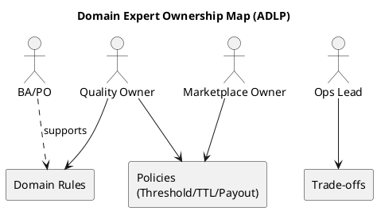
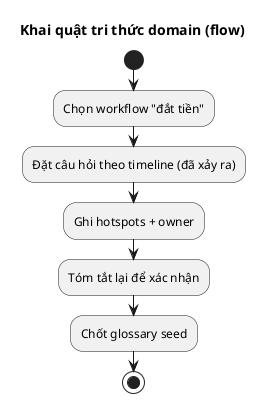

# Chương 5 — Domain Expert: khai quật tri thức đúng người

Nếu bạn hiểu sai domain, mọi kiến trúc đẹp đều trở thành “bức tranh trang trí”. Và lỗi phổ biến nhất khiến domain bị hiểu sai không nằm ở kỹ thuật, mà ở **con người**: bạn nói chuyện sai người, hoặc nói chuyện đúng người nhưng sai cách.  
Chương này tập trung vào Domain Expert — ai là người nắm tri thức thật, làm sao khai thác tri thức đó, và vì sao “BA/PO không đủ” trong các domain phức tạp như ADLP.

---

## Bạn sẽ nhận được gì sau chương này?

1) Biết phân biệt **Domain Expert thật** và “người biết dự án” (BA/PO/PM).  
2) Biết thiết kế buổi làm việc để **tri thức domain lộ ra** (không chỉ là requirements).  
3) Tránh các anti-pattern: dev tự suy diễn nghiệp vụ, workshop biến thành họp kỹ thuật.  
4) Có checklist và agenda mẫu để chạy discovery/event storming hiệu quả.  
5) Có bài tập có hướng dẫn để tự xác định domain expert và chuẩn bị câu hỏi đúng.

---

## 1) Domain Expert là ai (và không phải ai)?

### 1.1 Domain Expert thật sự
Domain Expert là người **ra quyết định và chịu trách nhiệm** về quy tắc nghiệp vụ. Họ có thể không biết kỹ thuật, nhưng họ biết:
- Quy tắc nào là “không thể sai”.
- Khi nào nên trade-off chất lượng vs tốc độ.
- Điều gì khiến khách hàng trả tiền, và điều gì khiến họ rời bỏ.

Đây là “tri thức vận hành” chứ không phải “tri thức mô tả”. Một Domain Expert có thể không viết spec, nhưng họ biết nếu thay đổi rule thì chuyện gì sẽ xảy ra ngoài đời: SLA bị phá, payout sai, customer churn, hoặc compliance bị phạt.

Trong ADLP, domain expert không chỉ là PO. Ví dụ:
- **Quality Owner:** người chịu trách nhiệm chính sách WER/agreement, escalation, bias policy.  
- **Ops Lead:** người chịu trách nhiệm SLA giao dataset, quy trình rework.  
- **Marketplace Owner:** người quyết định payout/penalty, rating policy, fairness.

Những người này mới là nguồn tri thức “sống” của domain.

### 1.2 Domain Expert không phải là…
- **BA/PO thuần**: họ hiểu yêu cầu, nhưng thường không chịu trách nhiệm trực tiếp khi hệ thống sai vận hành.  
- **Dev team**: họ hiểu code, nhưng dễ suy diễn domain theo logic kỹ thuật.  
- **Stakeholder xa**: chỉ nhìn KPI, không hiểu quy trình thực tế.

> **WARNING**  
> Nếu bạn để dev tự suy diễn domain, bạn sẽ xây đúng theo logic của dev — không phải logic của business.

---

## 2) Vì sao BA/PO “không đủ” trong domain phức tạp?

BA/PO cực kỳ quan trọng, nhưng họ không thể thay thế domain expert trong các domain có:
- nhiều ngoại lệ (edge cases),
- hệ thống thưởng/phạt/phân phối,
- compliance/audit,
- human-in-the-loop.

Trong ADLP, các câu hỏi kiểu sau **không thể trả lời đúng nếu thiếu domain expert**:
- “Batch bị nghi gian lận thì xử lý thế nào? ai quyết định?”
- “Labeler nào được nhận task premium? dựa trên rating hay certification?”
- “Nếu quality thấp nhưng deadline gấp, có chấp nhận không? có hạ tier không?”

BA/PO có thể mô tả yêu cầu, nhưng **domain expert mới xác định đúng trade-off**.

---

## 3) Điều bạn thực sự muốn lấy từ Domain Expert

Đừng chỉ lấy “yêu cầu”. Bạn cần lấy **logic** và **ngôn ngữ** để hệ thống phản ánh đúng cách business vận hành, chứ không chỉ phản ánh “màn hình cần gì”. Khi bạn hỏi đúng, domain expert sẽ giúp bạn chốt rule và trade-off sớm — thứ quyết định 80% đúng sai của model.

Những thứ nên lấy từ domain expert:

1) **Rule**: điều gì không được phép sai (invariants).  
2) **Trade-off**: khi có xung đột, ưu tiên điều gì (quality vs speed, fairness vs throughput).  
3) **Ngôn ngữ**: từ nào dùng thế nào, nghĩa nào là chính thức.  
4) **Ngữ cảnh**: rule này áp dụng ở đâu, không áp dụng ở đâu.

Ví dụ trong ADLP:
- Rule: “Batch premium phải có agreement > 0.9.”  
  Ngữ cảnh: áp cho tier premium; tier standard có thể thấp hơn.  
  Trade-off: nếu deadline gấp, có thể hạ tier thay vì hạ threshold.

---

## 4) Cách “khai quật” tri thức domain (không để workshop thành họp kỹ thuật)

### 4.1 Câu hỏi đúng là câu hỏi về “đã xảy ra”
Thay vì hỏi “chúng ta nên xây API thế nào?”, hãy hỏi:
- “Điều gì xảy ra ngay trước khi một batch bị reject?”  
- “Ai là người quyết định escalation?”  
- “Chúng ta làm gì khi labeler bỏ dở batch?”  

Những câu hỏi này kéo domain expert về **thực tế vận hành**, không về kỹ thuật.

### 4.2 Bám vào workflow “đắt tiền”
Chọn một workflow có giá trị kinh tế cao hoặc rủi ro cao.  
Trong ADLP: “premium order 48h” là workflow đắt tiền nhất.

Khi domain expert nói chuyện trong bối cảnh workflow cụ thể, họ sẽ nêu rule chính xác hơn nhiều so với việc nói chung chung.

### 4.3 Tóm tắt ngay sau mỗi đoạn
Sau khi domain expert nói, bạn nên tóm lại:
- “Để xác nhận, nếu WER < 0.8 thì batch bị reject và quay lại queue rework, đúng không?”

Việc xác nhận này làm giảm hiểu sai và giúp domain expert tự kiểm tra logic.

---

## 5) Anti-patterns (triệu chứng → hậu quả → cách tránh)

### 5.1 Developer tự suy diễn nghiệp vụ
**Triệu chứng:** dev viết rule dựa trên “cảm giác hợp lý” thay vì xác nhận.  
**Hậu quả:** hệ thống chạy đúng logic dev, sai logic business.  
**Cách tránh:** bắt buộc có domain expert xác nhận invariants và trade-offs quan trọng.

### 5.2 Workshop biến thành họp kỹ thuật
**Triệu chứng:** 10 phút đầu nói về event, 50 phút sau tranh luận REST vs Kafka.  
**Hậu quả:** không có shared understanding, chỉ có “giải pháp”.  
**Cách tránh:** rule cứng: workshop chỉ nói “điều đã xảy ra” và “vì sao”.

### 5.3 Để domain expert xuất hiện quá muộn
**Triệu chứng:** domain expert chỉ đến khi UAT.  
**Hậu quả:** sai domain lộ muộn, sửa cực đắt.  
**Cách tránh:** domain expert phải tham gia discovery/event storming.

---

## 6) Best practices (kèm giải thích)

### 6.1 Chốt “Decision Owner” cho từng rule
Nếu không rõ ai quyết định rule, rule đó sẽ bị tranh chấp mãi.  
Trong ADLP, “quality threshold” nên có owner (Quality Lead), không để dev tự quyết.

### 6.2 Luôn hỏi về ngoại lệ
Domain nằm trong ngoại lệ, không nằm trong happy path.  
Ví dụ: “Nếu labeler submit quá nhanh, có auto-flag không? ai review?”

### 6.3 Một workflow, nhiều góc nhìn
Cho domain expert khác nhau “đi qua” cùng workflow.  
Ví dụ ADLP: Ops nhìn về SLA; Quality nhìn về accuracy; Finance nhìn về payout.

### 6.4 Tóm tắt thành artefacts ngay sau workshop
Nếu bạn không ghi lại glossary/invariants/hotspots ngay, tri thức sẽ biến mất.  
Artefacts chính: glossary seed, event list, hotspots/questions.

### 6.5 Script phỏng vấn domain expert (theo giai đoạn)

**Discovery (mở rộng bối cảnh)**
1) “Nếu workflow này sai, hậu quả kinh doanh lớn nhất là gì?”  
2) “Rule nào nếu sai sẽ làm mất tiền/uy tín ngay lập tức?”  
3) “Ai là người ra quyết định cuối cùng khi có tranh chấp?”  
4) “Đâu là KPI/SLA khiến mọi người căng thẳng nhất?”  

**Event Storming (đi theo timeline)**
5) “Trước khi event X xảy ra, điều kiện bắt buộc là gì?”  
6) “Nếu event X trễ 2 giờ thì chuyện gì xảy ra?”  
7) “Có trường hợp ngoại lệ nào làm bạn phá quy trình?”  
8) “Nếu labeler submit sau TTL thì xử lý ra sao?”  

**Validation/Review (chốt rule + trade-offs)**
9) “Trong 2 lựa chọn A/B, team thường ưu tiên cái nào và vì sao?”  
10) “Rule này có phiên bản/policy không? Ai đổi policy?”  
11) “Điểm nào bạn muốn audit lại sau 1 tuần chạy thật?”  
12) “Có rule nào bạn chưa chắc và muốn test bằng data thật?”  

---

## 7) Agenda mẫu (dùng ngay)

### 7.1 Kick-off 45 phút
1) 10’ — chọn workflow “đắt tiền”.  
2) 15’ — liệt kê top 3–5 rules không được sai.  
3) 10’ — xác định decision owners.  
4) 10’ — thống nhất agenda Event Storming.

### 7.2 Event Storming 2 giờ
1) 10’ — luật chơi: chỉ nói “điều đã xảy ra”.  
2) 40’ — đặt events theo timeline.  
3) 20’ — gắn actors/commands ở hotspots.  
4) 30’ — chốt glossary seed + ghi quyết định trade-off.  
5) 20’ — review và phân công follow-up.

---

## 8) Exercise có hướng dẫn: xác định Domain Expert cho ADLP

### Bước 1: Liệt kê 3 quyết định “đắt nhất”
Ví dụ ADLP:
1) Chấp nhận/loại batch dựa trên tiêu chí nào?  
2) Khi deadline gấp, ưu tiên speed hay quality?  
3) Payout bị chặn trong trường hợp nào?  

### Bước 2: Với mỗi quyết định, ghi người sở hữu
- Quality Lead (quyết định thresholds).  
- Ops Lead (quyết định SLA trade-off).  
- Finance/Marketplace Owner (quyết định payout/penalty).

### Bước 3: Chuẩn bị 3 câu hỏi sâu cho từng người
Ví dụ cho Quality Lead:
- “Nếu agreement thấp nhưng deadline gấp, có rule hạ tier không?”  
- “Batch bị nghi gian lận thì escalation theo cấp nào?”  
- “Bias detection có phải điều kiện reject bắt buộc không?”

### Đáp án tham khảo (rút gọn)
Domain experts chính trong ADLP:
- Quality Lead  
- Ops Lead  
- Marketplace/Finance Owner  
BA/PO hỗ trợ, nhưng không thay thế.

---

## 9) Artefacts/Deliverables sau chương này

1) Danh sách Domain Experts + decision ownership.  
2) Danh sách rule/invariants quan trọng.  
3) Danh sách trade-offs cần ADR.  
4) Agenda workshop cụ thể (có người tham gia, có mục tiêu rõ).

---

## 10) Kết nối sang chương sau

Chương 6 sẽ đi sâu vào Event Storming — lúc này, bạn đã biết **ai phải ngồi trong phòng** và **cách kéo tri thức domain ra khỏi họ**.

---

## Checklist (dùng ngay)

> **CHECKLIST**
> - [ ] Bạn xác định domain expert “thật” (người ra quyết định/trade-off), không chỉ người viết spec  
> - [ ] Bạn chốt cơ chế làm việc: review vòng lặp ngắn (30–60 phút) thay vì “đợi xong rồi demo”  
> - [ ] Bạn có danh sách thuật ngữ đắt tiền cần domain expert chốt nghĩa (Submitted/Accepted/QualityScore/TTL…)  
> - [ ] Bạn có “parking lot” cho tranh luận kỹ thuật để workshop không trượt  
> - [ ] Bạn có lịch/agenda workshop cụ thể + người tham gia + mục tiêu + output artefacts  
