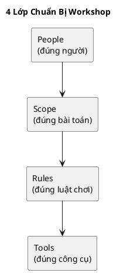

# Chương 8 — Chuẩn bị Event Storming Workshop (để ra kết quả thật)

Chương 6–7 nói về Event Storming và các cấp độ. Nhưng có một sự thật: Event Storming không thất bại vì thiếu lý thuyết; nó thất bại vì **chuẩn bị sai**. Bạn có thể có một phòng đầy người giỏi mà vẫn ra một timeline vô nghĩa nếu:

- sai người (không có domain expert thật),
- sai mục tiêu (muốn “thiết kế kỹ thuật” thay vì “khám phá domain”),
- sai luật chơi (trượt sang debate tool/framework),
- sai cách ghi nhận (không chốt hotspots/glossary/artefacts).

Chương này là một hướng dẫn “cầm tay chỉ việc”: bạn có thể dùng ngay để tổ chức một workshop 2–3 giờ cho ADLP (hoặc dự án tương tự) và thu được artefacts đủ để bước sang strategic/tactical.

---

## Bạn sẽ nhận được gì sau chương này?

1) Biết chuẩn bị workshop theo 4 lớp: người — mục tiêu — luật chơi — artefacts.  
2) Có danh sách vai trò cần có và tiêu chí chọn đúng người.  
3) Có agenda mẫu 2 giờ và 3 giờ (Big Picture) + cách điều phối để không trượt sang kỹ thuật.  
4) Biết cách ghi nhận output đúng: events, hotspots, glossary seed, decision owners, action items.  
5) Có exercise có hướng dẫn: bạn tự thiết kế một workshop cho workflow “premium order 48h” của ADLP.

---

## 1) Mục tiêu thật sự của workshop (đừng bắt đầu bằng “chúng ta cần vẽ kiến trúc”)

Event Storming workshop không phải buổi “thiết kế giải pháp”. Nó là buổi để:

1) Tạo shared understanding: mọi người nhìn cùng một workflow, cùng một ngôn ngữ.  
2) Lộ hotspots: điểm mơ hồ/mâu thuẫn cần làm rõ.  
3) Chốt vocabulary seed: glossary bắt đầu “sống”.  
4) Tìm ranh giới tự nhiên: candidate bounded contexts và ownership.

Nếu bạn đi vào workshop với mục tiêu “chốt Kafka hay RabbitMQ”, bạn sẽ thu được… tranh luận, không thu được domain truth.

> **NOTE**  
> Quy tắc vàng: workshop này phải trả lời “điều gì đã xảy ra?” trước khi trả lời “làm thế nào?”.

---

## 2) Chuẩn bị 4 thứ trước workshop (People, Scope, Rules, Tools)

### 2.1 People: chọn đúng người

#### Vai trò bắt buộc
1) **Facilitator** (1 người)  
Người điều phối. Không nhất thiết là sếp, nhưng phải đủ “cứng” để kéo cuộc họp về đúng câu hỏi.

2) **Domain Experts** (2–4 người, tùy domain)  
Người có quyền quyết định rule/trade-off và chịu trách nhiệm outcome.

3) **Architect/Tech Lead** (1–2 người)  
Đảm bảo các artefacts sau workshop “đi được” sang strategic/tactical, và chốt những thứ cần ADR.

4) **Dev leads** (2–5 người)  
Những người sẽ implement. Họ cần nghe domain truth trực tiếp để không suy diễn.

#### Người nên có (tùy dự án)
- Ops/QA (để nói về SLA, failure modes)
- Finance/Compliance (nếu domain có payout/audit/PII)

#### Áp vào ADLP (gợi ý)
- Quality Lead (quality gate, review/escalation)
- Ops Lead (SLA premium 48h, rework)
- Marketplace/Finance Owner (payout/penalty, rating policy)
- Tech Lead/Architect (facilitation hoặc co-facilitation)
- Dev leads (backend/ML/frontend)

> **WARNING — Red flag**  
> Nếu bạn không có domain expert thật sự, workshop sẽ ra “giả định”, không ra domain.

Điểm mấu chốt là **quyền quyết định**, không phải “chức danh”. Một domain expert đúng nghĩa phải có khả năng nói “điều này đúng/không đúng” và chịu trách nhiệm về trade-off đó.

### 2.2 Scope: chọn đúng bài toán (đừng tham)

Chọn **một workflow đắt tiền nhất**. Đừng chọn nhiều workflow cùng lúc.

Với ADLP, workflow tốt nhất để bắt đầu là:
- “Premium order 48h” (vì nó kéo theo assignment, quality, escalation, export, payout).

Vì sao scope phải hẹp? Vì Event Storming là về **độ sâu của sự thật**, không phải độ rộng của danh sách tính năng.

### 2.3 Rules: luật chơi để tránh trượt

Thiết lập 5 luật cứng:
1) Bắt đầu bằng **events** (điều đã xảy ra).  
2) Nếu tranh luận kỹ thuật → ghi vào “parking lot” (một góc) và quay lại timeline.  
3) Chỉ một người nói một lúc; facilitator có quyền cắt ngang để giữ nhịp.  
4) Mọi thuật ngữ gây tranh cãi phải ghi vào glossary seed ngay.  
5) Mọi hotspot phải được ghi thành câu hỏi rõ ràng và gán owner để follow-up.

Những luật này giúp bạn giữ “ngôn ngữ domain” ở trung tâm. Nếu không có luật, workshop sẽ trở thành “bàn thiết kế kỹ thuật” và mất tác dụng discovery.

### 2.4 Tools: dùng cái đơn giản nhất có thể

Bạn có thể làm Event Storming bằng:
- bảng trắng + sticky notes,
- hoặc Miro/FigJam.

Không cần tool phức tạp. Điều quan trọng là **mọi người nhìn cùng một bức tranh**.

> **BEST PRACTICE**  
> Nếu remote, chuẩn bị board trước: lanes cho timeline, glossary, hotspots, parking lot.

---

## 3) Chuẩn bị artefacts trước workshop (để không mất 40 phút “khởi động”)

Trước workshop, facilitator/architect nên chuẩn bị sẵn:

1) **One-page framing** (1 trang): mục tiêu, KPI/SLA, scope workshop.  
2) **Workflow statement**: mô tả 5–7 câu về workflow (không kỹ thuật).  
3) **Seed glossary** 5–10 từ quan trọng (Batch, Segment, Submitted, Accepted, Confidence).  
4) **Seed events (optional)** 5–7 events đầu/cuối để mọi người “bám” (DataItemUploaded, BatchAccepted, DatasetExported).

Lưu ý: seed chỉ để khởi động. Workshop không phải điền vào template có sẵn; workshop là để khám phá.

---

## 4) Agenda mẫu (2 giờ) — Big Picture Event Storming

Agenda này phù hợp cho lần đầu, mục tiêu là ra timeline + hotspots + glossary seed.

### 0) Setup (trước giờ) — 10 phút
Facilitator mở board, nhắc scope, nhắc luật chơi.

### 1) Kick-off (10 phút)
- Nhắc mục tiêu: shared understanding, không chốt giải pháp.
- Chốt workflow: premium order 48h.

### 2) Storm events (40 phút)
Mọi người viết events theo timeline. Facilitator giúp:
- giữ event ở thì quá khứ,
- tránh “RunXxx” (command trá hình),
- gom cụm events khi lặp.

### 3) Identify hotspots (20 phút)
Ở mỗi chỗ tranh cãi/mơ hồ, tạo sticky “Question/Hotspot”, ví dụ:
- “Accepted nghĩa là gì? threshold nào?”
- “Lock TTL bao lâu? hết hạn thì sao?”

### 4) Glossary pass (20 phút)
Chốt nghĩa các từ gây tranh cãi. Không cần hoàn hảo, chỉ cần thống nhất phiên bản v0.

### 5) Wrap-up (30 phút)
- Tóm tắt timeline.
- Chốt top 5 hotspots quan trọng nhất.
- Gán owner và due date cho mỗi hotspot.
- Chốt output: ảnh/board link + action items.

> **NOTE**  
> 2 giờ đủ cho big picture. Nếu bạn thấy mình đi vào “cách implement lock”, bạn đang trượt sang process/design-level.

---

## 5) Agenda mẫu (3 giờ) — Big Picture + Process-level nhẹ

Dùng khi bạn muốn ra thêm policy/ownership cho 3–5 events quan trọng.

Phần đầu giống agenda 2 giờ. Thêm:

### 4) Process pass cho 3–5 events (40 phút)
Chọn 3–5 events “đắt tiền” (ADLP: BatchAssigned, BatchSubmitted, ReviewRequired, BatchAccepted) và gắn:
- Actor (ai kích hoạt),
- Policy (điều kiện),
- External systems (notification, payment, audit).

### 5) Wrap-up (30 phút)
Giống agenda 2 giờ, nhưng thêm “decision owners”.

---

## 6) Kỹ thuật facilitation để workshop không “toang”

### 6.1 Câu hỏi kéo đúng hướng
Khi mọi người tranh luận giải pháp, facilitator hỏi:
- “Trong thực tế, chuyện gì đã xảy ra ngay trước đó?”
- “Ai là người quyết định ở bước này?”
- “Nếu làm sai bước này thì hậu quả gì?”

### 6.2 Kỹ thuật “parking lot”
Mọi tranh luận về tool/framework phải được ghi lại và hoãn. Tại sao? Vì nếu bạn giải quyết tool trước khi chốt domain, bạn sẽ chọn tool dựa trên giả định sai.

### 6.3 Kỹ thuật “time-box”
Mỗi hotspot được time-box: 2–3 phút để mô tả câu hỏi, không giải quyết tại chỗ. Giải quyết sau bằng follow-up/ADR.

---

## 7) Output chuẩn sau workshop (để bước sau không mơ hồ)

Sau Big Picture workshop, bạn cần có 4 artefacts:

1) **Event timeline** (10–20 events).  
2) **Hotspots & Questions** (có owner + due date).  
3) **Glossary seed** (10–30 terms).  
4) **Next step plan** (process-level hoặc strategic design).

Áp ADLP: timeline phải có tối thiểu các “điểm neo”:
- `PrelabelCompleted` (vì pipeline STT),
- `BatchAssigned` và “lock TTL” (assignment),
- `BatchSubmitted` vs `BatchAccepted` (quality gate),
- `ReviewRequired` (escalation),
- `DatasetExported` (export).

---

## 8) Anti-patterns (và cách tránh)

### 8.1 Không có decision owner
Nếu hotspot không có owner, nó sẽ chết. Và rồi dev sẽ tự quyết — quay lại anti-pattern “suy diễn nghiệp vụ”.

### 8.2 Workshop thành buổi “điền template”
Nếu facilitator đưa sẵn model và bắt mọi người điền vào, bạn sẽ bỏ lỡ discovery. Template chỉ là khung, không phải kết luận.

### 8.3 Chọn scope quá rộng
Chọn 3 workflows một lúc khiến timeline loãng, không ra được rule nào rõ. Scope hẹp nhưng sâu là chìa khóa.

---

## 9) Exercise có hướng dẫn (30 phút): thiết kế workshop cho ADLP

Mục tiêu: bạn có thể tự tổ chức workshop ngay ngày mai.

### Bước 1: Chọn scope
Chọn workflow: “premium order 48h”.

### Bước 2: Chọn người
Ghi tên (hoặc vai trò) cho:
- facilitator,
- 2–3 domain experts,
- 2 dev leads.

### Bước 3: Chuẩn bị seed artefacts
- 5 thuật ngữ seed (Batch, Segment, Submitted, Accepted, Confidence).
- 5 events seed (DataItemUploaded, PrelabelCompleted, BatchAssigned, BatchAccepted, DatasetExported).

### Bước 4: Chọn agenda
Chọn agenda 2 giờ hoặc 3 giờ và time-box từng phần.

### Đáp án tham khảo (rút gọn)
- Agenda: 2 giờ big picture.
- Domain experts: Quality Lead + Ops Lead + Finance Owner.
- Output kỳ vọng: timeline 12–15 events + top 5 hotspots + glossary 15 terms.

---

## 10) Artefacts/Deliverables sau chương này

- `Event Timeline v0` (board link hoặc ảnh).
- `Hotspots & Questions` (có owner + due date).
- `Glossary seed` (bảng 10–30 thuật ngữ).
- `Action items` cho workshop tiếp theo (process-level hoặc strategic design).

---

## Checklist (dùng ngay)

> **CHECKLIST**
> - [ ] Chốt kịch bản “đắt tiền” + definition-of-done (business) trước khi họp  
> - [ ] Mời đúng người: domain expert có quyền quyết + facilitator + dev leads  
> - [ ] Chuẩn bị board lanes (timeline/hotspots/glossary/policies/parking lot)  
> - [ ] Chốt luật: event-centric, timebox tranh luận, hotspot phải có owner + due date  
> - [ ] Chốt output pack: ai tổng hợp, lưu ở đâu, deadline (để workshop không “trôi”)  
