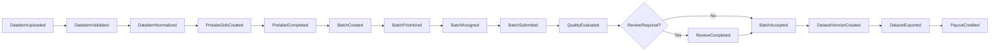
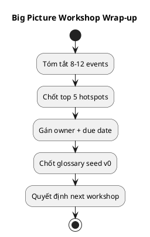

# Chương 9 — Big Picture Event Storming (thực hành thật, không mơ hồ)

Chương 6–8 đã nói Event Storming là gì, có những cấp độ nào, và cách chuẩn bị workshop để không “toang”. Chương 9 là phần thực hành Big Picture: **làm thế nào để bạn đứng trước một bảng trắng và bắt đầu đặt events**, rồi kết thúc buổi workshop với artefacts đủ tốt để bước sang Process-level hoặc Strategic Design.

Ở chương này, mình sẽ dùng workflow “đắt tiền” nhất của ADLP: **premium order 48h** (audio STT). Bạn có thể thay bằng workflow của dự án bạn, nhưng hãy học cách làm theo “bộ xương” này: chọn scope đúng, đặt câu hỏi đúng, ghi nhận đúng, và chốt output đúng.

---

## Bạn sẽ nhận được gì sau chương này?

1) Một cách bắt đầu Big Picture Event Storming trong 10 phút (không bị đứng hình).  
2) Bộ câu hỏi thực dụng để kéo domain expert nói ra “sự thật vận hành” thay vì requirements mơ hồ.  
3) Một bản timeline mẫu cho ADLP (đủ chi tiết để bạn copy và biến đổi).  
4) Cách xử lý tranh cãi và mâu thuẫn ngay trong workshop mà không trượt sang technical design.  
5) Cách kết thúc workshop: chốt hotspots + glossary seed + action items (có owner).  
6) Exercise có hướng dẫn để bạn tự chạy một Big Picture cho workflow của mình.

---

## 1) Big Picture Event Storming: “đầu ra” là gì?

Trước khi bắt đầu, bạn phải hiểu rõ Big Picture *không* nhằm thiết kế kỹ thuật. Nó nhằm tạo ba artefacts:

1) **Event timeline (10–20 events)** cho một workflow end-to-end.  
2) **Hotspots & Questions** — danh sách điểm mơ hồ/mâu thuẫn có owner để follow-up.  
3) **Glossary seed (10–30 terms)** — ngôn ngữ chung phiên bản v0.

Nếu bạn rời workshop mà chỉ có “một đống sticky notes đẹp”, nhưng không có 3 artefacts trên, buổi workshop đó thất bại.

> **NOTE**  
> Big Picture không cần “đúng 100%”. Nó cần “đúng đủ” để lộ ra những chỗ phải hỏi thêm. Sai sớm ở đây là tốt, vì sai ở đây rẻ.

---

## 2) Chuẩn bị tâm thế: “sự kiện đã xảy ra” là câu trả lời, không phải giải pháp

Big Picture Event Storming chỉ có một “điều luật”: mọi thứ phải được diễn đạt dưới dạng **điều đã xảy ra**.

Vì sao? Vì khi bạn nói “hãy làm” (command), bạn lập tức lao vào giải pháp. Khi bạn nói “đã xảy ra” (event), bạn buộc cả nhóm nhìn vào thực tế business.

### Ví dụ ADLP

- Command trá hình: “Run prelabeling”  
- Event đúng nghĩa: “Prelabel completed”

Bạn sẽ thấy ngay sự khác nhau: “Run prelabeling” mở ra tranh luận “run thế nào”; còn “Prelabel completed” mở ra câu hỏi đúng: “khi nào xem là completed? output là gì? ai dùng output đó?”.

---

## 3) Bắt đầu trong 10 phút: 4 câu hỏi mở khóa (để không bị đứng hình)

Nếu bạn bước vào workshop và mọi người im lặng, thường là vì scope quá rộng hoặc câu hỏi quá chung. Hãy dùng 4 câu hỏi này để “mở khóa”:

1) **Sự kiện đầu tiên là gì?** (khi workflow bắt đầu, điều gì xảy ra?)  
2) **Sự kiện cuối cùng là gì?** (khi business coi là “xong”, điều gì xảy ra?)  
3) **Chỗ nào hay xảy ra sự cố nhất?** (để ghi hotspot)  
4) **Ai sẽ than phiền nếu bước này sai?** (để tìm decision owner)

### Áp vào ADLP

1) Đầu: `DataItemUploaded` (hoặc `DataItemCrawled`)  
2) Cuối: `DatasetExported` (và/hoặc `BatchAccepted` nếu export do consumer kéo sau)  
3) Sự cố: lock TTL, review/escalation, payout trigger  
4) Người than phiền: Ops (SLA), Quality (accuracy), Finance (payout), Consumer (dataset)

Bạn sẽ thấy ngay: chỉ cần khóa được “đầu” và “cuối”, phần giữa sẽ tự nhiên xuất hiện.

---

## 4) Thực hành ADLP: dựng timeline “premium order 48h”

### 4.1 Gợi ý cách viết event (để domain expert hiểu)

Event name nên:
- ở thì quá khứ (`XxxCreated`, `XxxSubmitted`, `XxxAccepted`),
- dùng từ business hiểu được (tránh `updated`, `processed`),
- mô tả đúng *ý nghĩa*, không mô tả cách implement.

### 4.2 Timeline mẫu (đủ dùng cho Big Picture)

Dưới đây là timeline mẫu cho ADLP. Bạn có thể dùng nó như “khung xương”:

1) `DataItemUploaded` — audio được upload (hoặc `DataItemCrawled`).  
2) `DataItemValidated` — file hợp lệ (duration/format/size).  
3) `DataItemNormalized` — audio đã được chuẩn hóa + dedupe.  
4) `PrelabelJobCreated` — hệ thống tạo job prelabel.  
5) `PrelabelCompleted` — có segments + prelabel text + confidence + model version.  
6) `BatchCreated` — segments được gom thành batch theo policy.  
7) `BatchPrioritized` — batch được tính priority (tier/deadline/difficulty).  
8) `BatchAssigned` — batch được lock và gán cho labeler (kèm TTL).  
9) `LabelingStarted` — labeler bắt đầu phiên làm việc (optional, tuỳ muốn audit/telemetry).  
10) `BatchSubmitted` — labeler submit transcript.  
11) `QualityEvaluated` — tính WER/agreement/anomaly/bias metrics.  
12) `ReviewRequired` — nếu dưới threshold hoặc bất thường.  
13) `ReviewCompleted` — reviewer ra quyết định (accept/reject/rework).  
14) `BatchAccepted` — batch đạt quality gate và trở thành exportable.  
15) `DatasetVersionCreated` — snapshot dataset được chốt theo version.  
16) `DatasetExported` — export artifact được tạo + signed URL.  
17) `PayoutCredited` — payout được ghi có (nếu payout là một phần workflow).

> **NOTE**  
> Bạn không bắt buộc phải có 17 events. Big Picture thường đẹp nhất ở 10–20 events. Nếu vượt quá 25, bạn đang làm Process-level/Design-level mà không nhận ra.

### 4.3 Chọn mức “đúng đủ”

Tại Big Picture, bạn không cần quyết định:
- event #9 có cần hay không,
- event #7 là event thật hay chỉ là thuộc tính,
- payout có phải nằm trong workflow này hay trong workflow khác.

Bạn chỉ cần ghi chúng ra và đánh dấu “candidate” hoặc “question”. Big Picture là để lộ mơ hồ, không phải để ép chốt.

---

## 5) Hotspots: bạn phải ghi lại như thế nào để không “mơ hồ có tổ chức”?

Hotspot không phải một cảm giác. Hotspot là một câu hỏi có thể follow-up được.

### 5.1 Hotspot viết sai
- “Quality khó.”  
- “Lock hơi phức tạp.”  

Những câu này không ai follow-up được.

### 5.2 Hotspot viết đúng
- “BatchAccepted: threshold nào theo tier? ai sở hữu policy? policy có version không?”  
- “BatchAssigned: TTL là bao lâu? hết TTL thì unlock/reassign thế nào? có penalty không?”  
- “ReviewRequired: khi nào auto-flag? escalation có mấy cấp? SLA review bao lâu?”

### 5.3 Hotspots mẫu cho ADLP (gợi ý)

1) **Submit vs Accept**: định nghĩa “Accepted” thuộc Quality context, không thuộc Labeling UI.  
2) **Lock TTL & Reassign**: fairness + SLA, cần policy rõ.  
3) **Quality metrics**: WER/agreement/bias: thresholds và weight.  
4) **Escalation workflow**: level 1–3? ai review? SLA?  
5) **Payout trigger**: payout ở `BatchAccepted` hay ở `ReviewCompleted`? có hold period?

> **BEST PRACTICE**  
> Mỗi hotspot phải có owner (người chịu trách nhiệm trả lời) và due date. Không owner = hotspot chết.

---

## 6) Glossary seed: chốt nghĩa “đắt tiền” ngay trong workshop

Big Picture không thể thành công nếu mọi người dùng từ theo cảm tính. Nhưng bạn cũng không thể chốt glossary hoàn hảo trong 2 giờ. Mục tiêu là glossary seed (v0).

### 6.1 Cách chốt nhanh
Chọn 10–15 từ gây tranh cãi nhất và chốt nghĩa tối thiểu:
- Batch, Segment, Task,
- Submitted, Accepted, Approved,
- Confidence, QualityScore,
- Review, Escalation,
- Tier (premium/standard),
- Deadline, TTL.

Bạn có thể dùng template trong `design/docs/0.ref/DDDPractical/templates.md` để ghi ngay.

### 6.2 Ví dụ: 2 từ “đắt tiền” của ADLP

**Submitted**: labeler đã nộp kết quả chỉnh sửa; chưa đảm bảo đạt quality gate.  
**Accepted**: batch đã qua quality policy (và review nếu cần) và được phép export/payout.

Chỉ cần chốt được hai từ này, bạn đã tránh được một trong những lỗi đắt nhất của marketplace.

---

## 7) Xử lý tranh cãi: làm sao để không trượt sang technical design?

Tranh cãi là bình thường — và nó thường là dấu hiệu bạn vừa chạm vào “core domain”. Vấn đề không phải tránh tranh cãi, mà là **đóng gói tranh cãi đúng cách**.

### 7.1 Kỹ thuật “parking lot”
Nếu tranh cãi về tool/implementation, ghi vào parking lot và quay lại event timeline.

Ví dụ:
- “Kafka hay RabbitMQ?” → parking lot, vì đó là solution choice.
- “BatchAccepted nghĩa là gì?” → giữ lại ở hotspot, vì đó là domain truth.

### 7.2 Kỹ thuật “chốt câu hỏi thay vì chốt câu trả lời”
Trong Big Picture, chốt câu hỏi tốt hơn chốt câu trả lời vội.

Ví dụ:
- Không chốt ngay “TTL = 4 giờ”.  
→ chốt câu hỏi: “TTL phụ thuộc tier? phụ thuộc difficulty? ai quyết định?”

Bạn sẽ giải ở Process-level hoặc ADR sau.

---

## 8) Kết thúc workshop: 15 phút cuối quyết định thành công hay thất bại

Nhiều workshop làm rất tốt 1 giờ 45 phút đầu rồi thất bại vì… kết thúc quá vội. 15 phút cuối phải tạo ra “đầu ra có thể dùng”.

Checklist wrap-up:

1) Tóm tắt workflow bằng 8–12 events (nói được thành câu chuyện).  
2) Chốt top 5 hotspots quan trọng nhất.  
3) Gán owner + due date cho từng hotspot.  
4) Chốt glossary seed 10–30 terms (v0).  
5) Chốt “next workshop”: process-level hay strategic design?

> **NOTE**  
> Nếu bạn rời workshop mà không có owner cho hotspots, bạn đang đặt cược rằng dev sẽ tự suy diễn. Và đó là cược thua.

---

## 9) Best practices (kèm giải thích)

### 9.1 Big Picture phải “một workflow, một bức tranh”
Một buổi Big Picture nên chỉ có một workflow. Nếu bạn làm 3 workflows, bạn sẽ không đủ thời gian để lộ hotspots.

### 9.2 Dùng “đầu và cuối” để neo timeline
Khi bắt đầu, chốt event đầu và event cuối. Nó giúp cả nhóm không bị lạc.

### 9.3 Hotspot phải viết thành câu hỏi có owner
Hotspot không owner là hotspot vô dụng. Mọi quyết định đắt tiền đều cần owner.

### 9.4 Glossary seed phải chốt “từ đắt tiền”
Từ đắt tiền là từ gây tranh cãi và có hậu quả nếu hiểu sai (Submitted/Accepted).

---

## 10) Anti-patterns (triệu chứng → hậu quả → cách tránh)

### 10.1 “Timeline đẹp nhưng vô dụng”
**Triệu chứng:** có nhiều sticky notes nhưng không có hotspots/glossary/owners.  
**Hậu quả:** workshop chỉ là trình diễn.  
**Cách tránh:** wrap-up nghiêm túc, có owner và next steps.

### 10.2 “Event list chỉ là CRUD”
**Triệu chứng:** `record.updated`, `row.changed`.  
**Hậu quả:** không có business meaning, không audit được.  
**Cách tránh:** đặt event theo domain language.

### 10.3 “Không dám ghi điều mơ hồ”
**Triệu chứng:** cố chốt mọi thứ ngay trong 2 giờ.  
**Hậu quả:** quyết định vội, sai domain.  
**Cách tránh:** ghi hotspot + owner; giải sau bằng process-level/ADR.

---

## 11) Exercise có hướng dẫn (45 phút): chạy Big Picture cho dự án của bạn

Mục tiêu: bạn tự làm Big Picture mà không cần “nghĩ mò”.

### Bước 1: Chọn workflow đắt tiền
Chỉ một workflow. Viết 1 câu mô tả: “Ai muốn gì, deadline gì, quality gì”.

### Bước 2: Chốt event đầu và event cuối
Viết 2 sticky: “đầu” và “cuối”. Nếu không chốt được, scope đang sai.

### Bước 3: Điền 8–12 events ở giữa (dựa trên câu chuyện)
Viết câu chuyện 8–12 câu “đã xảy ra”, rồi chuyển mỗi câu thành event name ở thì quá khứ.

### Bước 4: Đánh dấu 3–5 hotspots
Mỗi hotspot phải là một câu hỏi có thể follow-up.

### Bước 5: Chốt 10 thuật ngữ vào glossary seed
Chọn các từ gây tranh cãi nhất.

### Bước 6: Wrap-up
Gán owner + due date cho hotspots và chốt next step (process-level hay strategic).

### Đáp án tham khảo (ADLP, rút gọn)
- Đầu: `DataItemUploaded`  
- Cuối: `DatasetExported`  
- Events giữa: `PrelabelCompleted`, `BatchAssigned`, `BatchSubmitted`, `BatchAccepted`  
- Hotspots: accepted definition, lock TTL, review policy  

**Câu hỏi tự kiểm**
1) Event của bạn có bị lẫn command không?  
2) Bạn có đang dùng từ mơ hồ mà chưa chốt nghĩa không?  
3) Hotspot nào nếu bỏ qua sẽ tạo tranh chấp lớn nhất?  

---

## 12) Artefacts/Deliverables sau chương này

- Big Picture timeline (10–20 events) cho 1 workflow đắt tiền.  
- Hotspots & Questions (top 5, có owner + due date).  
- Glossary seed (10–30 terms).  
- Kế hoạch bước tiếp theo: process-level hoặc strategic design.

---

## Checklist (dùng ngay)

> **CHECKLIST**
> - [ ] Timeline events business-readable (past tense), tránh `updated/changed/processed`  
> - [ ] Mỗi tranh luận mơ hồ được ghi thành hotspot (question, why, owner, due)  
> - [ ] Glossary seed được cập nhật trong lúc làm (không đợi sau)  
> - [ ] Board kết thúc bằng “câu chuyện 8–12 events” mà mọi người cùng đồng ý  
> - [ ] Bạn chốt rõ bước tiếp theo: process-level (đào sâu) hay strategic design (chốt boundaries)  
