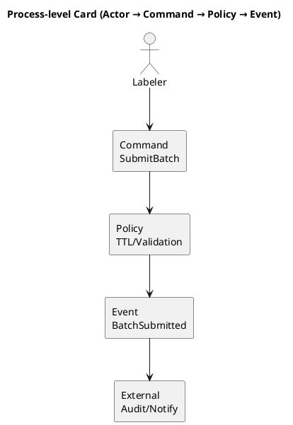
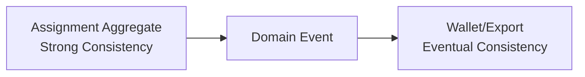

# Chương 10 — Process-level Event Storming (thực hành): Commands, Policies, Actors, External Systems, Time Boundaries

Big Picture (chương 9) cho bạn timeline “điều đã xảy ra”. Design-level (chương 11) giúp bạn đi tới aggregate/invariant để code. Nhưng có một khoảng giữa cực quan trọng: **Process-level**. Nếu Big Picture trả lời “cái gì xảy ra”, Process-level trả lời:

> “Ai làm? ai quyết định? theo policy nào? khi nào? và ranh giới thời gian/nhất quán nằm ở đâu?”

Trong thực tế, hầu hết bug production “đắt tiền” không nằm ở happy path. Nó nằm ở policy và time boundaries:
- batch bị kẹt vì TTL không unlock đúng,
- double-assign vì concurrency,
- review bị trễ vì không có SLA/owner,
- payout bị credit sai vì event duplicate,
- workflow “đứt” vì external system fail.

Process-level Event Storming giúp bạn làm lộ những thứ đó *trước khi code*.

Ví dụ xuyên suốt: ADLP theo Strategic Design v0.2 (`design/docs/2.StrategicDesign/DDD_STRATEGIC_DESIGN_V0.2.md`), workflow “premium order 48h”.

---

## Bạn sẽ nhận được gì sau chương này?

1) Biết cách chuyển Big Picture timeline thành Process map có actor/command/policy/external system.  
2) Biết cách tìm và mô tả **policy** (quality gate, routing, TTL, escalation) để không mơ hồ.  
3) Biết cách xác định **time boundaries** và **consistency boundaries** (điểm hay vỡ).  
4) Có ví dụ ADLP cho 5 events “đắt tiền” nhất: Assign, Submit, Evaluate, Review, Accept.  
5) Có best practices, trade-offs, anti-patterns.  
6) Có exercise có hướng dẫn để bạn tự làm Process-level cho workflow của mình.

---

## 1) Process-level Event Storming là gì (tóm đúng bản chất)?

Process-level Event Storming là bước bạn bổ sung “ngữ cảnh vận hành” cho Big Picture:
- Ai là actor thực sự (human/system)?
- Cái gì kích hoạt cái gì (commands)?
- Quy tắc quyết định (policies) nằm ở đâu?
- Hệ thống ngoài nào can thiệp (external systems)?
- Thời gian và nhất quán bị ràng buộc như thế nào (deadlines, TTL, eventual consistency)?

Nếu Big Picture là bản đồ tuyến đường, Process-level là bản đồ giao thông: có đèn đỏ, luật ưu tiên, giờ cao điểm, và chỗ dễ tắc.

> **NOTE**  
> Process-level chưa phải design-level. Bạn chưa cần chốt aggregate nào. Bạn cần chốt “ai quyết định” và “rule nào chi phối”.

---

## 2) Bốn thành phần chính: Actor, Command, Policy, External System

### 2.1 Actor: ai làm?
Actor có thể là:
- con người (labeler, reviewer, admin),
- service nội bộ (assignment service),
- scheduler (cron),
- external system (payment provider callback).

Điểm quan trọng: actor là **nguồn quyết định**. Nếu bạn không rõ actor, bạn không rõ ownership.

### 2.2 Command: ai yêu cầu thay đổi gì?
Command là ý định thay đổi trạng thái. Nó trả lời “hãy làm X”.

Ví dụ ADLP:
- `AssignBatch` (system yêu cầu assign)
- `SubmitBatch` (labeler yêu cầu submit)
- `EvaluateQuality` (quality worker yêu cầu evaluate)
- `CompleteReview` (reviewer yêu cầu ra quyết định)

### 2.3 Policy: theo rule nào mà quyết định?
Policy là nơi domain complexity “ẩn” nhất. Policy thường là:
- threshold theo tier,
- routing theo skill/rating,
- TTL rules,
- escalation rules.

Policy cần owner. Nếu policy không có owner, nó sẽ bị dev tự quyết.

### 2.4 External Systems: cái gì ở ngoài boundary?
External systems bao gồm:
- object storage (S3),
- notification (email/push),
- payment provider,
- model inference endpoint (SageMaker).

Process-level buộc bạn nghĩ: nếu external system fail thì workflow thế nào?



---

## 3) Time boundaries và consistency boundaries: nơi bug “rare but deadly” sinh ra

### 3.1 Time boundaries (thời gian là một phần của domain)
Trong ADLP, thời gian không chỉ là “timestamp”; nó là rule:
- deadline của premium order,
- lock TTL cho batch,
- SLA review trong escalation.

Nếu bạn không mô hình hóa time boundaries ở Process-level, bạn sẽ xử bằng cron job ad-hoc và tạo batch “kẹt”.

Thời gian trong domain luôn đi kèm **precedence rule**. Ví dụ: submit đến trước unlock hay ngược lại sẽ quyết định batch bị chấp nhận hay bị trả về. Nếu bạn không chốt precedence ở đây, nó sẽ bị “đẻ” ra trong code theo kiểu ngẫu hứng.

### 3.2 Consistency boundaries (nhất quán ở đâu, eventual ở đâu)
Bạn cần biết:
- rule nào cần strong consistency (ví dụ “one active assignment”),
- rule nào chấp nhận eventual consistency (quality → payout).

Process-level không chốt kỹ thuật, nhưng chốt nơi cần consistency để design-level không sai.



---

## 4) Thực hành ADLP: Process map cho 5 events đắt tiền

Phần này là “xương sống” để bạn copy sang dự án khác. Mỗi event dưới đây có: actor/command/policy/external/time boundaries và các failure modes cần ghi hotspot.

### 4.1 `BatchAssigned` (Task Assignment)

**Actor:** Assignment service (system)  
**Command:** `AssignBatch(labeler_id, ttl)`  
**Policy (routing):**
- Eligibility: rating >= ngưỡng theo tier.
- Skill match: labeler có skill phù hợp (ngôn ngữ, accent/noise…).
- Priority: premium + deadline gần → ưu tiên.
**Time boundaries:** lock TTL (ví dụ 4h), deadline batch  
**External systems:** notification (gửi “có batch premium”), Redis lock (nếu dùng), DB (atomic assign)  

**Failure modes / hotspots:**
- Concurrency: 2 labeler lấy cùng batch → cần atomic assign (hotspot: lock strategy).
- TTL expiry: hết TTL thì unlock/reassign → policy reassign + penalty?
- Fairness: labeler giỏi “hút hết” premium → policy quota?

### 4.2 `BatchSubmitted` (Labeling)

**Actor:** Labeler (human)  
**Command:** `SubmitBatch(batch_id, submission_id)`  
**Policy:** submit phải bao phủ đủ segments; submit trước deadline; autosave không đồng nghĩa submit  
**Time boundaries:** deadline; TTL precedence (submit vs unlock race)  
**External systems:** audit log; optional notification “batch received”  

**Failure modes / hotspots:**
- Duplicate submit (retry) → idempotency theo `submission_id`.
- Submit sau TTL → reject hay accept? (precedence rule).
- Partial submit → allowed hay not? (policy).

### 4.3 `QualityEvaluated` (Quality)

**Actor:** Quality worker (system)  
**Command:** `EvaluateQuality(batch_id, submission_id, policy_version)`  
**Policy:** how to compute overall_score (WER/agreement/bias weights), thresholds theo tier, anomaly detection  
**Time boundaries:** SLA evaluation (ví dụ <5m), backpressure theo queue depth  
**External systems:** metrics store, feature store (optional), model for anomaly detection (optional)  

**Failure modes / hotspots:**
- Policy change: re-evaluate old batches? (policy_versioning).
- Duplicate evaluation (worker retry) → idempotency key.
- Missing data: segments/transcript mismatch → data integrity invariants.

### 4.4 `ReviewRequired` / `ReviewCompleted` (Review/Escalation)

**Actor:** System tạo review; Reviewer/Admin thực hiện  
**Commands:** `CreateReview(reason, level)`, `CompleteReview(decision)`  
**Policy:** escalation levels + SLA (level1 <4h, level2 <24h…), reviewer assignment policy (skill-based)  
**Time boundaries:** SLA review; freeze dataset nếu compliance incident  
**External systems:** notification (Slack/email), audit log, admin dashboard  

**Failure modes / hotspots:**
- Reviewer unavailable → reassign review.
- Conflict decision: reviewer vs admin override (precedence).
- Cheating suspicion → penalty policy (rating/payout).

### 4.5 `BatchAccepted` (Quality → Export/Payout)

**Actor:** Quality context (system/human decision)  
**Command:** `AcceptBatch(batch_id, decision_id, policy_version)`  
**Policy:** accepted implies exportable/payoutable; accepted thresholds theo tier; audit trail required  
**Time boundaries:** SLA from submit to accept; hold period trước payout?  
**External systems:** Export service, Wallet/Payment service, notification to consumer  

**Failure modes / hotspots:**
- Event duplicate: `BatchAccepted` consumed twice → double payout → idempotency at consumer.
- Export race: export triggered trước acceptance commit → strong ordering needed.
- Dispute: consumer khiếu nại sau accept → policy for rollback/versioning.

> **NOTE**  
> Bạn thấy Process-level làm lộ rất nhiều “policy decisions” mà Big Picture không thể chốt. Đây chính là nơi DDD giúp bạn tránh nợ về sau.

---

## 5) Từ Process-level sang Design-level: làm cầu nối đúng

Sau Process-level, bạn có 3 thứ để vào Design-level (chương 11):
1) danh sách policy cần “đóng gói” vào aggregate invariants,
2) danh sách concurrency/idemponentcy hotspots,
3) xác định đâu là strong consistency boundary.

Ví dụ:
- “one active assignment” → invariant của `Batch` aggregate.
- “accepted triggers payout/export” → domain event + eventual consistency, idempotency required.

---

## 6) Best practices (kèm giải thích)

### 6.1 Mọi policy phải có owner
Policy không owner sẽ thành “dev quyết”. Với ADLP, quality thresholds thuộc Quality Lead, TTL policy thuộc Workflow/Ops, payout policy thuộc Finance.

### 6.2 Time boundaries phải viết thành rule
Đừng ghi “có TTL”. Hãy ghi: TTL bao lâu, hết TTL thì gì xảy ra, precedence rule ra sao.

### 6.3 Ghi idempotency keys ngay ở process-level
Đừng đợi đến implementation. Process-level là lúc bạn thấy ai retry, ai duplicate.

### 6.4 Chỉ chọn 3–5 events đắt tiền để process-level
Không cần process-level cho toàn timeline. Chọn các điểm có policy và rủi ro cao.

---

## 7) Anti-patterns (triệu chứng → hậu quả → cách tránh)

### 7.1 “Policy nằm trong code rải rác”
**Triệu chứng:** threshold nằm trong UI, TTL nằm trong cron, payout nằm trong service khác.  
**Hậu quả:** không audit được, rule thay đổi gây ripple.  
**Cách tránh:** policy được mô tả rõ + owner; sau đó đóng gói vào bounded context/aggregate.

### 7.2 “Time boundary bị bỏ quên”
**Triệu chứng:** không định nghĩa precedence submit vs unlock; không SLA review.  
**Hậu quả:** batch kẹt, tranh chấp, SLA vỡ.  
**Cách tránh:** viết time rules ở process-level và tạo hotspot nếu chưa chốt.

### 7.3 “External failure không có kịch bản”
**Triệu chứng:** không nghĩ về S3/payment/notification fail.  
**Hậu quả:** workflow đứt, dữ liệu inconsistent.  
**Cách tránh:** ghi failure modes + retry/DLQ policy gợi ý.

---

## 8) Exercise có hướng dẫn (60 phút): Process-level cho workflow của bạn

### Bước 1: Lấy Big Picture timeline
Chọn workflow chính và lấy 10–15 events đã có.

### Bước 2: Chọn 5 events đắt tiền
Chọn events có policy/owner/time constraints.

### Bước 3: Với mỗi event, điền “process card”

Copy template này và điền cho từng event:

```markdown
**Event Name:** [Tên sự kiện, e.g. BatchAssigned]
- **Actor:** [Ai thực hiện? User/System/Timer]
- **Command:** [Tên lệnh, e.g. AssignBatch]
- **Policy:** [Quy tắc nghiệp vụ chi phối, e.g. "Chỉ assign cho top tier"]
- **Time Boundaries:** [TTL, Deadline, SLA]
- **External Systems:** [Dependency bên ngoài, e.g. Notification, Payment]
- **Failure Modes / Hotspots:** [Rủi ro gì? e.g. Concurrency, Timeout]
```

### Bước 4: Chốt top 5 hotspots và owner
Không giải hết, nhưng phải gán owner.

### Đáp án tham khảo (ADLP, rút gọn)
Làm cho `BatchAssigned`, `BatchSubmitted`, `QualityEvaluated`, `ReviewRequired`, `BatchAccepted` theo các cards ở mục 4.

**Câu hỏi tự kiểm**
1) Policy nào chưa có owner?  
2) Time rule nào chưa rõ và sẽ tạo tranh chấp?  
3) Idempotency key nào cần thiết ngay?  

---

## 9) Artefacts/Deliverables sau chương này

- Process cards cho 3–5 events đắt tiền (actor/command/policy/time/external/failure).  
- Danh sách policy + decision owners.  
- Hotspots list có owner + due date.  
- Gợi ý idempotency keys và retry/DLQ policy.

---

## Checklist (dùng ngay)

> **CHECKLIST**
> - [ ] Mỗi process card có actor/command/policy/time boundary rõ (không chỉ vẽ flow)  
> - [ ] Bạn tìm được “policy owners” (ai quyết định TTL/threshold/deadline/payout trigger)  
> - [ ] Failure modes được ghi lại (duplicates/out-of-order/retry) thay vì bỏ qua  
> - [ ] Bạn đã có gợi ý idempotency key cho các bước đắt tiền (submit/accept/export/payout)  
> - [ ] Hotspots được chốt follow-up: ADR/workshop tiếp theo/spike  
