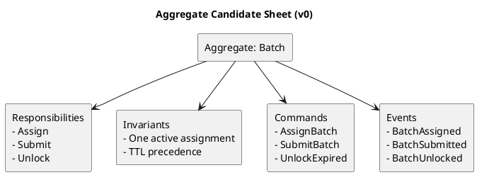
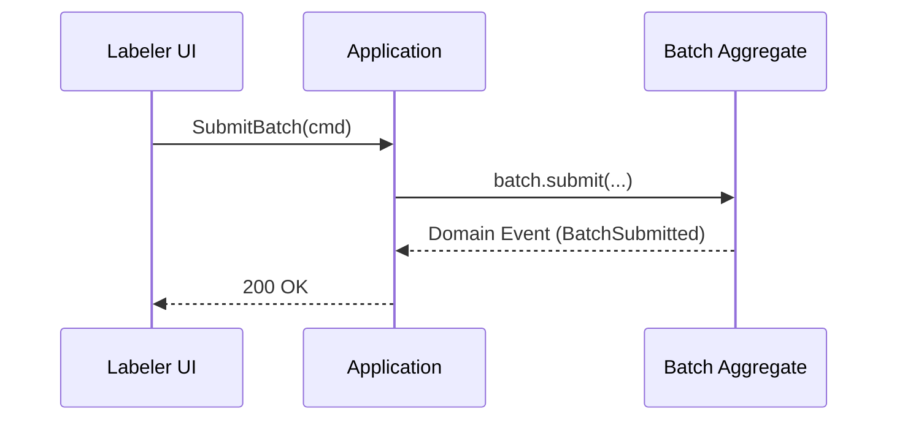

# Chương 11 — Design-level Event Storming: từ “event timeline” đến Aggregate, Invariant và Transaction Boundary

Big Picture (chương 9) giúp bạn nhìn thấy workflow; Process-level (chương 10) làm lộ actor/policy. Nhưng đến một lúc, team phải code. Và đây là điểm nhiều dự án “gãy” nhất: họ nhảy từ timeline sang code mà không có cầu nối đủ chắc, dẫn đến:

- Aggregate thiết kế theo bảng DB (join-driven), không theo invariant.
- Rule nằm rải rác ở controller/service, không có nơi “bảo vệ”.
- Event-driven trở thành “queue của CRUD” vì event không phản ánh domain change.
- Concurrency/idemponentcy không được nghĩ trước → bug production kiểu “rare but deadly”.

Design-level Event Storming tồn tại để làm cầu nối đó. Nó biến tri thức từ workshop thành **mô hình có thể triển khai**, đồng thời giữ đúng tinh thần DDD: bắt đầu từ domain, không bắt đầu từ schema.

Ví dụ xuyên suốt: ADLP theo Strategic Design v0.2 (`design/docs/2.StrategicDesign/DDD_STRATEGIC_DESIGN_V0.2.md`), tập trung vào 2 core contexts “đắt nhất” để minh họa:
- Task Assignment (batch lifecycle, lock TTL, routing)
- Quality Assurance (WER/agreement, review/escalation, accept/reject)

---

## Bạn sẽ nhận được gì sau chương này?

1) Hiểu rõ Design-level Event Storming khác gì so với Process-level (và vì sao không nên làm quá sớm).  
2) Biết một quy trình 60–120 phút để chạy Design-level cho một slice cụ thể.  
3) Biết cách chuyển **hotspots** thành **invariants** và **commands/events** cụ thể.  
4) Có template artefacts: command/event list, aggregate candidate sheet, invariant list, edge-case list.  
5) Có ví dụ ADLP “đi tới nơi”: Batch aggregate + QualityEvaluation aggregate + các command/event tương ứng.  
6) Có exercise có hướng dẫn để tự làm cho workflow của bạn.

---

## 1) Design-level Event Storming là gì (và nó không phải là gì)?

### 1.1 Nó là gì
Design-level Event Storming là workshop nhằm chốt ba thứ:

1) **Aggregate candidates** (những “cụm nhất quán” cần bảo vệ).  
2) **Invariants** (quy tắc phải luôn đúng) cho mỗi aggregate.  
3) **Commands/Events** (ai yêu cầu thay đổi gì → domain phản ứng ra sao).

Kết quả của nó là: bạn có thể nhìn vào artefacts và bắt tay viết code (use case handlers, domain methods, event publishing) mà ít phải “đoán”.

### 1.2 Nó không phải là…
- Thiết kế database schema chi tiết.
- Thiết kế kiến trúc network (service mesh, ALB…).
- Chốt luôn “REST hay Kafka”.

Những thứ đó thuộc system/detailed design. Design-level quan tâm đến: **giao dịch nào cần nhất quán, rule nào cần bảo vệ, và domain change nào cần phát event**.

> **NOTE**  
> Design-level không thay thế tactical design. Nó là “đường ray” để tactical design không trôi khỏi domain truth đã khám phá.

---

## 2) Khi nào bạn nên vào Design-level?

Bạn nên vào Design-level khi:
- Big Picture đã ổn (timeline không còn thiếu các bước lớn).
- Process-level đã lộ các policy trọng yếu (lock TTL, quality gate, escalation).
- Hotspots quan trọng đã có owner và ít nhất có hướng giải (hoặc đã ghi ADR).

Bạn **không nên** vào Design-level khi:
- Team vẫn tranh cãi nghĩa của “Accepted”.
- Chưa phân loại core/supporting/generic.
- Domain expert chưa xác nhận trade-off quan trọng (vd: threshold theo tier).

Với ADLP, Design-level phù hợp nhất khi bạn chọn một slice rõ ràng, ví dụ:
- Slice A: `PrelabelCompleted → BatchCreated → BatchAssigned` (Task Assignment core)
- Slice B: `BatchSubmitted → QualityEvaluated → (ReviewRequired|BatchAccepted)` (Quality core)

---

## 3) Artefacts tối thiểu của Design-level (để code không mơ hồ)

Đừng tham làm mọi thứ. Chỉ cần 4 artefacts là đủ để bắt đầu coding đúng:

1) **Aggregate candidate sheet**: tên aggregate + responsibilities + invariants.  
2) **Command/Event table**: command nào dẫn tới event nào (happy path + failure path).  
3) **Edge-cases list**: retries, duplicates, concurrency, timeouts, TTL expiry.  
4) **Consistency decisions**: cái gì strong consistency (trong aggregate), cái gì eventual (qua events).

Template cho glossary/event catalog đã có trong `design/docs/0.ref/DDDPractical/templates.md`. Chương này bổ sung cách dùng chúng ở design-level.

---

## 4) Quy trình chạy workshop Design-level (90 phút, dùng được ngay)

### Bước 0 — Chọn scope thật hẹp (5 phút)
Chọn một “mảnh” workflow có giá trị và có rủi ro domain cao. Ví dụ ADLP:
- “Assign batch với lock TTL và reassign”
hoặc
- “Evaluate quality và quyết định accept vs review”.

Nếu scope rộng (“từ upload đến export”), bạn sẽ không đi sâu đủ để chốt invariants.

### Bước 1 — Chọn 3–5 events trung tâm (10 phút)
Từ Big Picture, chọn events “đắt tiền” nhất.

Ví dụ slice B (Quality):
- `BatchSubmitted`
- `QualityEvaluated`
- `ReviewRequired`
- `BatchAccepted`

### Bước 2 — Lùi lại một nhịp: “điều gì thay đổi trong domain?” (10 phút)
Với mỗi event, hỏi:
- Trạng thái nào thay đổi?
- Ai sở hữu trạng thái đó?
- Rule nào chi phối trạng thái?

Nếu không trả lời được, đó là hotspot chưa giải.

### Bước 3 — Tạo aggregate candidates (20 phút)
Gom các thay đổi có liên quan chặt về consistency vào cùng aggregate. Tiêu chí gom không phải “cùng bảng DB”, mà là:
- cùng invariant,
- cần transaction chung để bảo vệ invariant,
- có một “root” chịu trách nhiệm quyết định.

Ở bước này, bạn nên nói thành câu: “Aggregate X bảo vệ rule Y”. Nếu không nói được thành câu, bạn chưa có aggregate đúng nghĩa.

### Bước 4 — Viết invariants trước, rồi mới viết commands (20 phút)
Đây là điểm khác biệt lớn nhất với “thiết kế theo CRUD”.

Hỏi: “Điều gì không được phép xảy ra?” (vì nếu xảy ra sẽ phá business).
Sau đó mới hỏi: “Command nào có thể làm thay đổi? Và domain phản ứng ra sao?”

### Bước 5 — Gắn edge-cases (15 phút)
Chọn 3 edge-cases hay gặp nhất (đúng kiểu production):
- duplicate events/commands,
- concurrent assign,
- TTL expiry đúng lúc submit.

Gắn vào aggregate/invariant để tránh “đến production mới nghĩ”.

### Bước 6 — Chốt output và action items (20 phút)
Kết thúc bằng:
- aggregate sheet v0,
- command/event table v0,
- edge-case list,
- danh sách câu hỏi chưa trả lời (hotspots) + owner.

> **WARNING**  
> Nếu workshop kết thúc mà invariants vẫn chưa viết được, bạn chưa sẵn sàng code slice đó. Bạn đang thiếu domain truth.

---

## 5) Ví dụ ADLP (Task Assignment): Batch aggregate “đúng nghĩa” trông thế nào?

### 5.1 Bài toán domain
Trong ADLP, Task Assignment phải đảm bảo fairness và chống tranh chấp:
- batch chỉ thuộc 1 labeler tại một thời điểm,
- lock TTL hết hạn phải unlock/reassign đúng,
- không được “double assign” khi hai labeler bấm cùng lúc,
- priority có thể thay đổi theo deadline/tier.

### 5.2 Candidate aggregates (gợi ý)
Bạn có thể có:
- `Batch` (aggregate root)
- `Assignment` (entity bên trong batch)

Bạn *không cần* biến Queue thành aggregate nếu queue chỉ là read model hoặc scheduler view; hãy để đó là system concern (có thể là projection).

### 5.3 Invariants (viết trước)
Một vài invariants “đắt”:

1) **One active assignment**: mỗi batch chỉ có 1 assignment active tại một thời điểm.  
2) **TTL lock**: nếu `locked_until < now` và chưa submit, batch phải trở lại trạng thái available (hoặc rework) theo policy.  
3) **Cannot submit if not assigned**: submission phải gắn với assignment hợp lệ.  
4) **Priority recalculation**: khi deadline/tier đổi, priority phải được tính lại (có thể eventual nếu không ảnh hưởng consistency).

### 5.4 Commands và events (happy path)

| Command | Aggregate | Điều kiện (tóm tắt) | Event(s) phát ra |
|---|---|---|---|
| `CreateBatch(segments, tier, deadline?)` | Batch | segments hợp lệ | `BatchCreated`, (optional) `BatchPrioritized` |
| `AssignBatch(labeler_id, ttl)` | Batch | batch available, labeler eligible | `BatchAssigned` |
| `UnlockExpired(now)` | Batch | `locked_until < now` và chưa submit | `BatchUnlocked` |
| `SubmitBatch(labeler_id, submission)` | Batch | có assignment active cho labeler | `BatchSubmitted` |

### 5.5 Edge-cases cần chốt ngay

1) **Concurrent assign**: hai labeler bấm “lấy việc” cùng lúc.  
Giải pháp domain-level: `AssignBatch` phải atomic theo transaction boundary của batch. Về kỹ thuật: optimistic lock/version hoặc DB row lock.

2) **TTL expiry vs submit race**: labeler submit đúng lúc TTL hết hạn.  
Giải pháp domain-level: define precedence rule. Ví dụ: nếu submit đến trước khi unlock commit, submit thắng; nếu unlock commit trước, submit bị reject và phải reassign. Điều này phải được nói rõ để tránh tranh chấp.

3) **Duplicate command/event**: UI retry submit.  
Giải pháp: idempotency key cho submission; `BatchSubmitted` phải idempotent theo `(batch_id, assignment_id)` hoặc submission_id.

> **NOTE**  
> Design-level không bắt bạn chọn optimistic hay pessimistic lock. Nhưng nó bắt bạn chốt invariant và precedence rule. Kỹ thuật sẽ follow.

---

## 6) Ví dụ ADLP (Quality Assurance): QualityEvaluation aggregate trông thế nào?

### 6.1 Bài toán domain
Quality là core domain vì nó quyết định dataset có đáng tiền không. Nó phải:
- tính quality metrics (WER/agreement/bias),
- auto-flag anomalies,
- tạo review/escalation,
- ra quyết định accept/reject/rework,
- phát event để export/payout chạy đúng.

### 6.2 Candidate aggregates
Gợi ý:
- `QualityEvaluation` (aggregate root)
- `Review` (entity trong aggregate)
- `QualityScore` (value object)

### 6.3 Invariants (đặt rõ)

1) **Accepted implies exportable**: chỉ khi accepted mới export/payout.  
2) **Decision audit trail**: mọi review decision phải có audit trail (ai, khi nào, lý do).  
3) **Policy versioning**: decision phải gắn policy version (để giải thích “vì sao” về sau).  
4) **Review gating**: nếu overall_score < threshold hoặc anomaly detected → `ReviewRequired`.

### 6.4 Commands/events (happy path)

| Command | Aggregate | Điều kiện | Event(s) |
|---|---|---|---|
| `EvaluateQuality(batch_id, submission_id)` | QualityEvaluation | submission tồn tại | `QualityEvaluated`, (`ReviewRequired` or `BatchAccepted`) |
| `CreateReview(reason, level)` | QualityEvaluation | review policy match | `ReviewRequired` |
| `CompleteReview(decision, notes)` | QualityEvaluation | reviewer authorized | `ReviewCompleted`, (`BatchAccepted` or `BatchRejected`) |

### 6.5 Edge-cases cần chốt

1) **Re-evaluation**: policy đổi, có re-evaluate batch cũ không?  
Nếu có, event phải ghi policy_version mới và batch_version/submission_version.

2) **Duplicate evaluate**: worker retry.  
Idempotency theo `(batch_id, submission_id, policy_version)`.

3) **Human vs automation conflict**: auto-accept nhưng reviewer override?  
Chốt rule: manual decision luôn thắng, hay chỉ thắng ở level tertentu. Đây là domain policy, không phải kỹ thuật.

---

## 7) Trade-offs: “strong consistency ở đâu, eventual ở đâu?”

Một sai lầm phổ biến là cố gắng làm mọi thứ strong consistency xuyên nhiều context. DDD giúp bạn xác định:
- strong consistency trong aggregate (bảo vệ invariants),
- eventual consistency giữa contexts (qua events).

Ví dụ ADLP:
- “Batch chỉ assigned 1 labeler” → strong consistency trong `Batch` aggregate.
- “Quality quyết định payout” → eventual consistency: Quality phát `BatchAccepted`, Wallet nhận và credit.

Trade-off:
- Strong consistency xuyên context → distributed transaction (đắt, rủi ro).
- Eventual consistency → cần idempotency, retry, DLQ, observability.

Design-level workshop phải làm lộ trade-off này và ghi ADR khi cần.

---

## 8) Best practices (kèm giải thích)

### 8.1 Invariants trước, schema sau
Nếu bạn không viết được invariants, bạn không biết mình đang bảo vệ cái gì. Schema lúc đó chỉ là guess.

### 8.2 Commands và events phải “đúng nghĩa”
Command: “hãy làm”; Event: “đã xảy ra”. Lẫn lộn sẽ làm workflow khó hiểu và khó audit.

### 8.3 Chốt idempotency và concurrency sớm
Idempotency và concurrency không phải “chuyện kỹ thuật nhỏ”; nó quyết định bạn có tranh chấp/payout sai hay không.

### 8.4 Không cố model hết thế giới
Chọn 1–2 aggregates cho slice quan trọng nhất. Mô hình sẽ tiến hóa theo vòng lặp.

---

## 9) Anti-patterns (triệu chứng → hậu quả → cách tránh)

### 9.1 “Aggregate = bảng DB”
**Triệu chứng:** aggregate boundaries trùng với tables, rule nằm ở service.  
**Hậu quả:** invariants không được bảo vệ; concurrency bug.  
**Cách tránh:** bắt đầu từ invariants và transaction boundary.

### 9.2 “God Aggregate”
**Triệu chứng:** một aggregate chứa mọi thứ (Transcript+Payment+Assignment…).  
**Hậu quả:** lock contention, thay đổi nhỏ gây ripple, team không tách được ownership.  
**Cách tránh:** chia theo bounded context + invariants, không theo “đỡ phải join”.

### 9.3 “Event = log”
**Triệu chứng:** event tên mơ hồ, payload full row DB, không versioning.  
**Hậu quả:** consumer vỡ âm thầm; schema coupling.  
**Cách tránh:** event là published language; schema versioning; consumer tolerant.

---

## 10) Exercise có hướng dẫn (45–60 phút): làm Design-level cho một slice ADLP

Mục tiêu: bạn tự làm được, không cần “đoán”.

### Bước 1: Chọn slice
Chọn slice B (Quality): `BatchSubmitted → QualityEvaluated → (ReviewRequired|BatchAccepted)`.

### Bước 2: Viết 3 invariants “đắt nhất”
Gợi ý:
1) accepted mới export/payout  
2) review decision có audit trail  
3) policy_version được ghi kèm decision

### Bước 3: Đặt candidate aggregate
Chọn `QualityEvaluation` làm aggregate root. Ghi responsibilities và state.

### Bước 4: Viết command/event table
Viết 2 commands: `EvaluateQuality`, `CompleteReview` và events tương ứng.

### Bước 5: Gắn 2 edge-cases
Chọn “duplicate evaluate” và “manual override”.

### Đáp án tham khảo (rút gọn)
- Aggregate: `QualityEvaluation`  
- Commands: `EvaluateQuality(batch_id, submission_id)`, `CompleteReview(decision)`  
- Events: `QualityEvaluated`, `ReviewRequired`, `BatchAccepted`  
- Idempotency: `(batch_id, submission_id, policy_version)`

**Câu hỏi tự kiểm**
1) Invariant có chỗ “bảo vệ” không? (aggregate boundary)  
2) Event có “ý nghĩa business” không?  
3) Nếu command retry 2 lần, hệ thống có an toàn không?  

---

## 11) Artefacts/Deliverables sau chương này

- 1–2 aggregate candidate sheets (v0) cho slice quan trọng nhất.
- Command/Event table cho happy path + failure path.
- Edge-case list (retries/duplicates/concurrency) + idempotency keys.
- Danh sách câu hỏi còn mở (hotspots) + owner để follow-up/ADR.

---

## Checklist (dùng ngay)

> **CHECKLIST**
> - [ ] Bạn chọn đúng slice (1 context + 1 luồng), không ôm cả hệ thống  
> - [ ] Aggregate candidate có responsibilities + 2–5 invariants viết được thành câu  
> - [ ] Command/Event table có cả failure path (lock conflict, TTL expiry, duplicate submit…)  
> - [ ] Idempotency keys và concurrency rules được chốt sớm (không để “lúc code tính”)  
> - [ ] Kết quả design-level đủ để đi tactical/implement (không phải diagram cho đẹp)  
