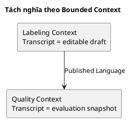
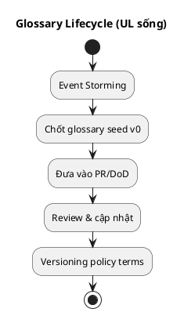

# Chương 12 — Chốt Ubiquitous Language: “ngôn ngữ là kiến trúc”

Nếu phải chọn một “đòn bẩy” có ROI cao nhất trong DDD, mình sẽ chọn Ubiquitous Language. Lý do rất đơn giản: phần lớn thất bại của hệ thống business không đến từ code sai cú pháp, mà đến từ **khái niệm sai**. Và khái niệm sai thường bắt đầu bằng… **từ ngữ sai**.

Trong ADLP, chỉ cần bạn dùng sai 2 từ — “Submitted” và “Accepted” — là bạn sẽ sai payout, sai export, sai SLA, và tạo tranh chấp. Chương này giúp bạn biến ngôn ngữ thành tài sản: chốt nghĩa, tách nghĩa theo context, và giữ glossary “sống” khi hệ thống tiến hóa.

---

## Bạn sẽ nhận được gì sau chương này?

1) Hiểu Ubiquitous Language là gì (và vì sao nó là kiến trúc, không phải tài liệu).  
2) Biết cách “chốt nghĩa” từ Event Storming và từ hotspots.  
3) Biết cách xử lý đồng nghĩa/đa nghĩa và tách nghĩa theo bounded context.  
4) Có một glossary seed mẫu cho ADLP (đủ để dùng ngay).  
5) Có quy trình vận hành glossary (ownership, review, PR rules) để nó không chết.  
6) Có exercise có hướng dẫn: xây glossary seed 20 thuật ngữ cho workflow của bạn.

---

## 1) Ubiquitous Language là gì?

Ubiquitous Language (UL) là ngôn ngữ chung giữa domain experts và dev, được phản ánh trực tiếp trong:
- cách bạn đặt tên event,
- cách bạn đặt tên aggregate/entity/value object,
- cách bạn đặt tên API contracts và field,
- cách bạn nói về domain trong review và incident.

Điểm quan trọng: UL không phải “từ điển cho vui”. UL là một phần của thiết kế. Khi UL đúng, model dễ đúng; khi UL sai, model gần như chắc chắn sai.

> **NOTE**  
> UL không phải một lần làm xong. Nó là một tài sản “sống”: càng dùng, càng tinh.

---

## 2) Vì sao ngôn ngữ quyết định kiến trúc?

Ngôn ngữ quyết định kiến trúc theo 3 cách:

### 2.1 Nó định hình boundaries
Nếu cùng một từ có hai nghĩa, bạn có hai lựa chọn:
- ép mọi nơi dùng một nghĩa → overload model → coupling tăng,
- hoặc tách nghĩa theo bounded context → boundaries rõ hơn.

Ví dụ ADLP:
- “Transcript” trong Labeling (đang edit, versioning) vs trong Quality (để evaluate, audit).

### 2.2 Nó định hình events và workflow
Nếu event tên mơ hồ (`batch.updated`), consumer không biết phải làm gì. Nếu event rõ nghĩa (`BatchAccepted`), workflow trở nên rõ.

### 2.3 Nó định hình invariants
Invariant là rule phải luôn đúng. Nhưng để viết invariant, bạn phải có ngôn ngữ rõ. “Accepted” phải nghĩa là gì thì bạn mới viết được rule “export chỉ lấy accepted”.

---

## 3) Các kiểu vấn đề ngôn ngữ (và cách xử lý)

### 3.1 Đồng nghĩa (synonyms)
Hai từ khác nhau nhưng cùng nghĩa. Ví dụ: “approve” vs “accept”.  
Giải pháp: chọn một từ chính thức, các từ khác đưa vào “deprecated synonyms”.

### 3.2 Đa nghĩa (polysemy)
Một từ nhưng nhiều nghĩa theo context. Ví dụ: “task” có thể là segment hoặc batch.  
Giải pháp: tách nghĩa theo bounded context (và tốt nhất đổi từ).

### 3.3 Từ kỹ thuật lấn át từ domain
Dev hay nói “job”, “process”, “handler”. Domain expert nói “batch”, “review”, “escalation”.  
Giải pháp: ưu tiên ngôn ngữ business trong domain layer; kỹ thuật là infrastructure layer.

---

## 4) Cách xây UL từ Event Storming (quy trình thực dụng)

### Bước 1: UL xuất phát từ event names
Event names là chỗ UL “lộ ra” rõ nhất vì nó buộc bạn gọi tên sự kiện. Khi event name gây tranh cãi, đó là dấu hiệu từ ngữ chưa chốt.

### Bước 2: Mọi hotspot đều phải đi kèm “định nghĩa từ”
Nếu hotspot là “Accepted nghĩa là gì?”, bạn không được chỉ ghi “hotspot”. Bạn phải biến nó thành:
- định nghĩa UL,
- policy owner,
- policy versioning.

### Bước 3: Tách UL theo bounded context khi cần
Nếu một term bị overload, bạn quyết định:
- split theo context, hoặc
- rename để tránh nhầm.

Ví dụ: thay vì “Task”, dùng “SegmentTask” (unit of work) và “Batch” (assignment unit).

### Bước 4: Đưa UL vào code review rules
UL chỉ sống khi nó đi vào:
- naming conventions,
- API/event schema,
- PR review checklist.

---

## 5) Glossary seed mẫu cho ADLP (v0, dùng ngay)

Bạn có thể copy bảng này và mở rộng dần. Template chuẩn nằm trong `design/docs/0.ref/DDDPractical/templates.md`.

| Term | Định nghĩa 1–2 câu | Ví dụ đúng | Ví dụ sai | Owner context |
|---|---|---|---|---|
| Segment | Đoạn audio có start/end; đơn vị nhỏ để transcribe và evaluate. | “Segment 10s, confidence 0.82.” | “Segment = batch.” | Prelabeling / Labeling |
| Prelabel | Kết quả AI gợi ý ban đầu cho segment (text + confidence). | “Prelabel giúp labeler sửa nhanh.” | “Prelabel = nhãn cuối.” | Prelabeling |
| Confidence | Mức chắc chắn của model prelabel; không phải quality score. | “avg_confidence=0.9.” | “confidence = quality.” | Prelabeling |
| Batch | Nhóm segments được phân công như một đơn vị công việc; có lock TTL và lifecycle. | “Batch A assigned đến 14:00.” | “Batch = 1 segment.” | Task Assignment |
| Lock TTL | Thời hạn giữ batch cho một labeler; hết hạn thì unlock/reassign theo policy. | “TTL=4h, hết hạn reassign.” | “TTL chỉ là cron job.” | Task Assignment |
| Submitted | Labeler đã nộp kết quả chỉnh sửa; chưa qua quality gate. | “BatchSubmitted → QualityEvaluated.” | “Submitted = Accepted.” | Labeling |
| Accepted | Batch qua quality policy (và review nếu cần) → exportable/payoutable. | “BatchAccepted → Exportable.” | “Accepted do UI.” | Quality Assurance |
| Review | Hoạt động human-in-the-loop để quyết định accept/reject khi bị flag. | “ReviewRequired → ReviewCompleted.” | “Review = autosave.” | Quality Assurance |
| Escalation | Nâng cấp review lên cấp cao hơn khi rủi ro cao hoặc dispute. | “Level2 review within 24h.” | “Escalation = retry.” | Quality Assurance |
| QualityScore | Điểm chất lượng tổng hợp (WER/agreement/…) theo policy version. | “score=0.87 (policy v3).” | “score=confidence.” | Quality Assurance |
| Tier (Premium/Standard) | Mức chất lượng/giá; quyết định threshold và SLA. | “Premium requires agreement>0.9.” | “Tier chỉ là tag.” | Marketplace/Quality |
| Exportable | Trạng thái dữ liệu đủ điều kiện export. | “Only accepted is exportable.” | “Submitted is exportable.” | Dataset Export |
| Dataset Version | Snapshot dataset tại thời điểm; phục vụ reproducibility/audit. | “Dataset v12 generated.” | “Dataset không version.” | Dataset Export |
| Payout | Ghi nhận thu nhập cho labeler theo batch accepted. | “BatchAccepted triggers credit.” | “Submit triggers payout.” | Wallet & Payment |
| Audit Trail | Dấu vết bất biến: ai làm gì, khi nào, vì sao. | “review decision logged.” | “no log.” | Cross-cutting |

> **NOTE**  
> Nếu bạn chốt được 10–20 thuật ngữ “đắt tiền” như bảng trên, bạn sẽ giảm rất mạnh tranh luận và giảm khả năng sai domain.

---

## 6) Vận hành UL: làm sao để glossary không chết?

Glossary chết vì không ai có trách nhiệm và không ai dùng nó. Bạn cần 3 cơ chế:

### 6.1 Ownership
Mỗi term có owner context. Owner context chịu trách nhiệm đổi nghĩa (nếu cần) và công bố thay đổi.

### 6.2 Review process
Thay đổi UL phải đi qua review giống như thay đổi API:
- PR sửa glossary,
- nêu lý do (hotspot/incident),
- chỉ ra impacts (event schema, API contracts, code names).

### 6.3 “Definition of Done” cho PR domain
Một PR thêm feature domain phải:
- thêm/đổi term trong glossary nếu xuất hiện thuật ngữ mới,
- dùng đúng term trong event/API/code,
- cập nhật ADR nếu có trade-off mới.

> **BEST PRACTICE**  
> UL phải xuất hiện trong code review. Nếu không, nó là tài liệu chết.

Điểm thực dụng ở đây là: **glossary là contract nội bộ**. Khi bạn thay đổi một term “đắt tiền”, bạn đang thay đổi cách team hiểu và triển khai workflow, nên cần versioning và review như API.

---

## 7) Trade-offs: chốt nghĩa sớm vs để linh hoạt

Chốt nghĩa sớm giúp giảm sai domain và giảm tranh luận. Nhưng chốt quá cứng có thể làm bạn khó tiến hóa khi domain hiểu rõ hơn.

Giải pháp thực dụng:
- chốt UL ở mức “đủ dùng” (v0),
- versioning policy/definitions (đặc biệt cho QualityScore/threshold),
- ghi ADR khi đổi nghĩa có impact lớn (ví dụ thay đổi định nghĩa Accepted).

---

## 8) Anti-patterns về ngôn ngữ

### 8.1 “Một từ cho mọi thứ”
**Triệu chứng:** dùng “task” cho segment lẫn batch, dùng “approved” cho review lẫn quality.  
**Hậu quả:** model overload, coupling tăng.  
**Cách tránh:** tách nghĩa theo context hoặc rename.

### 8.2 “Glossary làm một lần rồi bỏ”
**Triệu chứng:** có file glossary nhưng không ai cập nhật, code dùng từ khác.  
**Hậu quả:** glossary trở thành rác; onboarding chậm; tranh luận lặp.  
**Cách tránh:** đưa glossary vào PR/DoD.

### 8.3 “Ngôn ngữ kỹ thuật lấn át”
**Triệu chứng:** domain layer dùng từ kỹ thuật (job, process) thay vì business (batch, review).  
**Hậu quả:** domain expert không đọc được; model lệch.  
**Cách tránh:** domain terms phải là ngôn ngữ chính trong domain layer.

---

## 9) Exercise có hướng dẫn (45 phút): xây glossary seed 20 thuật ngữ

### Bước 1: Chọn workflow
Chọn workflow “premium order 48h”.

### Bước 2: Liệt kê 20 từ xuất hiện khi kể câu chuyện
Ví dụ: upload, segment, prelabel, confidence, batch, lock, TTL, submit, accept, review, escalation, quality, tier, export, payout…

### Bước 3: Điền bảng glossary seed
Với mỗi term, điền:
- định nghĩa 1–2 câu,
- ví dụ đúng/sai,
- owner context.

### Bước 4: Gắn 5 terms “đắt tiền”
Chọn 5 terms có hậu quả lớn nếu hiểu sai: Submitted, Accepted, Confidence, QualityScore, Lock TTL.

### Đáp án tham khảo
Dùng bảng glossary seed mẫu của ADLP ở mục 5 và mở rộng thêm 5–10 dòng.

**Câu hỏi tự kiểm**
1) Term nào đang bị overload? (một từ nhiều nghĩa)  
2) Term nào cần policy versioning? (QualityScore, threshold, tier)  
3) Owner context của term có rõ không?  

---

## 10) Artefacts/Deliverables sau chương này

- Glossary seed 20–40 terms (v0) với owner context.  
- Danh sách 5 terms “đắt tiền” cần bảo vệ nghĩa và gắn vào PR review.  
- Danh sách hotspots về ngôn ngữ (từ nào mơ hồ/đa nghĩa cần tách).  

---

## Checklist (dùng ngay)

> **CHECKLIST**
> - [ ] Mỗi thuật ngữ đắt tiền có định nghĩa 1–2 câu + ví dụ đúng/sai  
> - [ ] Mỗi thuật ngữ có owner context (để “đóng nghĩa” theo ranh giới)  
> - [ ] Các từ đồng nghĩa/đa nghĩa được tách entry (không để “ai hiểu sao cũng được”)  
> - [ ] 5 thuật ngữ đắt tiền nhất được đưa vào code review (cảnh báo khi dùng sai)  
> - [ ] Glossary được coi là tài sản sống: có người cập nhật định kỳ (continuous discovery)  
