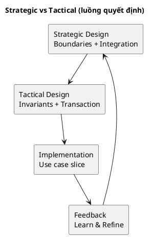
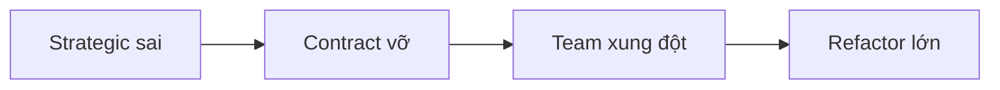

# Chương 13 — Strategic vs Tactical: biết dừng đúng chỗ, biết đi sâu đúng lúc

Nếu Event Storming là cách bạn “nhìn thấy sự thật nghiệp vụ”, thì Strategic Design là cách bạn **chốt ranh giới và quan hệ** để hệ thống không tự biến thành một mớ coupling. Và Tactical Design là cách bạn **bảo vệ rule** bằng mô hình nhất quán để code không bị rò rỉ nghiệp vụ.

Vấn đề là: nhiều team nhầm lẫn hai thứ này. Họ đi vào tactical quá sớm (vẽ aggregate trước khi chốt bounded context), hoặc họ dừng ở strategic quá lâu (vẽ context map đẹp nhưng không bao giờ đi tới code). Cả hai đều làm dự án chậm, và vẫn có thể sai domain.

Chương này giúp bạn trả lời 3 câu hỏi thực dụng:
1) Strategic và Tactical khác nhau ở điểm nào (theo “quyết định đắt tiền”)?
2) Khi nào nên dừng ở strategic, khi nào phải đi sâu tactical?
3) Với ADLP, bạn nên đầu tư tactical sâu ở đâu, và nên “DDD-lite” ở đâu?

---

## Bạn sẽ nhận được gì sau chương này?

1) Một “mental model” rõ ràng: strategic quyết định **boundaries + integration**, tactical quyết định **invariants + transaction boundaries**.  
2) Dấu hiệu nhận biết bạn đang làm sai pha (đang tactical khi strategic chưa ổn, hoặc ngược lại).  
3) Trade-offs: cái giá của việc chốt sai boundary so với chốt sai aggregate.  
4) Best practices để đi theo vòng lặp đúng: strategic đủ → tactical đủ → implement slice → feedback.  
5) Áp dụng vào ADLP: vì sao Quality/Assignment cần tactical sâu, còn Identity/Auth có thể không.  
6) Exercise có hướng dẫn để tự đánh giá dự án của bạn.

---

## 1) Một câu chuyện thật: “vẽ aggregate đẹp, rồi vẫn vỡ”

Hãy tưởng tượng team bắt đầu ADLP và rất hứng thú với tactical DDD. Họ vẽ ra:
- Aggregate `Transcript` (versioning),
- Aggregate `Batch` (assignment),
- Aggregate `Payment` (payout),
và họ gắn mọi thứ vào nhau để “đảm bảo nhất quán”.

Sau 2 sprint, họ có một domain model khá “đẹp”. Nhưng khi bắt đầu chia service và làm integration, mọi thứ đổ:
- Labeling muốn update transcript nhanh và autosave liên tục.
- Quality muốn tính WER/agreement và có review flow, cần audit trail.
- Payment muốn credit payout khi accepted.

Và rồi `Transcript` aggregate trở thành một con “God Aggregate”: ai cũng cần nó, ai cũng sửa nó, và mọi thay đổi đều gây ripple.

Gốc rễ: team đi vào tactical trước khi chốt strategic. Họ chưa tách được:
- Transcript semantics trong Labeling vs Quality,
- Và họ chưa chốt context map: ai upstream, ai downstream, coupling pattern là gì.

Strategic sai → tactical đẹp vẫn vỡ.

---

## 2) Strategic Design là gì (theo cách “đắt tiền”)

Strategic Design là tập các quyết định ở mức hệ thống mà chi phí thay đổi rất cao về sau. Nó trả lời:

1) Hệ thống gồm những **Bounded Contexts** nào (ngôn ngữ + trách nhiệm)?  
2) Quan hệ giữa contexts là gì (**Context Map**): upstream/downstream, partnership, ACL…?  
3) Mô hình tích hợp (events/REST) và “published language” tối thiểu?  
4) Ownership: team nào chịu trách nhiệm context nào?  

Bạn có thể thay DB, thay framework; nhưng nếu bạn chốt sai bounded context và context relationships, bạn sẽ trả giá bằng:
- schema và contracts vỡ liên tục,
- distributed transactions,
- tổ chức team xung đột,
- và “đổi nhỏ thành đổi lớn”.

Trong ADLP Strategic Design v0.2, quyết định chiến lược rất rõ:
- 9 bounded contexts,
- event-driven integration chủ đạo,
- shared kernel tối thiểu,
- ACL cho hệ thống ngoài.

Đó là strategic.

---

## 3) Tactical Design là gì (theo cách “bảo vệ invariants”)

Tactical Design là cách bạn biến domain truth thành mô hình có thể triển khai:
- Aggregate boundaries (transaction boundaries),
- Entities / Value Objects,
- Domain Services,
- Domain Events,
- Consistency model (strong vs eventual).

Tactical quyết định “chúng ta bảo vệ rule ở đâu?”.

Ví dụ ADLP:
- “một batch chỉ assigned một labeler tại một thời điểm” → invariant của `Batch` aggregate (Task Assignment).
- “accepted mới export/payout” → invariant/policy ở Quality, phát event `BatchAccepted` cho Export/Wallet.

Bạn có thể làm strategic hoàn hảo mà tactical yếu (rule rải rác), thì hệ thống vẫn sai. Nhưng tactical chỉ có ý nghĩa khi strategic đã xác định đúng ranh giới.

---

## 4) Strategic vs Tactical: bảng so sánh (để không nhầm)

| Tiêu chí | Strategic | Tactical |
|---|---|---|
| Trả lời câu hỏi | “Chia hệ thống thế nào?” | “Bảo vệ rule thế nào?” |
| Đơn vị chính | Bounded Context + Context Map | Aggregate + Invariants |
| Artefacts | BC catalog, context map, UL per context, ADRs | aggregates, commands/events, consistency decisions |
| Sai thì sao? | Coupling hệ thống, khó tách team | Rule rò rỉ, concurrency bug, logic sai |
| Khi nào làm? | Sau discovery + big picture | Sau strategic ổn và process/design-level đủ |

---

## 5) Khi nào nên dừng ở strategic? Khi nào phải đi sâu tactical?

### 5.1 Dấu hiệu strategic “đủ” để đi tiếp
- Bạn có thể mô tả 1 workflow đắt tiền bằng 10–20 events (big picture).
- Bạn biết events nào thuộc context nào (owner).
- Bạn có context map sơ bộ (ai upstream/downstream).
- Hotspots lớn đã có owner và hướng giải (hoặc ADR).

### 5.2 Dấu hiệu bạn đang tactical quá sớm
- Team vẫn tranh luận “Accepted nghĩa là gì”.
- Bạn chưa chốt thuật ngữ, nhưng đã vẽ aggregates.
- Bạn chưa biết context boundaries, nhưng đã định nghĩa repository cho mọi thứ.

### 5.3 Dấu hiệu bạn đang “kẹt ở strategic”
- Bạn có sơ đồ đẹp nhưng không có slice nào được implement.
- Hotspots không có owner, không có action items.
- Không có “definition of done” cho decisions.

> **BEST PRACTICE**  
> Chốt strategic đủ để implement một slice. Implement slice. Feedback. Rồi refine strategic/tactical. DDD thực dụng là vòng lặp, không phải milestone.

---

## 6) Trade-offs: sai ở strategic vs sai ở tactical

### 6.1 Sai strategic thường đắt hơn
Sai bounded context khiến mọi thứ downstream sai: schema, API, event contracts, team ownership. Chỉnh lại thường là “tái cấu trúc tổ chức”.

### 6.2 Sai tactical vẫn đắt nhưng sửa “cục bộ” hơn
Sai aggregate boundary gây concurrency bug hoặc rule rò rỉ. Sửa khó, nhưng thường nằm trong một context. Dĩ nhiên, nếu bạn đã build data history lớn, migrations vẫn đau.

Kết luận thực dụng:
- Đầu tư strategic trước để giảm blast radius.
- Rồi tactical sâu ở core domains để giữ đúng business.

---

## 7) Áp dụng vào ADLP: tactical sâu ở đâu, tactical-lite ở đâu?

Theo Strategic Design v0.2:
- **Core domains:** Prelabeling, Task Assignment, Quality Assurance.
- **Generic:** Identity & Access, Notification (và nhiều phần infra).

Thực dụng:
- Tactical sâu ở **Task Assignment** (locking, TTL, fairness) và **Quality** (policy versioning, review/escalation, audit trail).
- Tactical vừa ở Prelabeling (model versioning, confidence, segmentation).
- Tactical-lite ở Identity/Auth (đừng tự invent RBAC nếu không có yêu cầu đặc thù).

> **EXAMPLE**  
> “BatchAccepted triggers payout” là domain policy. Nó thuộc Quality context và phải được bảo vệ bằng event + idempotency ở consumer. Đây là tactical + integration decision, không thể chỉ là “if” trong controller.

---

## 8) Best practices (kèm giải thích)

### 8.1 Chốt “định nghĩa đắt tiền” trước khi vẽ aggregate
Các từ như Accepted/Submitted/Confidence/QualityScore nếu chưa chốt nghĩa, tactical sẽ sai.

### 8.2 Strategic output phải “đi được” sang code
Context map phải dẫn tới câu trả lời: event nào publish, payload tối thiểu là gì, ai consume, idempotency ra sao.

### 8.3 Tactical bắt đầu từ invariants, không bắt đầu từ tables
Nếu bắt đầu từ tables, bạn sẽ vô thức làm join-driven design.

### 8.4 DDD là vòng lặp theo slice
Bạn không cần tactical hoàn hảo cho toàn hệ thống trước khi code. Bạn cần tactical đủ cho 1–2 slice core nhất.

---

## 9) Anti-patterns

### 9.1 “Strategic đồ chơi”
Sơ đồ đẹp, không có owner, không có contracts, không có ADR. Kết quả: tuần sau tranh luận lại từ đầu.

### 9.2 “Tactical cosplay”
Nhiều class, nhiều layer, nhưng invariants không có nơi bảo vệ. Rule nằm ở service/controller.

### 9.3 “One model for all”
Một model Transcript dùng cho Labeling lẫn Quality lẫn Export. Đây là con đường nhanh nhất tới coupling.

---

## 10) Exercise có hướng dẫn (30–45 phút): xác định mức strategic/tactical cho dự án của bạn

### Bước 1: Chọn workflow đắt tiền
Viết 1 câu “ai muốn gì, deadline gì, quality gì”.

### Bước 2: Viết 10 events big picture
Nếu không viết nổi 10 events, bạn đang thiếu discovery hoặc scope sai.

### Bước 3: Chọn 2 hotspots và biến thành câu hỏi
Ví dụ: “Accepted nghĩa là gì?”, “TTL precedence ra sao?”.

### Bước 4: Chọn 1 context core và viết 2 invariants
Chỉ 1 context. Viết 2 invariants “nếu sai là toang”.

### Đáp án tham khảo (ADLP)
- Workflow: premium order 48h  
- Hotspots: accept definition, lock TTL  
- Core context: Task Assignment  
- Invariants: one active assignment; TTL unlock/reassign rules

---

## 11) Artefacts/Deliverables sau chương này

- “Decision map”: strategic decisions vs tactical decisions cho workflow đắt tiền.
- Danh sách 5 “định nghĩa đắt tiền” cần chốt UL.
- Danh sách 2–3 contexts cần tactical sâu.
- Kế hoạch slice đầu tiên để implement (tactical đủ để code).

---

## Checklist (dùng ngay)

> **CHECKLIST**
> - [ ] Bạn chốt được “điểm dừng” của workshop để đi strategic (không vẽ tactical quá sớm)  
> - [ ] Bạn có context map v0 cho workflow đắt tiền (coupling thật nằm ở integration)  
> - [ ] Bạn biết context nào cần tactical sâu (core) và context nào tactical-lite (generic)  
> - [ ] Bạn chốt được 3 quyết định đắt tiền cần ADR (integration, SLO/NFR, data ownership)  
> - [ ] Bạn có 1 slice implement đầu tiên để kiểm chứng model (ship nhỏ, học nhanh)  
