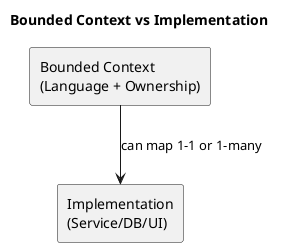
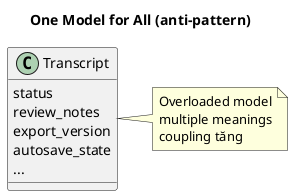
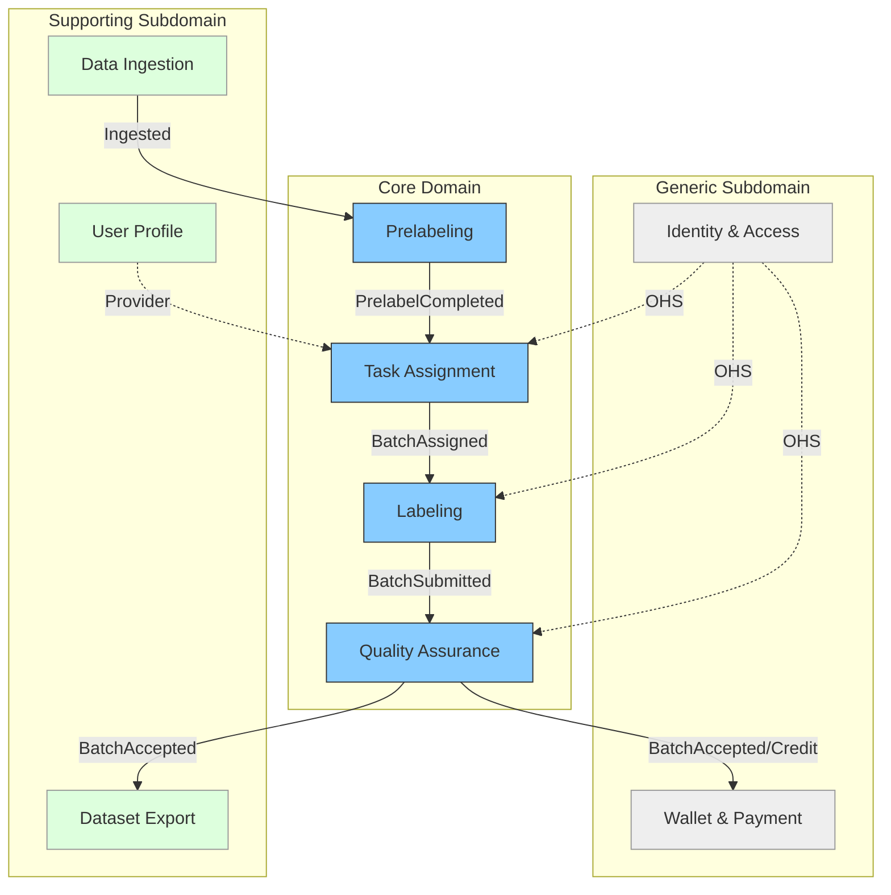

# Chương 14 — Bounded Context: chia hệ thống đúng cách (và tránh “một model cho tất cả”)

Bạn có thể có code sạch, test tốt, infra mạnh, nhưng nếu bạn chia hệ thống sai ranh giới, bạn vẫn sẽ tạo ra một “cục nợ”: coupling tăng, thay đổi nhỏ thành thay đổi lớn, và team không thể làm việc độc lập.

Bounded Context (BC) là khái niệm trung tâm của Strategic Design. Nó trả lời một câu hỏi tưởng đơn giản nhưng cực đắt:

> “Trong phạm vi nào thì một từ/khái niệm có nghĩa nhất quán?”

Nếu bạn không tách BC, bạn sẽ bị “một model cho tất cả”. Khi một model phải phục vụ nhiều ngữ cảnh, nó sẽ bị overload: field chồng chất, trạng thái chồng chất, rules chồng chéo — và cuối cùng bạn có một hệ thống mà không ai dám sửa.

Trong ADLP, chỉ cần bạn không tách rõ Labeling và Quality thì “Transcript” sẽ trở thành một God Aggregate: ai cũng sửa, ai cũng cần, và mọi thay đổi đều có blast radius lớn.

---

## Bạn sẽ nhận được gì sau chương này?

1) Hiểu BC là ranh giới của ngôn ngữ + trách nhiệm (không phải DB/service).  
2) Bộ tiêu chí thực dụng để tìm BC từ Event Storming và từ core/supporting/generic.  
3) Dấu hiệu BC tốt / BC xấu, và anti-patterns khi chia BC.  
4) Trade-offs: chia nhiều BC vs ít BC; modular monolith vs microservices.  
5) Áp dụng vào ADLP: vì sao 9 BC trong Strategic Design v0.2 hợp lý, và chỗ nào cần chú ý để tránh coupling.  
6) Exercise có hướng dẫn để bạn tự đề xuất BC cho workflow của mình.

---

## 1) BC là gì (và vì sao nó không phải là service/database)?

Bounded Context là nơi một mô hình domain có nghĩa nhất quán. BC gồm:
- vocabulary (UL) trong phạm vi đó,
- rules/invariants áp dụng trong phạm vi đó,
- ownership (ai chịu trách nhiệm),
- và boundary để tránh “leak” nghĩa ra ngoài.

BC **không đồng nghĩa** với:
- một database,
- một microservice,
- một UI module,
- một folder trong repo.

Service/DB/UI là cách bạn triển khai. BC là cách bạn tổ chức ngôn ngữ và trách nhiệm.

> **NOTE**  
> BC trả lời “ai sở hữu sự thật của khái niệm này?”. Nếu không trả lời được, BC chưa rõ.

---

## 2) Vì sao “một model cho tất cả” là con đường nhanh nhất tới coupling?

Một model dùng cho mọi nơi thường bắt đầu rất đẹp: “tái sử dụng”, “đỡ trùng lặp”. Nhưng nó nhanh chóng trở thành bãi chiến trường, vì cùng một từ thường có nghĩa khác nhau theo ngữ cảnh.

Ví dụ ADLP:
- “Transcript” trong Labeling: thứ labeler edit, autosave, versioning liên tục.
- “Transcript” trong Quality: đối tượng để evaluate quality, audit, review decisions.
- “Transcript” trong Export: snapshot đã accepted, immutable, có dataset version.

Nếu bạn cố dùng 1 model Transcript:
- bạn sẽ phải thêm field “status”, “review_notes”, “export_version”, “autosave_state”…,
- bạn sẽ phải thêm logic “nếu đang review thì …, nếu đang autosave thì …”.

Đó là overloaded model. Và overloaded model là coupling dưới dạng “class”.

BC giúp bạn chấp nhận một sự thật: **có thể trùng tên, nhưng không trùng nghĩa**; hoặc **không trùng tên để tránh trùng nghĩa**.

---

## 3) Tiêu chí tìm BC (thực dụng)

Bạn có thể tìm BC từ 3 nguồn: Event Storming, Subdomain classification, và Organization/team.

### 3.1 Từ Event Storming: cụm events + hotspots
Khi bạn nhìn timeline:
- các cụm events thường thuộc cùng một “năng lực” (capability),
- hotspots thường xuất hiện ở ranh giới giao tiếp.

Ví dụ ADLP:
- `QualityEvaluated`, `ReviewRequired`, `BatchAccepted` cụm lại → Quality capability.
- `BatchAssigned`, `BatchUnlocked` cụm lại → Assignment capability.

### 3.2 Từ Subdomain: core/supporting/generic
Core domains thường là BC riêng vì:
- cần đầu tư sâu,
- thay đổi nhanh,
- không muốn bị kéo chậm bởi generic.

Trong ADLP, Quality và Assignment là core → tách BC riêng là hợp lý.

### 3.3 Từ ownership/team (Conway’s Law)
Team ownership không phải là lý do duy nhất, nhưng là tín hiệu mạnh:
- nếu hai nhóm thay đổi vì hai lý do khác nhau, nhiều khả năng bạn có hai BC.

---

## 4) Dấu hiệu BC tốt vs BC xấu

### 4.1 BC tốt
- Ngôn ngữ rõ và nhất quán trong phạm vi.
- Có owner chịu trách nhiệm model và policy.
- Rule/invariant tập trung, không rải rác.
- Integration với BC khác có contract rõ (events/API), không join DB.

### 4.2 BC xấu
- Tên gọi mơ hồ, nhiều nghĩa trong cùng phạm vi.
- “Ai cũng sửa được” hoặc “không ai sở hữu”.
- Mô hình tăng field vô hạn vì phải phục vụ nhiều use cases.
- Bị chia theo DB/UI/CRUD (anti-pattern).

---

## 5) Trade-offs: chia nhiều BC hay ít BC?

### 5.1 Nhiều BC
**Ưu:** ownership rõ, giảm coupling nghĩa, dễ tách team/microservice, giảm blast radius.  
**Nhược:** integration cost tăng (events/contracts/versioning), eventual consistency xuất hiện nhiều hơn.

### 5.2 Ít BC
**Ưu:** đơn giản hóa integration, ship nhanh ban đầu.  
**Nhược:** model overload, rule rò rỉ, thay đổi nhỏ kéo theo ripple effects.

Thực dụng:
- Bắt đầu bằng số BC “đủ rõ” theo core domains, giữ modular monolith nếu cần.
- Khi scaling/ownership rõ, tách deploy.

---

## 6) Anti-patterns khi chia BC

### 6.1 Chia theo database
“BC là vì nó có DB riêng” là suy luận ngược. DB per service là kỹ thuật triển khai; BC là ngôn ngữ/trách nhiệm.

### 6.2 Chia theo UI
UI không phải ranh giới domain. UI có thể ghép nhiều BC để phục vụ người dùng.

### 6.3 Chia theo CRUD
Nếu bạn chia BC theo entity CRUD (User/Task/Batch), bạn sẽ tạo ra “entity services” và coupling ở workflow.

### 6.4 Shared model xuyên BC
Nếu nhiều BC dùng chung một model code, bạn đang phá BC boundary ngay trong codebase. Nếu cần chia sẻ, dùng published language hoặc shared kernel cực nhỏ.

---

## 7) Áp dụng vào ADLP (Strategic Design v0.2)

Strategic Design v0.2 định nghĩa 9 BC:
1) Identity & Access  
2) User Profile  
3) Wallet & Payment  
4) Data Ingestion  
5) Prelabeling  
6) Task Assignment  
7) Labeling  
8) Quality Assurance  
9) Dataset Export

### 7.1 Context Map Diagram (ADLP Core Flow)

  

Điểm cần chú ý để BC “sống” chứ không chỉ là danh sách:

### 7.1 Tách nghĩa theo BC
- “Submitted” thuộc Labeling; “Accepted” thuộc Quality.
- “Confidence” thuộc Prelabeling; “QualityScore” thuộc Quality.

### 7.2 Contract rõ ở ranh giới
- Prelabeling → Assignment: `PrelabelCompleted` event.
- Assignment → Labeling: batch/segments retrieval (API) + `BatchAssigned`.
- Labeling → Quality: `BatchSubmitted`.
- Quality → Export/Wallet: `BatchAccepted`.

### 7.3 Tránh “xuyên tường”
Không để Export/Wallet đọc trực tiếp DB của Labeling/Quality. Hãy dùng event hoặc API/Read model theo context map.

---

## 8) Best practices (kèm giải thích)

### 8.1 BC trước, microservice sau
BC là ranh giới ngôn ngữ; microservice là triển khai. Bạn có thể giữ modular monolith nhưng BC phải rõ.

### 8.2 Chốt UL theo BC
Glossary phải ghi “owner context”. Đây là cách rẻ nhất để tránh overload model.

### 8.3 Ranh giới giao tiếp phải có “published language”
Event schema là API public. Có versioning, idempotency, compatibility rules.

### 8.4 Đừng sợ trùng dữ liệu
BC tách nghĩa → data duplication có thể xảy ra (CQRS/read model). Đừng join xuyên BC để “đỡ trùng”.

---

## 9) Exercise có hướng dẫn (45 phút): đề xuất BC cho workflow của bạn

### Bước 1: Chọn workflow đắt tiền và Big Picture timeline
Bạn cần 10–20 events big picture.

### Bước 2: Gom events theo capability
Nhìn timeline và khoanh 3–5 cụm events liên quan.

### Bước 3: Tìm từ bị overload
Các từ mơ hồ (task, approved, status) thường báo hiệu BC boundary.

### Bước 4: Đề xuất 3–5 BC candidates
Đặt tên theo capability, không theo entity.

### Đáp án tham khảo (ADLP, rút gọn)
- Ingestion, Prelabeling, Assignment, Labeling, Quality, Export (cộng Identity/Profile/Wallet cho enterprise).

**Câu hỏi tự kiểm**
1) BC nào đang bị chia theo DB/UI/CRUD?  
2) Term nào đang overload và cần owner context?  
3) Boundary nào có integration rủi ro cao và cần contract rõ?  

---

## 10) Artefacts/Deliverables sau chương này

- Danh sách BC candidates + ownership (v0).
- Glossary seed có owner context.
- Context boundary map sơ bộ (điểm giao tiếp chính).
- Danh sách anti-patterns cần tránh khi triển khai.

---

## Checklist (dùng ngay)

> **CHECKLIST**
> - [ ] Mỗi bounded context có “in/out of scope” rõ (không chỉ là danh sách tên)  
> - [ ] Ownership rõ: ai chịu trách nhiệm quyết định và vận hành context này  
> - [ ] Thuật ngữ đắt tiền có owner context (từ nào mơ hồ thì ghi hotspot)  
> - [ ] BC không bị chia theo DB/UI/CRUD (đã tự kiểm anti-pattern)  
> - [ ] Bạn có giả thuyết integration edges chính (sync/async + contract owner)  
