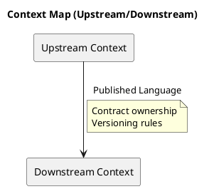
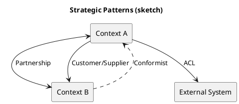

# Chương 15 — Context Map: thiết kế quan hệ giữa các miền (integration là coupling thật)

Bạn có thể chia bounded contexts “đẹp” nhưng hệ thống vẫn vỡ nếu bạn tích hợp sai. Lý do: coupling thật không nằm ở sơ đồ service; coupling nằm ở **integration**: ai phụ thuộc ai, ai đổi là ai vỡ, và bạn chấp nhận coupling đó bằng cách nào.

Context Map là bản đồ thể hiện:
- các bounded contexts,
- quan hệ upstream/downstream,
- và strategic patterns (partnership, customer/supplier, conformist, shared kernel, OHS, ACL).

Trong ADLP Strategic Design v0.2, context map đã được xác định khá rõ. Chương này giúp bạn hiểu “vì sao” đằng sau các pattern đó, khi nào dùng pattern nào, trade-off ra sao, và cách triển khai để không biến event-driven thành “distributed coupling”.

---

## Bạn sẽ nhận được gì sau chương này?

1) Hiểu context map là gì và vì sao nó quan trọng hơn service diagram.  
2) Hiểu từng strategic pattern: khi dùng, khi tránh, trade-offs.  
3) Biết cách chọn giữa sync vs async theo context relationship (không chọn theo cảm tính).  
4) Áp dụng vào ADLP: giải thích các quan hệ chính và điểm rủi ro.  
5) Có checklist và exercise có hướng dẫn để tự vẽ context map cho workflow của bạn.

---

## 1) Vì sao context map quan trọng hơn sơ đồ service?

Sơ đồ service thường trả lời: “có những service nào”. Nó ít khi trả lời: “service nào phụ thuộc vào service nào, và phụ thuộc kiểu gì”.

Nhưng trong hệ thống phân tán, thứ làm bạn đau nhất là:
- thay đổi schema/API làm consumer vỡ,
- thay đổi semantics làm workflow sai (âm thầm),
- tổ chức team không biết ai chịu trách nhiệm.

Context Map là “bản đồ quyền lực” của domain:
- Ai là upstream (công bố ngôn ngữ)?
- Ai là downstream (phải thích nghi)?
- Ai là customer (định nghĩa contract)?
- Ai là supplier (cung cấp theo contract)?

> **NOTE**  
> Một context map tốt giúp bạn chấp nhận coupling có chủ đích và tránh coupling vô thức.

---

## 2) Các strategic patterns và trade-offs

Chương này không chỉ liệt kê pattern; nó giải thích “khi nào dùng” và “giá phải trả”.

### 2.1 Partnership
**Khi dùng:** hai contexts phụ thuộc chặt, cùng team, cùng roadmap.  
**Giá:** coordinated release, coupling cao.  
**Khi tránh:** khi team/ownership tách hoặc change rate khác nhau.

ADLP: Data Ingestion ↔ Prelabeling có thể là partnership nếu cùng team và workflow chặt.

### 2.2 Customer/Supplier
**Khi dùng:** downstream cần upstream cung cấp contract theo nhu cầu của downstream (customer).  
**Giá:** cần governance; supplier không được phá contract.  
**Lợi:** contract phục vụ đúng workflow của customer.

ADLP: Task Assignment (customer) cần User Profile cung cấp search API theo skill/rating.

### 2.3 Conformist
**Khi dùng:** downstream chấp nhận model upstream như “chuẩn”, upstream ổn định.  
**Giá:** downstream bị coupling mạnh với upstream.  
**Khi tránh:** upstream hay đổi hoặc không đáng tin.

ADLP: User Profile conform theo Identity user id/role có thể hợp lý.

### 2.4 Open Host Service (OHS)
**Khi dùng:** một context có nhiều consumers → cần API ổn định, versioned.  
**Giá:** maintenance burden, governance cần chặt.  

ADLP: Identity & Access là OHS cho các contexts khác.

### 2.5 Anti-Corruption Layer (ACL)
**Khi dùng:** tích hợp hệ thống ngoài hoặc upstream không ổn định; cần bảo vệ domain model.  
**Giá:** thêm lớp translation, thêm code và test.  
**Lợi:** domain model ổn định, provider thay đổi không phá domain.

ADLP: Wallet & Payment ↔ Stripe/PayPal; Prelabeling ↔ SageMaker/Inference provider.

### 2.6 Shared Kernel
**Khi dùng:** shared concepts rất nhỏ, stable, cùng team.  
**Giá:** kernel phình to → coupling toàn hệ thống.  
**Best practice:** shared kernel phải cực nhỏ và có ownership rõ.

---

## 3) Sync vs Async: chọn theo relationship, không chọn theo sở thích

Một câu hỏi thường gây tranh luận: “REST hay event?”.

Context map giúp bạn chọn dựa trên coupling và workflow:

### 3.1 Khi nên sync (REST/gRPC)
- Query cần trả lời ngay (search labelers theo skill).
- User-facing path cần latency thấp và có UX rõ.
- Dữ liệu thay đổi không quá lớn và upstream ổn định.

### 3.2 Khi nên async (events)
- Workflow dài, eventual consistency chấp nhận được (prelabel → assignment).
- Cần decouple temporal/spatial (producer không cần consumer online).
- Cần audit trail và replay (ở mức integration).

### 3.3 Trade-off
- Sync dễ debug nhưng coupling thời gian cao (upstream down → downstream down).
- Async bền hơn nhưng cần governance: schema versioning, idempotency, tracing.

ADLP: Prelabeling → Assignment hợp lý dùng async (PrelabelCompleted). Assignment → Labeling có thể dùng sync để lấy batch segments kèm signed URL (UX).

---

## 4) Áp dụng vào ADLP (Strategic Design v0.2): các quan hệ “đắt tiền”

Trong ADLP, có vài quan hệ quan trọng và dễ vỡ nếu chọn sai pattern:

### 4.1 Prelabeling → Task Assignment (Customer/Supplier qua events)
- Assignment cần prelabel results để tạo batch.
- Event schema phải do Assignment (customer) định hình ở mức tối thiểu cần thiết.
- Trade-off: payload quá lớn → coupling; payload quá nhỏ → consumer phải gọi DB nội bộ (xuyên tường).

### 4.2 Labeling ↔ Quality (Partnership-ish, workflow coupling)
- Labeling submit → Quality evaluate.
- Quality có thể yêu cầu rework → quay lại assignment/labeling.
- Đây là chỗ cần rõ semantics: Submitted vs Accepted.

### 4.3 Quality → Wallet/Payment (Customer/Supplier)
- Quality quyết định payout trigger.
- Wallet chỉ ghi transaction; Quality drives semantics.
- Idempotency là bắt buộc để tránh double credit.

### 4.4 Identity → mọi context (OHS)
- Identity cung cấp user id/role.
- Downstream conformist theo model stable.

---

## 5) Best practices để context map “đi được” sang triển khai

### 5.1 Mỗi edge trên context map phải có contract
Contract có thể là:
- REST API spec,
- event schema + versioning rules,
- hoặc ACL interface.

### 5.2 Published language phải có governance
Ai đổi schema? đổi thế nào? compatibility rules? deprecation plan?

### 5.3 Luôn ghi “direction”
Context map phải ghi rõ upstream/downstream, customer/supplier. Nếu không có direction, bạn không biết ai phải thích nghi khi đổi.

### 5.4 Không join DB xuyên context
Nếu bạn thấy mình cần join, đó là tín hiệu:
- boundary sai, hoặc
- bạn cần read model/projection.

---

## 6) Anti-patterns

### 6.1 “Event payload = full row DB”
Consumer phụ thuộc schema nội bộ → vỡ khi producer refactor.

### 6.2 “Mọi thứ đều sync”
Hệ thống biến thành chuỗi phụ thuộc thời gian → downtime cascade.

### 6.3 “Shared Kernel phình to”
Mọi team cùng sửa → coordinated release nightmare.

---

## 7) Exercise có hướng dẫn (45 phút): vẽ context map cho workflow của bạn

### Bước 1: Liệt kê 5–8 bounded contexts (v0)
Nếu chưa có, lấy theo capability (không theo entity).

### Bước 2: Chọn 1 workflow và vẽ edges
Chỉ vẽ edges cần cho workflow đó.

### Bước 3: Gán pattern cho mỗi edge
Chọn partnership/customer-supplier/conformist/OHS/ACL/shared kernel.

### Bước 4: Chọn sync vs async cho mỗi edge
Giải thích vì sao (latency, coupling, audit, resilience).

### Đáp án tham khảo (ADLP, rút gọn)
- Ingestion → Prelabeling: partnership (events)
- Prelabeling → Assignment: customer/supplier (events)
- Assignment → Labeling: customer/supplier (API + events)
- Labeling → Quality: partnership (events)
- Quality → Export/Wallet: customer/supplier (events + idempotency)

**Câu hỏi tự kiểm**
1) Edge nào có rủi ro schema evolution cao?  
2) Edge nào cần ACL vì upstream không ổn định?  
3) Edge nào nếu sync sẽ gây downtime cascade?  

---

## 8) Artefacts/Deliverables sau chương này

- Context map v0 (cho workflow đắt tiền).
- Danh sách contracts cần viết (API specs, event schemas, ACL interfaces).
- Danh sách quyết định cần ADR (sync/async, schema governance).

---

## Checklist (dùng ngay)

> **CHECKLIST**
> - [ ] Mỗi edge có direction (upstream/downstream) và pattern (ACL/OHS/Conformist/…)  
> - [ ] Mỗi edge có “ngôn ngữ công bố” (API/event) và owner rõ  
> - [ ] Bạn biết edge nào “rủi ro cao” (payout/export/compliance) và cần contract test  
> - [ ] Bạn có plan versioning/deprecation cho contracts quan trọng  
> - [ ] Bạn tránh shared kernel trừ khi có governance cực rõ  
