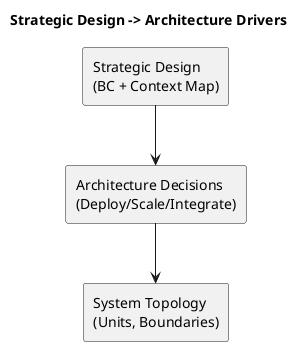
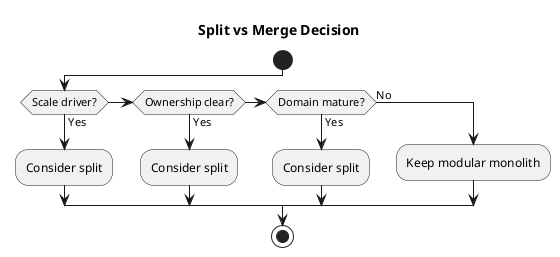
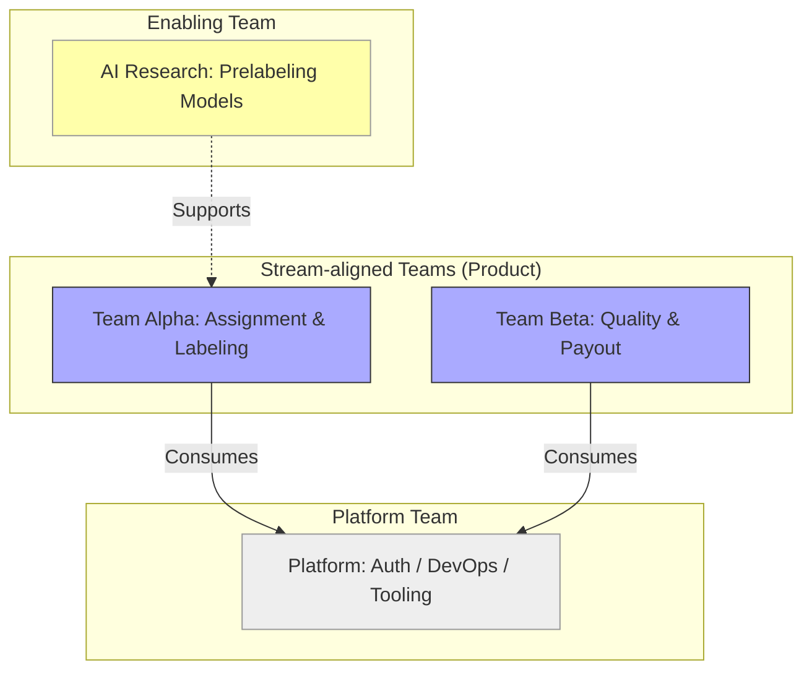
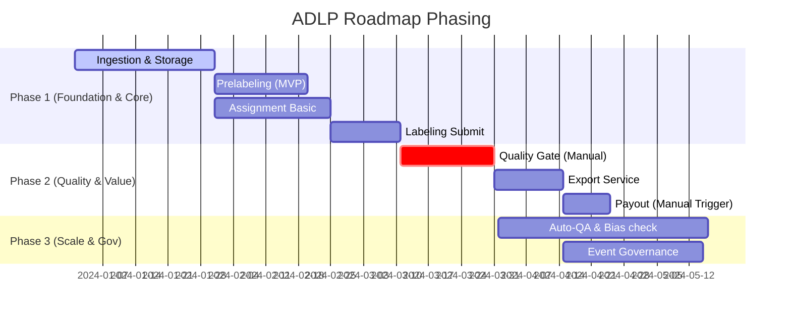

# Chương 16 — Strategic Design → Kiến trúc, Team Topology, Roadmap (từ bản đồ domain tới hệ thống chạy được)

Strategic Design không phải là “tài liệu cho đẹp”. Nếu strategic của bạn đúng, nó sẽ kéo theo ba thứ rất thực tế:

1) **Kiến trúc**: bạn deploy cái gì, tách hay gộp, giao tiếp kiểu gì.  
2) **Team topology**: ai sở hữu cái gì, ai quyết định policy nào.  
3) **Roadmap**: đầu tư vào core domain trước, tránh đốt thời gian vào generic.

Chương này là cầu nối giữa “bản đồ domain” và “kế hoạch triển khai”. Nó trả lời câu hỏi mà Tech Lead/Architect hay bị hỏi nhất:

> “Từ Strategic Design, bây giờ chúng ta nên làm gì tiếp theo để ship?”

Ví dụ xuyên suốt: ADLP theo Strategic Design v0.2.

---

## Bạn sẽ nhận được gì sau chương này?

1) Biết cách dùng Strategic Design để chọn **modular monolith vs microservices** (không theo trend).  
2) Biết cách ánh xạ BC → deployment units theo driver thực tế (scale, ownership, change rate, risk).  
3) Biết cách thiết kế team ownership và decision ownership theo BC (Conway’s Law thực dụng).  
4) Biết cách xây roadmap theo core/supporting/generic (đầu tư đúng chỗ).  
5) Áp vào ADLP: đề xuất thứ tự triển khai (foundation → core workflow → quality/export).  
6) Checklist và exercise để tự áp cho dự án của bạn.

---

## 1) Strategic design ảnh hưởng kiến trúc như thế nào?

Strategic design cho bạn:
- bounded contexts (ranh giới ngôn ngữ + trách nhiệm),
- context map (quan hệ + integration patterns),
- core/supporting/generic classification.

Từ đó, bạn quyết được:
- đâu là unit cần scale độc lập,
- đâu là unit có blast radius cao cần cô lập,
- đâu là unit nên “buy/standardize” để ship nhanh.

Điều này khác với kiến trúc “thuần kỹ thuật” ở chỗ: bạn không tối ưu cho sơ đồ đẹp; bạn tối ưu cho **thay đổi đúng chỗ**.

---

## 2) Bounded Context ↔ Deployment Unit: khi nào 1-1, khi nào không?

Strategic Design v0.2 của ADLP định hướng “microservice per bounded context”. Đây là một hướng hợp lý cho enterprise, nhưng không nên biến thành giáo điều.

### 2.1 Khi 1 BC nên là 1 deployment unit
Driver thường gặp:
- **Scale khác nhau** (GPU inference vs API CRUD).
- **Change rate khác nhau** (core domain đổi liên tục, generic ổn định).
- **Ownership khác nhau** (team tách rõ).
- **Risk isolation** (payout/quality sai gây thiệt hại lớn).

ADLP: Prelabeling (inference) và Quality có driver scale/risk rất khác Labeling UI.

### 2.2 Khi nhiều BC có thể chung một deployment unit (giai đoạn đầu)
Driver:
- team nhỏ, cần ship nhanh,
- integration cost quá cao ở MVP,
- domain chưa đủ chín để tách.

Đây là nơi modular monolith phát huy tác dụng: BC boundaries ở module level, deploy vẫn một khối.

> **BEST PRACTICE**  
> Dù deploy chung, boundary vẫn phải rõ trong code: không xuyên module, contract rõ, events internal.

### 2.3 Decision matrix: tách hay gộp?

| Driver | Tín hiệu nên tách | Tín hiệu nên gộp (tạm thời) |
|---|---|---|
| Scale | workload khác hẳn (GPU vs API) | load ổn định, chưa bottleneck |
| Change rate | core đổi weekly | domain chưa chín, nhiều giả định |
| Ownership | team độc lập, on-call riêng | team nhỏ, ownership chồng lấn |
| Risk isolation | sai → mất tiền/uy tín | rủi ro thấp, dễ rollback |
| Integration cost | async contract ổn | integration overhead cao |

Mục tiêu là “tách có lý do” chứ không phải “tách cho đẹp”.

---

## 3) Team topology: Conway’s Law trong thực tế

Conway’s Law nói rằng kiến trúc phản ánh cấu trúc tổ chức. Strategic Design giúp bạn chủ động “thiết kế tổ chức” để kiến trúc không bị kéo lệch.

### 3.1 Ownership theo BC
Mỗi BC cần:
- owner team,
- decision owner cho policy (threshold, SLA, payout rules),
- runbook/observability ownership.

### 3.2 Core domain phải có người giỏi
Đây là rule thực dụng đã nói ở chương 4: nếu team giỏi nhất đang làm generic, bạn đang tự thua.

ADLP: Quality/Assignment/Prelabeling phải có senior ownership.

### 3.3 Minh họa Team Topology (Stream-aligned vs Platform)

Mô hình team phổ biến cho ADLP:

### 3.4 Decision ownership matrix (ai quyết định policy nào?)

Ví dụ ADLP (rút gọn):

| Decision | Owner | Context | Ghi chú |
|---|---|---|---|
| Lock TTL rules | Assignment Lead | Task Assignment | Quyết định fairness vs throughput |
| Accept criteria | Quality Lead | Quality Assurance | Policy versioning + audit |
| Payout trigger | Finance Owner | Wallet & Payment | Không để dev tự quyết |
| Export gate | Delivery Owner | Dataset Export | Đảm bảo chỉ export accepted |
| Prelabel model version | ML Lead | Prelabeling | A/B + rollback plan |

Không có owner = không có rule. Đây là nguồn gốc của tranh chấp về sau.

### 3.5 Case Study: Conway’s Law trong định giá (Pricing)
Ban đầu, Pricing Logic nằm ở cả **Finance Team** (tính tiền) và **Operation Team** (cấu hình giá).
- Kết quả kiến trúc: Logic giá bị phân mảnh ra 2 service: `BillingService` và `ConfigService`.
- Hậu quả: Mỗi lần thay đổi giá phải deploy 2 nơi.
- Giải pháp: Gom Pricing về **Commercial Context**, do 1 team sở hữu trọn vẹn. Kiến trúc map theo tổ chức mới: 1 Pricing Service duy nhất.

### 3.6 Case study ADLP: “Assignment vs Labeling” bị kéo lệch

Trong một team startup nhỏ, Assignment và Labeling thường bị gộp bởi cùng một nhóm UI.  
Hậu quả thường gặp:
- Quy tắc lock TTL bị chỉnh theo UX mà không qua domain owner.  
- Invariants “one active assignment” bị phá vì autosave/submit đi tắt.  

Giải pháp thực dụng:
- Chốt ownership cho Assignment (policy/TTL) khác Labeling (UI/flows).  
- Dù deploy chung, vẫn tách module boundary + contract rõ.  

---

## 4) Roadmap: đầu tư theo core domain (đừng “đốt” generic)

Roadmap DDD không bắt đầu bằng “xây hết platform”. Nó bắt đầu bằng:
- foundation đủ để chạy,
- slice core workflow,
- rồi quality gates để tạo business value.

### 4.1 Một roadmap thực dụng cho ADLP
(tương thích với roadmap trong Strategic Design v0.2, nhưng viết theo logic “ship đúng”)

1) Foundation:
- Identity (standard), basic RBAC
- storage + ingestion pipeline
- minimal observability + CI/CD

2) Core workflow slice:
- Prelabeling orchestration (đủ chạy)
- Task Assignment (lock TTL + routing cơ bản)
- Labeling submit

3) Quality gate:
- WER/agreement minimal
- ReviewRequired + escalation v1
- BatchAccepted semantics chốt

4) Export & payout:
- export only accepted
- payout only accepted (idempotent)

### 4.2 Visual Roadmap (Mermaid Gantt)

Điểm mấu chốt: business value của ADLP nằm ở quality + routing, không nằm ở hệ thống auth “tối thượng”.

### 4.3 Roadmap phasing: MVP → Scale → Optimize

**MVP (ship đúng workflow)**
- 1 slice end-to-end: `BatchAssigned → BatchSubmitted → BatchAccepted`.  
- Manual quality review, manual payout trigger (để chốt semantics).  

**Scale (stability + throughput)**
- Idempotency + outbox chuẩn, retry/DLQ có owner.  
- Tách deployment unit cho Prelabeling/Quality nếu GPU load tăng.  

**Optimize (automation + governance)**
- Auto-QA, policy versioning chặt, A/B for prelabeling.  
- Contract tests + schema evolution policy vận hành.  

---

## 5) Trade-offs: ship nhanh vs ship đúng

Strategic design giúp bạn ship nhanh *mà vẫn đúng* bằng cách:
- dùng giải pháp chuẩn cho generic (auth, notification),
- dồn chất xám vào core (quality, assignment),
- tách/gộp đúng driver.

Trade-off điển hình:
- Tách microservices sớm → vận hành khó hơn, nhưng scale/ownership tốt hơn.
- Modular monolith → ship nhanh hơn, nhưng cần kỷ luật boundary để không thành monolith bừa.

Không có one-size-fits-all. Strategic design giúp bạn chọn có lý do.

---

## 6) Best practices (kèm giải thích)

### 6.1 Roadmap theo workflow đắt tiền
Chọn workflow tạo tiền (premium 48h) làm “xương sống”. Build quanh nó.

### 6.2 Chốt semantics trước khi tối ưu
Chốt `Submitted` vs `Accepted` và payout trigger trước khi tối ưu queue.

### 6.3 Tách theo driver, không theo cảm xúc
Nếu tách vì “microservices nhìn ngầu”, bạn sẽ trả giá. Tách vì scale/ownership/change rate/risk.

### 6.4 Governance cho contracts từ sớm
Event schema + versioning rules là bắt buộc khi bạn tách contexts.

---

## 7) Anti-patterns

### 7.1 “Platform-first”
Xây infra/auth/logging 3 tháng trước khi có core workflow chạy. Kết quả: không có business value.

### 7.2 “Microservices-first”
Tách 20 services khi domain chưa rõ. Kết quả: distributed monolith.

### 7.3 “No owner”
Policy không owner, decision lơ lửng. Kết quả: dev tự quyết.

---

## 8) Exercise có hướng dẫn (45 phút): ánh xạ BC → roadmap

### Bước 1: Chọn 3 core BC
Ví dụ ADLP: Prelabeling, Assignment, Quality.

### Bước 2: Liệt kê 1 workflow đắt tiền và dependencies
Premium 48h kéo theo ingestion + labeling + export.

### Bước 3: Đề xuất 3 phase
- Phase 1: foundation + minimal slice
- Phase 2: quality gate + review
- Phase 3: scale/optimization + governance

### Đáp án tham khảo (ADLP)
Phase 1: ingestion + prelabel + assignment + submit  
Phase 2: evaluate + review + accept + export/payout  
Phase 3: autoscaling, SLOs, governance, bias detection

---

## 9) Artefacts/Deliverables sau chương này

- Bảng mapping BC → team ownership + decision ownership.
- Roadmap theo phases (gắn workflow đắt tiền).
- Danh sách quyết định cần ADR (tách/gộp, sync/async, SLOs).

---

## Checklist (dùng ngay)

> **CHECKLIST**
> - [ ] Bạn map được BC → team ownership (ai ship/ai on-call/ai quyết định)  
> - [ ] Bạn có roadmap theo phases dựa trên core domain (không làm “mọi thứ cùng lúc”)  
> - [ ] Bạn chốt tối thiểu 3 ADR đắt tiền (boundaries, integration, SLO/NFR)  
> - [ ] Bạn có plan rollout để tránh distributed monolith (giảm call chain, bảo vệ contracts)  
> - [ ] Bạn xác định “điểm đo” để biết kiến trúc đang tốt lên (lead time, incidents, SLO)  
