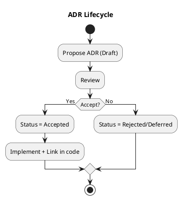

# Chương 17 — ADRs: bộ nhớ tổ chức cho những quyết định đắt tiền

Mọi hệ thống sống đủ lâu sẽ gặp một vấn đề không nằm trong code: **tổ chức quên lý do vì sao đã quyết định như vậy**. Khi trí nhớ biến mất, tranh luận lặp lại từ đầu, quyết định bị đảo liên tục, và hệ thống tiến hóa theo kiểu “giật cục”.

Architecture Decision Records (ADR) là cách đơn giản nhất để giữ “bộ nhớ tổ chức” cho các quyết định đắt tiền:
- vì sao chọn event-driven,
- vì sao payout trigger ở BatchAccepted,
- vì sao lock TTL là 4 giờ,
- vì sao một context là OHS,
- vì sao policy versioning là bắt buộc.

Trong ADLP Strategic Design v0.2 có ADR-001..ADR-007. Chương này giúp bạn hiểu ADR nên viết thế nào để dùng được, và khi nào cần ADR (không biến ADR thành nghi thức).

---

## Bạn sẽ nhận được gì sau chương này?

1) Hiểu ADR là gì và vì sao nó giải quyết “memory loss” trong tổ chức.  
2) Biết khi nào cần ADR (decision nào đắt tiền, decision nào không).  
3) Biết cách viết ADR ngắn nhưng đủ: context → decision → consequences → mitigations.  
4) Biết cách vận hành ADR (ownership, review, link với code).  
5) Áp vào ADLP: ví dụ 3 ADR điển hình (sync/async, quality gate, payout).  
6) Exercise có hướng dẫn để viết ADR đầu tiên cho dự án của bạn.

---

## 1) ADR là gì (và vì sao nó quan trọng hơn bạn nghĩ)?

ADR là một tài liệu ngắn ghi lại:
- bối cảnh (context),
- quyết định (decision),
- các lựa chọn đã cân nhắc (alternatives),
- hệ quả (consequences) và cách giảm thiểu (mitigations).

Vấn đề ADR giải quyết không phải “thiếu tài liệu”. Nó giải quyết:
- **tranh luận lặp lại**,
- **đảo quyết định không có lý do**,
- **onboarding chậm** (người mới không hiểu vì sao hệ thống như vậy),
- **sửa sai** (không biết quyết định nào cần revisit).

> **NOTE**  
> ADR tốt giúp bạn thay đổi nhanh hơn, vì bạn không mất thời gian “đào lại” lý do.



---

## 2) Khi nào cần ADR? (không viết ADR cho mọi thứ)

Bạn nên viết ADR khi quyết định:
- có blast radius rộng,
- khó rollback,
- ảnh hưởng tới nhiều team/contexts,
- và có trade-off lớn.

Ví dụ:
- chọn event-driven vs sync-only,
- chọn DB per service,
- định nghĩa accepted/payout semantics,
- SLOs theo context,
- schema versioning rules.

Bạn **không** cần ADR cho:
- đổi tên biến,
- chọn library nhỏ,
- refactor cục bộ không ảnh hưởng contract.

### Heuristic thực dụng
Nếu bạn nghĩ “tuần sau người khác sẽ hỏi lại”, hãy viết ADR.

---

## 3) Cách viết ADR để “dùng được” (ngắn nhưng đủ)

ADR dài 10 trang thường không ai đọc. ADR tốt thường 1–2 trang.

Bạn có thể dùng template trong `design/docs/0.ref/DDDPractical/templates.md`. Dưới đây là nguyên tắc:

1) **Context** phải nêu constraint và vì sao câu hỏi này tồn tại.  
2) **Decision** phải rõ và testable (có thể xác định đang làm theo hay không).  
3) **Consequences** phải nói cả positive lẫn negative.  
4) **Mitigations** giúp decision “an toàn hơn” trong thực tế.

> **BEST PRACTICE**  
> ADR nên có “How to measure” (metric) nếu decision liên quan performance/SLO.

---

## 4) Áp vào ADLP: 3 ADR mẫu (điển hình)

4.1 ADR-002: Payout trigger ở BatchAccepted (Quality)

**Status:** Accepted  
**Owner:** Finance & Quality Team  
**Date:** 2024-03-15

#### Context
Marketplace ADLP trả tiền cho labeler dựa trên kết quả công việc. Ban đầu, payout được trigger ngay khi labeler bấm "Submit". Tuy nhiên, điều này dẫn đến rủi ro:
- Fraud: labeler spam submit rác để lấy tiền.
- Poor quality: dữ liệu chưa được kiểm tra nhưng đã trả tiền, khó đòi lại (chargeback) nếu labeler rút tiền ngay.
- Business rule: chỉ trả tiền cho dữ liệu đạt chuẩn (Acceptance Criteria).

#### Decision
Chúng tôi quyết định dời điểm trigger payout từ `BatchSubmitted` sang `BatchAccepted`.
- `BatchAccepted` là sự kiện được publish bởi Quality Context sau khi batch vượt qua kiểm tra chất lượng (Auto hoặc Manual Review).
- Wallet/Payment Service sẽ subscribe `BatchAccepted` để credit tiền.

#### Consequences
**Positive:**
- Loại bỏ hoàn toàn rủi ro trả tiền cho rác.
- Tăng độ tin cậy của hệ thống tài chính.

**Negative:**
- **Delayed Gratification:** Labeler nhận tiền chậm hơn (sau 1-4h thay vì tức thì).
- **Eventual Consistency:** Cần xử lý trường hợp Quality Service down hoặc event delay.

#### Mitigation
- **Observerability:** Dashboard cho labeler thấy "Pending Payout" để họ yên tâm.
- **SLA:** Quality process phải cam kết SLA < 4h để không giữ tiền quá lâu.
- **Idempotency:** Payment Service phải xử lý duplicate events safe (tránh trả tiền 2 lần).

### 4.2 ADR-005: Prelabeling → Assignment dùng Async Events

**Status:** Accepted  
**Owner:** AI & Assignment Team  
**Date:** 2024-03-20

#### Context
Quy trình Ingestion cần gọi Prelabeling Service (AI Model) để sinh nhãn gợi ý, sau đó mới đẩy sang Task Assignment để tạo batch.
- Prelabeling chạy GPU, latency cao (vài giây đến vài phút).
- Ingestion throughput cao, bursty.
- Nếu dùng Sync REST call từ Ingestion -> Prelabel -> Assignment, hệ thống sẽ bị backpressure và timeout chain.

#### Decision
Chuyển sang cơ chế Async Event-driven:
1. Ingestion publish `DataItemIngested`.
2. Prelabeling Worker consume, chạy inference, rồi publish `PrelabelCompleted`.
3. Assignment Service consume `PrelabelCompleted` để tạo batch.

#### Consequences
**Positive:**
- **Decoupling:** Assignment không bị chết nếu Prelabeling chậm.
- **Throttling:** Có thể scale worker Prelabeling độc lập với Assignment API.

**Negative:**
- **Complexity:** Khó debug luồng end-to-end (không còn 1 request trace duy nhất dễ dàng).
- **Schema Management:** Cần quản lý version của event payload.

#### Mitigation
- **Distributed Tracing:** Bắt buộc dùng `correlation_id` xuyên suốt các event.
- **Dead Letter Queue (DLQ):** Xử lý message lỗi để không block pipeline.
- **Contract Testing:** Dùng schema registry để đảm bảo producer/consumer đúng contract.

### 4.3 ADR-007: SLOs theo Context criticality

**Status:** Proposed  
**Owner:** SRE Team  
**Date:** 2024-04-01

#### Context
Hiện tại team SRE đang treat mọi service như nhau về alert policy (CPU > 80% là gọi). Điều này gây alert fatigue cho những service không quan trọng (như Export overnight), trong khi lại phản ứng chậm với Core (Assignment).

#### Decision
Định nghĩa SLO (Service Level Objective) dựa trên phân loại Subdomain:
- **Core (Assignment, Quality):** 
  - Availability 99.9%. 
  - Latency p95 < 200ms (API), < 5m (Async process).
  - PagerDuty: 24/7.
- **Generic (Export, Auth):** 
  - Availability 99.0% (Auth là exception, cần cao).
  - Latency p95 < 5s.
  - PagerDuty: Business Hours only.

#### Consequences
**Positive:**
- Tập trung nguồn lực cứu hỏa vào đúng chỗ kiếm tiền.
- Giảm stress cho on-call team.

**Negative:**
- Cần cấu hình monitoring phức tạp hơn (per service thresholds).

#### Mitigation
- Terraform module chuẩn hóa cho monitoring rules theo tier (Gold/Silver/Bronze).

### 4.4 ADR-001: Event-driven Architecture cho Workflow Async

**Status:** Accepted  
**Owner:** Platform Team  
**Date:** 2024-02-10

#### Context
Workflow ADLP có nhiều bước async (prelabel → assignment → labeling → quality → export).  
Cân nhắc giữa:
1) Sync REST calls giữa services  
2) Event-driven với message broker  
3) Hybrid (sync cho user-facing, async cho background)

Constraints:
- Workflow có thể mất 2–48h (không thể sync)  
- Cần audit trail đầy đủ  
- Cần retry/idempotency  
- Cần scale độc lập từng bước  

#### Decision
Chọn event-driven architecture với Kafka làm event backbone.  
Sync REST chỉ cho user queries và validation nhanh.

#### Consequences
**Positive:** decoupling, resilience, audit, scale độc lập.  
**Negative:** eventual consistency, debugging khó hơn, cần tracing.

#### Mitigation
- Outbox pattern  
- correlation_id bắt buộc  
- event schema versioning  
- tracing (Tempo/Jaeger)  

### 4.5 ADR-003: Database per Service với Logical Schema Separation

**Status:** Accepted  
**Owner:** Platform + Data Team  
**Date:** 2024-02-15

#### Context
9 bounded contexts cần data isolation. Cân nhắc:
1) 1 schema chung → coupling cao  
2) 9 instances riêng → cost cao  
3) 1 cluster, nhiều schema → trung dung  

Constraints:
- Budget hạn chế  
- Compliance: audit trail per context  
- Evolution: schema change không phá context khác  

#### Decision
1 Postgres cluster, 9 schemas riêng, access control theo context.

Rules:
- Mỗi context sở hữu schema của mình  
- Không FK xuyên schema  
- Logical references + events/API  
- Read models cho cross-context queries  

#### Consequences
**Positive:** cost thấp, ops đơn giản, ownership rõ.  
**Negative:** temptation join xuyên schema, cần read models.  

#### Mitigation
- DB roles theo context  
- Code review reject cross-schema join  
- CQRS-lite cho dashboard/reports  
- Migration theo context  

---

## 5) Vận hành ADR: làm sao để ADR không chết?

ADR chết vì:
- nằm ở chỗ không ai nhìn,
- không link với code/contracts,
- không có owner.

### 5.1 Ownership
Mỗi ADR phải có owner team/person. Owner chịu trách nhiệm:
- cập nhật khi decision superseded,
- đảm bảo implementation bám decision.

### 5.2 Link với code và contracts
Nếu ADR nói “event schema versioning”, hãy link ADR từ:
- docs về event schema,
- repo folder chứa schema,
- CI checks (contract tests).

### 5.3 Trạng thái ADR
ADR nên có trạng thái: Proposed/Accepted/Superseded/Rejected.  
Khi thay đổi decision, không sửa ADR cũ như chưa từng tồn tại; hãy supersede.

### 5.4 ADR lifecycle (đề xuất)

1) **Propose (Draft)**  
- Tạo ADR draft trong `design/adrs/`  
- Status: Proposed  
- Gửi PR với label `adr-review`

2) **Review**  
- Tech leads review trong 3 ngày  
- Discussion trong PR comments  
- Request changes hoặc alternatives nếu cần  

3) **Decision**  
- Accept: merge PR, status → Accepted  
- Reject: close PR, status → Rejected (giữ file)  
- Defer: status → Deferred  

4) **Implement**  
- Link ADR trong code/comments  
- Link ADR trong PRs  
- Update ADR nếu implementation lệch decision  

5) **Supersede**  
- ADR mới supersede ADR cũ  
- ADR cũ status → Superseded by ADR-XXX  

### 5.5 ADR linking strategy (code/PR)

**Code linking example**

```python
class EventPublisher:
    """
    Publish domain events to Kafka.

    Architecture Decision: ADR-001 (Event-driven architecture)
    Related: ADR-005 (Outbox pattern)
    """
    def publish(self, event: DomainEvent):
        pass
```

**PR description template**

```markdown
## Changes
- Implement payout trigger on BatchAccepted

## Architecture Decisions
- Follows ADR-002: Payout trigger ở BatchAccepted
- Implements ADR-005: Outbox pattern for reliable delivery
```

---

## 6) Anti-patterns

### 6.1 “ADR như giấy phép”
Viết ADR để hợp thức hóa quyết định đã lỡ làm. ADR phải giúp decision tốt hơn, không chỉ “đóng dấu”.

### 6.2 “ADR quá dài”
Không ai đọc. Hãy để ADR ngắn; chi tiết kỹ thuật để ở design docs khác.

### 6.3 “Không ghi negative consequences”
Nếu ADR chỉ ghi mặt tốt, nó không giúp ai trade-off. ADR tốt phải trung thực về cost.

---

## 7) Exercise có hướng dẫn (30 phút): viết ADR đầu tiên

### Bước 1: Chọn một quyết định đắt tiền
Ví dụ:
- “Payout trigger ở Accepted”
hoặc
- “Sync vs async giữa contexts”

### Bước 2: Viết 4 đoạn (context, decision, consequences, mitigations)
Giữ ngắn, rõ.

### Bước 3: Thêm 1 metric nếu phù hợp
Ví dụ: “p95 latency < 500ms”, “review SLA < 4h”.

### Đáp án tham khảo (khung)
Context: …  
Decision: …  
Consequences: (+) … (-) …  
Mitigations: …  

**Câu hỏi tự kiểm**
1) Decision có testable không? (nhìn vào system có biết đang làm theo?)  
2) Negative consequences có trung thực không?  
3) Mitigation có khả thi không?  

---

## 8) Artefacts/Deliverables sau chương này

- Bộ ADR tối thiểu cho dự án (3–7 ADR cho decisions đắt nhất).
- Quy ước đặt tên và nơi lưu ADR.
- Quy trình review ADR trong team.

---

## Checklist (dùng ngay)

> **CHECKLIST**
> - [ ] Mỗi decision “đắt tiền” có ADR (integration, SLO/NFR, data ownership, security/compliance)  
> - [ ] ADR có trade-offs thật (positive/negative/mitigations), không chỉ “chọn A”  
> - [ ] ADR có owner + status + ngày + scope rõ  
> - [ ] ADR có “How to Measure” cho quyết định ảnh hưởng vận hành (SLO/metric)  
> - [ ] ADR được review như code (PR, comment, accept) và lưu nơi dễ tìm  
