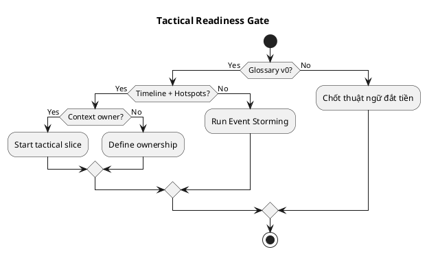

# Chương 18 — Khi nào bắt đầu Tactical Design? (và khi nào KHÔNG nên)

Strategic Design giúp bạn chia hệ thống đúng ranh giới. Event Storming giúp bạn nhìn thấy workflow và ngôn ngữ chung. Nhưng đến một lúc, bạn phải “đi vào trong” từng bounded context để biến rule thành mô hình có thể triển khai. Đó là lúc Tactical Design bắt đầu.

Vấn đề là: nhiều team vào tactical **quá sớm** (khi chưa chốt nghĩa, chưa chốt boundary), hoặc vào tactical **quá muộn** (vẽ strategic đẹp nhưng không có code). Cả hai đều dẫn đến chậm và sai.

Chương này giúp bạn biết:
- Dấu hiệu tactical đã “đến lúc”.
- Dấu hiệu tactical “chưa nên”.
- Cách bắt đầu tactical theo đúng nhịp: theo từng context, theo từng slice workflow.
- Áp dụng vào ADLP: bắt đầu tactical ở Task Assignment và Quality như thế nào.

---

## Bạn sẽ nhận được gì sau chương này?

1) Một checklist “tactical readiness” để biết đã đủ điều kiện đi sâu hay chưa.  
2) Một quy trình 5 bước để bắt đầu tactical cho một bounded context.  
3) Trade-offs thực tế: tactical sâu ở core domain vs tactical-lite ở generic.  
4) Anti-patterns khi bắt đầu tactical (God model, join-driven design, premature abstraction).  
5) Exercise có hướng dẫn: chọn slice và chốt 2 invariants đầu tiên cho ADLP.

---

## 1) Tactical Design giải quyết vấn đề gì?

Strategic Design trả lời: “chia hệ thống thế nào, ai sở hữu cái gì, tích hợp ra sao”.  
Tactical Design trả lời: “trong một bounded context, quy tắc nào phải luôn đúng, và ai chịu trách nhiệm bảo vệ nó”.

Nếu tactical yếu, rule sẽ rò rỉ:
- nằm trong controller,
- nằm trong cron job,
- nằm trong UI,
- hoặc nằm trong head của một dev senior.

Khi rule rò rỉ, bạn sẽ thấy:
- bug concurrency,
- tranh chấp (payout, ownership),
- logic sai nhưng không ai biết “đúng là gì”.

Tactical DDD đưa rule vào **aggregate boundary** và biến rule thành thứ có thể test/trace/audit.

---

## 2) Dấu hiệu bạn đã sẵn sàng bắt đầu tactical

Bạn sẵn sàng khi (ít nhất) có:

### 2.1 Một workflow “đắt tiền” được mô tả bằng events
Bạn có Big Picture timeline (10–20 events) cho workflow đắt tiền.  
Ví dụ ADLP: premium order 48h với các mốc `BatchAssigned`, `BatchSubmitted`, `BatchAccepted`.

### 2.2 Thuật ngữ đắt tiền đã được chốt nghĩa v0
Bạn không thể làm tactical nếu chưa chốt các từ như `Submitted`, `Accepted`, `Confidence`, `QualityScore`.  
Bạn không cần glossary hoàn hảo, nhưng phải có “v0” và owner context.

### 2.3 Hotspots đã có owner và hướng giải
Bạn không cần giải hết hotspots, nhưng phải:
- viết thành câu hỏi follow-up được,
- có owner,
- biết sẽ giải bằng ADR hay workshop tiếp theo.

### 2.4 Bạn biết context nào là core domain
Core contexts là nơi bạn đầu tư tactical sâu.  
Trong ADLP: Task Assignment + Quality Assurance + (một phần) Prelabeling.

> **NOTE**  
> Tactical không phải “vẽ UML cho vui”. Tactical bắt đầu khi bạn có đủ domain truth để bảo vệ invariants.

### 2.5 Tactical readiness checklist (chi tiết)

**Strategic foundation**
- [ ] Bounded contexts đã xác định (5–7 contexts tối thiểu)  
- [ ] Context map v0 có upstream/downstream rõ  
- [ ] Core/Supporting/Generic đã phân loại  

**Event Storming**
- [ ] Big Picture có 10–20 events cho workflow chính  
- [ ] Process-level đã chốt policies/actors  
- [ ] Design-level đã xuất hiện aggregate candidates  

**Domain understanding**
- [ ] Glossary v0 có 20–40 terms được chốt nghĩa  
- [ ] 3–5 invariants “đắt nhất” đã được viết thành câu  
- [ ] Hotspots có owner + hướng giải (ADR/workshop)  

**Team & ownership**
- [ ] Domain expert available trong 24h  
- [ ] Tech ownership cho core contexts rõ ràng  

**Scope & slice**
- [ ] Chọn được 1 slice 3–5 events  
- [ ] Slice đủ nhỏ để code trong 2–3 tuần  

---

## 3) Dấu hiệu bạn chưa nên bắt đầu tactical (hoặc cần quay lại strategic)

Nếu bạn gặp các dấu hiệu sau, hãy dừng tactical:

### 3.1 Bạn vẫn tranh luận nghĩa của từ
Nếu team còn tranh luận “Accepted là gì?”, “Task là segment hay batch?”, tactical sẽ sai.

### 3.2 Bạn chưa biết boundary và ownership
Nếu bạn chưa biết “ai sở hữu policy lock TTL” hoặc “ai quyết định quality threshold”, tactical sẽ biến thành dev tự quyết.

### 3.3 Bạn đang thiết kế theo schema
Nếu cuộc thảo luận tactical bắt đầu bằng “bảng nào join với bảng nào”, bạn đã trượt sang join-driven design.

### 3.4 Bạn đang cố model toàn hệ thống một lần
Tactical tốt nhất đi theo slice. Nếu bạn cố model 9 contexts cùng lúc, bạn sẽ over-model và vẫn sai.

### 3.5 Warning signs: tactical quá sớm vs quá muộn

**Tactical quá sớm**
- Tranh luận “Batch là aggregate hay entity” khi chưa chốt nghĩa “Batch”.  
- Vẽ class diagram trước khi có event timeline.  
- Bàn repository trước khi có invariants.  

**Tactical quá muộn**
- Strategic design 4–6 tuần nhưng chưa có dòng code nào.  
- Sợ “sai” nên không dám chốt slice nhỏ.  
- Context map thay đổi liên tục vì không có feedback từ code.  

Giải pháp: chọn 1 slice nhỏ, code để học, rồi quay lại refine strategic.

---

## 4) Cách bắt đầu tactical đúng nhịp (5 bước)

### Bước 1: Chọn 1 bounded context và 1 slice workflow
Chỉ chọn một context và một slice.  
Ví dụ ADLP:
- Context: Task Assignment  
- Slice: `BatchCreated → BatchAssigned → BatchUnlocked`

### Bước 2: Viết 2–3 invariants “đắt nhất”
Invariant là rule nếu sai sẽ tạo tranh chấp hoặc làm marketplace sụp.
Ví dụ:
- “một batch chỉ assigned một labeler tại một thời điểm”
- “TTL hết hạn phải unlock/reassign theo policy”

### Bước 3: Chọn aggregate root để bảo vệ invariants
Aggregate root không phải “entity lớn nhất”, mà là “điểm vào” để enforce invariant.
Ví dụ: `Batch` là aggregate root của assignment lifecycle.

### Bước 4: Vẽ command → event
Cho slice đó, liệt kê commands (ý định thay đổi) và events (điều đã xảy ra).
Ví dụ: `AssignBatch` → `BatchAssigned`.

### Bước 5: Chốt edge-cases và idempotency sớm
Tactical không dừng ở happy path. Bạn phải chốt:
- duplicate submit/evaluate,
- concurrent assign,
- TTL expiry vs submit race.

---

## 5) Áp dụng vào ADLP: bắt đầu tactical ở đâu?

Theo Strategic Design v0.2, ADLP có 9 contexts. Nhưng tactical sâu không cần cho tất cả từ ngày đầu.

### 5.1 Tactical sâu (core, rủi ro cao)
- **Task Assignment**: locking, TTL, routing eligibility, fairness.  
- **Quality Assurance**: quality gate semantics, review/escalation, audit trail, policy versioning.  

### 5.2 Tactical vừa (core nhưng scope có thể nhỏ)
- **Prelabeling**: model versioning, segmentation invariants, confidence semantics.

### 5.3 Tactical-lite (generic/supporting)
- **Identity & Access**: dùng giải pháp chuẩn, focus vào RBAC và audit hooks.  
- **Notification**: integration.  
- **Export**: nếu MVP, ưu tiên correctness (only accepted) hơn là domain model phức tạp.

### 5.4 Tactical Depth Matrix (đầu tư theo context)

| Context | Type | Tactical Depth | Investment | Rationale |
|---|---|---|---|---|
| Task Assignment | Core | ⭐⭐⭐⭐⭐ Deep | High | Locking/TTL/fairness |
| Quality Assurance | Core | ⭐⭐⭐⭐⭐ Deep | High | Quality gate + audit |
| Prelabeling | Core | ⭐⭐⭐⭐ Medium-Deep | Medium | Model versioning |
| Labeling | Supporting | ⭐⭐⭐ Medium | Medium | Versioning + UX |
| Wallet & Payment | Core-ish | ⭐⭐⭐⭐ Medium-Deep | Medium-High | Financial accuracy |
| Export | Supporting | ⭐⭐ Lite | Low-Medium | Correctness > complexity |
| Identity & Access | Generic | ⭐ Minimal | Low | Off-the-shelf |
| Notification | Generic | ⭐ Minimal | Low | Integration only |

**Depth levels**
- ⭐⭐⭐⭐⭐ Deep: full aggregates, invariants, tests, outbox, optimistic lock  
- ⭐⭐⭐⭐ Medium-Deep: aggregates + key invariants + domain events  
- ⭐⭐⭐ Medium: domain logic + integration events  
- ⭐⭐ Lite: basic validation + integration correctness  
- ⭐ Minimal: thin wrapper/integration  

---

## 6) Trade-offs: tactical sâu có giá gì?

Tactical sâu nghĩa là:
- bạn đầu tư thời gian để chốt invariants,
- bạn chấp nhận “ít đường tắt” (khó hack nhanh),
- bạn viết test domain và audit logic.

Đổi lại:
- bug domain giảm mạnh,
- code dễ tiến hóa,
- onboarding nhanh hơn,
- và bạn ít “đập đi làm lại”.

---

## 7) Anti-patterns khi bắt đầu tactical

### 7.1 “Một aggregate cho mọi thứ”
God Aggregate là dấu hiệu tactical sai. Nó thường xuất hiện khi strategic chưa rõ.

### 7.2 “Repository-first”
Nếu bạn thiết kế repository trước khi chốt invariants, bạn đang làm data-driven design chứ không phải domain-driven.

### 7.3 “Đưa rule vào service layer cho nhanh”
Rule quan trọng phải ở nơi enforce được (aggregate root). Nếu không, invariants sẽ bị phá ở nhiều đường đi.

---

## 8) Exercise có hướng dẫn (30 phút): chọn slice tactical đầu tiên cho ADLP

### Bước 1: Chọn 1 context core
Chọn Task Assignment hoặc Quality Assurance.

### Bước 2: Chọn 1 slice 3 events
Ví dụ Task Assignment: `BatchCreated → BatchAssigned → BatchUnlocked`.

### Bước 3: Viết 2 invariants
Ví dụ:
- one active assignment
- TTL expiry unlock rule

### Bước 4: Viết 2 commands và events tương ứng
`AssignBatch` → `BatchAssigned`  
`UnlockExpired` → `BatchUnlocked`

### Bước 5: Chọn 1 edge-case
Concurrent assign hoặc TTL expiry vs submit.

**Đáp án tham khảo**
- Context: Task Assignment  
- Aggregate root: Batch  
- Invariants: one active assignment; TTL unlock  
- Edge-case: concurrent assign → optimistic lock

---

## 9) Artefacts/Deliverables sau chương này

- “Tactical readiness” checklist (đã đạt/chưa đạt).
- 1 slice tactical plan (context + invariants + commands/events + edge-case).
- Danh sách questions còn mở (hotspots) + owner.

---

## Checklist (dùng ngay)

> **CHECKLIST**
> - [ ] Bạn có glossary v0 và thuật ngữ đắt tiền đã chốt nghĩa (Submitted/Accepted/TTL/Score…)  
> - [ ] Bạn có timeline events cho workflow đắt tiền và hotspots có owner  
> - [ ] Bạn chọn 1 bounded context + 1 slice (không scope quá rộng)  
> - [ ] Bạn viết ra 2–5 invariants đắt nhất (viết được thành câu)  
> - [ ] Bạn chốt early các edge-cases (duplicates/retry/race) trước khi code  
