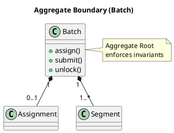
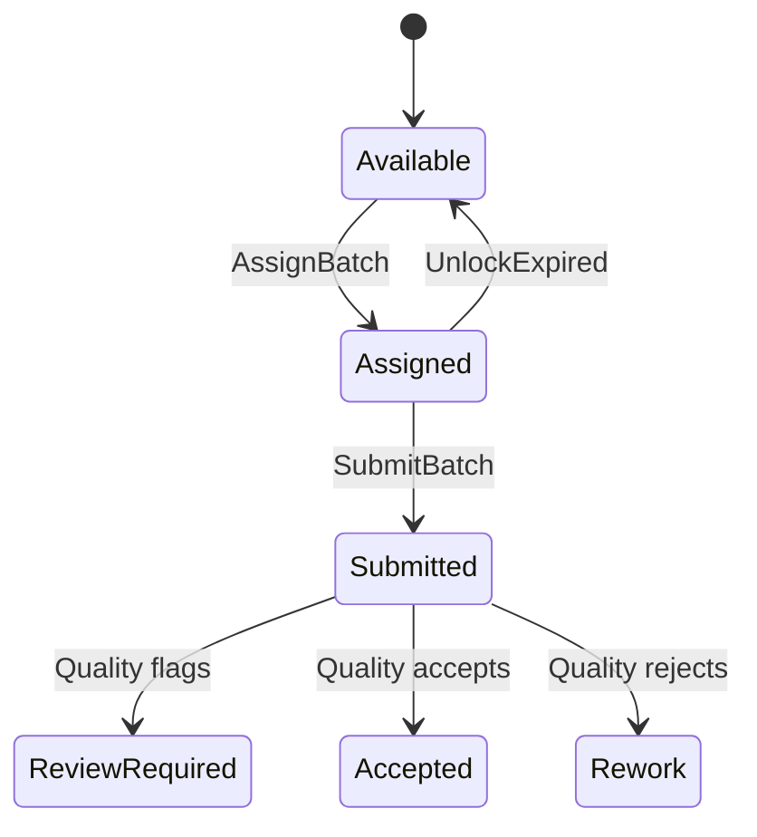

# Chương 19 — Aggregate: ranh giới nhất quán (Consistency Boundary) và nghệ thuật “chọn ít nhưng đúng”

Nếu có một khái niệm tactical DDD bị hiểu sai nhiều nhất, đó là Aggregate. Nhiều team nghe “aggregate” rồi nghĩ “một nhóm bảng DB”, hoặc “một object lớn”, hoặc “một module trong code”. Kết quả là:

- Aggregate được thiết kế theo join → invariants không được bảo vệ.
- Aggregate phình to thành God Aggregate → lock contention và coupling.
- Invariants rò rỉ ở service layer → concurrency bug production.

Trong ADLP, aggregate sai sẽ dẫn tới tranh chấp thật: batch bị double-assign, payout bị double-credit, export chứa dữ liệu chưa accepted. Vì vậy chương này sẽ đi sâu: aggregate là gì, chọn aggregate như thế nào, và cách dùng aggregate để bảo vệ invariants.

---

## Bạn sẽ nhận được gì sau chương này?

1) Hiểu aggregate là gì (và không phải là gì) theo đúng “consistency boundary”.  
2) Biết cách chọn aggregate bằng invariants, không bằng schema.  
3) Biết cách thiết kế aggregate root và state transitions an toàn.  
4) Biết cách xử lý concurrency, idempotency, và eventual consistency liên quan aggregate.  
5) Ví dụ ADLP chi tiết: `Batch` aggregate (Task Assignment) và `QualityEvaluation` aggregate (Quality).  
6) Exercise có hướng dẫn để bạn tự thiết kế một aggregate cho workflow của mình.

---

## 1) Aggregate là gì (theo định nghĩa “dùng được”)

Aggregate là một cụm đối tượng domain được xem như **một đơn vị nhất quán**. Aggregate có:
- một **Aggregate Root** (điểm vào duy nhất để thay đổi),
- các entity/value objects bên trong,
- và một tập **invariants** mà aggregate root có trách nhiệm bảo vệ.



Nói đơn giản: aggregate là nơi bạn đặt câu hỏi:

> “Những rule nào phải luôn đúng ngay lập tức, và cần transaction boundary để bảo vệ?”

Nếu rule phải luôn đúng ngay lập tức, nó thuộc aggregate. Nếu rule có thể eventual consistency, nó nên nằm ở ranh giới giữa aggregates/contexts bằng domain events.

> **NOTE**  
> Aggregate không phải là “tất cả thứ liên quan”. Aggregate là “tất cả thứ cần nhất quán ngay trong một giao dịch”.

---

## 2) Aggregate không phải là gì (3 hiểu lầm phổ biến)

### 2.1 Aggregate ≠ bảng DB
Nếu bạn thiết kế aggregate bằng cách nhìn schema và gom bảng theo FK, bạn đang làm data-driven design.

### 2.2 Aggregate ≠ object lớn
“Lớn” không phải tiêu chí. Aggregate càng nhỏ càng tốt, miễn là đủ để bảo vệ invariants.

### 2.3 Aggregate ≠ bounded context
Bounded context là boundary của ngôn ngữ và trách nhiệm. Aggregate là boundary của transaction. Một context có thể có nhiều aggregates.

---

## 3) Cách chọn aggregate: bắt đầu từ invariants

### 3.1 Câu hỏi “đắt tiền”
Để tìm aggregate, bạn hỏi:
- Điều gì không được phép xảy ra?
- Nếu xảy ra, ai bị thiệt hại?
- Rule này có cần đúng ngay, hay chấp nhận eventual consistency?

Ví dụ ADLP:
- “một batch chỉ assigned 1 labeler tại một thời điểm” → cần đúng ngay → aggregate.
- “payout xuất hiện sau accepted” → có thể eventual, nhưng phải idempotent → event-driven.

### 3.2 Nguyên tắc “một aggregate bảo vệ ít invariants nhưng quan trọng”
Aggregate không cần bảo vệ mọi rule. Nó cần bảo vệ rule “không được sai” trong phạm vi transaction.

---

## 4) Aggregate Root: điểm vào duy nhất

Aggregate root là entity duy nhất mà code bên ngoài được phép giữ reference và gọi để thay đổi state.

Ý nghĩa thực dụng:
- Bạn tránh “đi tắt” vào entity con.
- Bạn tập trung kiểm soát state transitions.
- Bạn có nơi duy nhất để enforce invariants.

Trong ADLP, `Batch` là aggregate root hợp lý cho assignment lifecycle. Không ai được “update assignment row” trực tiếp ngoài `Batch`.

---

## 5) Ví dụ ADLP 1: Batch aggregate (Task Assignment)

### 5.1 Vì sao Batch là aggregate?
Vì nó chứa invariants cần nhất quán ngay:
- one active assignment,
- lock TTL rules,
- cannot submit if not assigned.

### 5.2 State (mô tả ở mức domain)
`Batch` có thể đi qua:
- Available → Assigned (locked) → Submitted → (Accepted | ReviewRequired | Rework)

Ở Task Assignment context, bạn có thể chỉ quản lý tới Submitted; Accept/Review thuộc Quality. Đây là một quyết định strategic boundary: tránh model overload.



### 5.3 Commands và invariants
Các command “đắt”:
- `assignTo(labeler, ttl)`
- `unlockIfExpired(now)`
- `submit(labeler, submission_id)`

Invariants:
1) `activeAssignment == null || activeAssignment.isExpired(now)` trước khi assign mới.
2) `submit` chỉ hợp lệ nếu labeler_id khớp active assignment.
3) TTL expiry có precedence rule rõ (submit vs unlock race).

### 5.4 Concurrency và atomicity
Nếu hai labeler cùng assign, aggregate phải đảm bảo chỉ một người thắng. Kỹ thuật có thể là:
- optimistic lock (version field),
- hoặc DB row lock.

DDD không bắt bạn chọn kỹ thuật cụ thể, nhưng bắt bạn **đặt invariant** để kỹ thuật follow.

DDD không bắt bạn chọn kỹ thuật cụ thể, nhưng bắt bạn **đặt invariant** để kỹ thuật follow.

### 5.5 Code Example (Simplified)

```python
class Batch(AggregateRoot):
    def __init__(self, id, segments, tier):
        self.id = id
        self.status = BatchStatus.AVAILABLE
        self.active_assignment = None  # Value Object or Entity
        self.segments = segments
        self.tier = tier

    def assign_to(self, labeler_profile, ttl_policy):
        # Invariant 1: One active assignment rule
        if self.active_assignment and not self.active_assignment.is_expired():
            raise DomainError("Batch is already assigned and not expired")

        # Invariant: Skill match (policy)
        if not labeler_profile.has_skills_for(self.segments):
            raise DomainError("Labeler skill mismatch")

        # Command Logic
        expiry_time = ttl_policy.calculate_expiry(self.tier)
        self.active_assignment = Assignment(labeler_profile.id, expiry_time)
        self.status = BatchStatus.ASSIGNED
        
        # Event
        self.add_event(BatchAssigned(self.id, labeler_profile.id, expiry_time))

    def submit(self, labeler_id, submission_data):
        # Invariant 2: Ownership check
        if not self.active_assignment or self.active_assignment.labeler_id != labeler_id:
            raise DomainError("Labeler does not own this assignment")

        # Invariant 3: TTL check
        if self.active_assignment.is_expired():
             raise DomainError("Assignment expired, cannot submit")

        self.status = BatchStatus.SUBMITTED
        self.add_event(BatchSubmitted(self.id, labeler_id, submission_data.id))
```

---

## 6) Ví dụ ADLP 2: QualityEvaluation aggregate (Quality Assurance)

### 6.1 Vì sao QualityEvaluation là aggregate?
Vì nó bảo vệ các invariants:
- accepted implies exportable/payoutable,
- audit trail cho review decision,
- policy versioning gắn với decision,
- review gating logic.

### 6.2 Commands/events
Commands:
- `evaluate(batch_id, submission_id, policy_version)`
- `requireReview(reason, level)`
- `completeReview(decision, notes)`

Events:
- `QualityEvaluated`
- `ReviewRequired`
- `ReviewCompleted`
- `BatchAccepted` / `BatchRejected`

### 6.3 Idempotency
Worker retry là bình thường. Aggregate phải xử lý duplicate evaluate bằng idempotency key:
`(batch_id, submission_id, policy_version)`.

Nếu không, bạn có thể phát `BatchAccepted` hai lần → payout/export double.

---

## 7) Trade-offs: aggregate nhỏ vs aggregate lớn

### 7.1 Aggregate nhỏ
**Ưu:** giảm lock contention, dễ scale, boundary rõ.  
**Nhược:** nhiều invariants phải eventual consistency → cần events/process manager.

### 7.2 Aggregate lớn
**Ưu:** strong consistency nhiều hơn (trong 1 transaction).  
**Nhược:** God Aggregate, performance và coupling tệ, team khó độc lập.

Thực dụng:
- aggregate càng nhỏ càng tốt,
- chỉ enlarge khi invariant thật sự cần strong consistency.

---

## 8) Anti-patterns

### 8.1 God Aggregate
Aggregate chứa mọi thứ “liên quan” (Batch + Transcript + Payment).  
Hậu quả: lock contention, coupling giữa contexts, khó refactor.

### 8.2 Invariants rải rác
Rule nằm trong controller/service/UI.  
Hậu quả: đường đi khác phá invariant.

### 8.3 Aggregate theo schema
Gom theo FK join.  
Hậu quả: business rules không có boundary.

---

## 9) Best practices (kèm giải thích)

### 9.1 Viết invariants trước khi viết code
Nếu không viết được invariants, bạn không biết phải test gì.

### 9.2 Định nghĩa state transitions rõ
State machine rõ giúp debug và audit. Đừng để status field “tùy thích”.

### 9.3 Chốt idempotency sớm
Idempotency không phải “tối ưu”. Nó là điều kiện để workflow đúng trong distributed system.

### 9.4 Eventual consistency là bình thường
Đừng cố strong consistency xuyên contexts. Hãy dùng domain events + idempotency.

---

## 10) Exercise có hướng dẫn (45 phút): thiết kế một aggregate cho workflow của bạn

### Bước 1: Chọn 1 context và 1 slice
Ví dụ: Task Assignment slice “assign + unlock”.

### Bước 2: Viết 2 invariants
Chỉ 2. Nếu bạn viết 10 invariants, bạn đang scope sai.

### Bước 3: Chọn aggregate root
Ai là điểm vào duy nhất để enforce invariants?

### Bước 4: Viết 2 commands và 2 events
Command là “hãy làm”, event là “đã xảy ra”.

### Bước 5: Chọn 1 edge-case
Duplicate command hoặc concurrent update.

**Câu hỏi tự kiểm**
1) Invariant có được enforce ở đúng một nơi không?  
2) Nếu command retry, hệ thống có bị double effect không?  
3) Aggregate có đang phình to vì “đỡ phải join” không?  

---

## 11) Artefacts/Deliverables sau chương này

- Aggregate sheet v0 (root, responsibilities, invariants).
- Command/Event table cho 1 slice.
- Danh sách edge-cases + idempotency keys.

---

## Checklist (dùng ngay)

> **CHECKLIST**
> - [ ] Aggregate boundary được chọn để bảo vệ invariants, không phải để “gom cho tiện”  
> - [ ] Invariants được viết rõ và có unit tests (ít nhất 2–5 tests cho rule đắt nhất)  
> - [ ] State machine của aggregate có transitions rõ (kể cả rejection)  
> - [ ] Concurrency strategy rõ (optimistic locking/conflict handling)  
> - [ ] Idempotency keys cho commands/events đắt tiền được chốt sớm  
