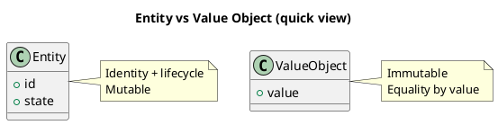

# Chương 20 — Entity, Value Object, Domain Service: đặt đúng loại để model không méo

Sau khi bạn hiểu bounded context và aggregate, câu hỏi tiếp theo thường là: “mình nên model cái này là entity hay value object?” và “khi nào cần domain service?”. Đây là chỗ dễ làm sai theo hai hướng:

1) **Mọi thứ đều là entity** → identity everywhere → logic rò rỉ, so sánh/đồng nhất khó.  
2) **Mọi thứ đều là DTO** → anemic domain model → invariants không ai bảo vệ.

Chương này giúp bạn chọn đúng loại và hiểu “vì sao” đằng sau lựa chọn đó. Ví dụ xuyên suốt là ADLP: Segment, Batch, Assignment, QualityScore, Money, Rating…

---

## Bạn sẽ nhận được gì sau chương này?

1) Một tiêu chí thực dụng để phân biệt Entity vs Value Object.  
2) Cách dùng Value Object để “đóng gói” rule và giảm bug.  
3) Khi nào cần Domain Service (và khi nào chỉ cần method trong aggregate).  
4) Best practices + anti-patterns thường gặp.  
5) Ví dụ ADLP cho từng loại.  
6) Exercise có hướng dẫn.

---

## 1) Entity vs Value Object: khác nhau ở “identity” và “nghĩa”

### 1.1 Entity
Entity là đối tượng có identity tồn tại theo thời gian. Bạn quan tâm “nó là ai”, không chỉ “nó có thuộc tính gì”.

Ví dụ ADLP:
- `User` (identity: user_id)
- `Batch` (identity: batch_id)
- `Review` (identity: review_id)

Entity có lifecycle. Nó đổi trạng thái, nhưng vẫn là “nó”.



### 1.2 Value Object (VO)
Value Object là đối tượng **không có identity riêng**, được xác định bởi giá trị/thuộc tính, và thường **immutable**. Bạn quan tâm “nó là gì”, không phải “nó là ai”.

Ví dụ ADLP:
- `QualityScore` (overall, wer_after, agreement, policy_version)
- `Money` (amount + currency)
- `TimeWindow` (start/end)
- `Priority` (tier_weight, deadline_urgency…)

VO đặc biệt hữu ích vì nó đóng gói rule: validation, normalization, comparison.

> **NOTE**  
> Nếu bạn thấy mình phải gắn `id` vào mọi thứ để so sánh, có thể bạn đang biến VO thành entity sai cách.

### 1.3 Code comparison: Entity vs Value Object (ADLP)

```python
@dataclass(frozen=True)
class BatchId:
    value: str

    def __post_init__(self):
        if not self.value:
            raise ValueError("BatchId cannot be empty")

    def __str__(self) -> str:
        return self.value


class Batch(Entity):
    def __init__(self, batch_id: BatchId, tier: str):
        self.id = batch_id
        self.tier = tier
        self.status = "AVAILABLE"
        self.version = 0  # identity persists over time

    def assign(self, labeler_id: str):
        if self.status != "AVAILABLE":
            raise DomainError("Batch not available")
        self.status = "ASSIGNED"
        self.version += 1
```

Điểm khác biệt:
- `BatchId` là VO: immutable, so sánh theo giá trị, không có lifecycle.  
- `Batch` là Entity: có identity + trạng thái thay đổi theo thời gian.  

### 1.4 Value Object với behavior: QualityScore

```python
@dataclass(frozen=True)
class QualityScore:
    overall: Decimal
    wer_after: Decimal
    agreement: Decimal
    policy_version: str

    def __post_init__(self):
        if not (0 <= self.overall <= 1):
            raise ValueError("Overall score must be 0..1")
        if not (0 <= self.wer_after <= 1):
            raise ValueError("WER must be 0..1")
        if not (0 <= self.agreement <= 1):
            raise ValueError("Agreement must be 0..1")

    def meets_threshold(self, tier: str) -> bool:
        thresholds = {"basic": Decimal("0.70"), "premium": Decimal("0.85")}
        return self.overall >= thresholds.get(tier, Decimal("0.70"))
```

### 1.5 Value Object tài chính: Money

```python
@dataclass(frozen=True)
class Money:
    amount: Decimal
    currency: str

    def __post_init__(self):
        if self.amount < 0:
            raise ValueError("Amount cannot be negative")
        if self.currency not in ["USD", "VND"]:
            raise ValueError("Unsupported currency")

    def add(self, other: "Money") -> "Money":
        if self.currency != other.currency:
            raise ValueError("Currency mismatch")
        return Money(self.amount + other.amount, self.currency)
```

---

## 2) Cách quyết định: “cái này có identity riêng không?”

Hãy hỏi 3 câu:

1) Nếu hai đối tượng có cùng giá trị, chúng có được xem là một không?  
Nếu “có” → VO. Nếu “không” → Entity.

2) Bạn có cần theo dõi lịch sử của đối tượng đó như một cá thể không?  
Nếu “có” → Entity.

3) Đối tượng có lifecycle độc lập không (create/update/delete)?  
Nếu “có” → Entity.

Ví dụ ADLP:
- `Segment`: có segment_id, tồn tại độc lập → Entity (trong Prelabeling/Labeling).
- `Confidence`: chỉ là số + rule range 0..1 → VO (hoặc primitive với validation VO).
- `Assignment`: thường là entity trong Batch aggregate (assignment_id + locked_until).

---

## 3) Vì sao Value Object là “vũ khí bí mật” để giảm bug?

VO giúp bạn:
- ép validation tại biên,
- tránh “magic numbers” rải rác,
- so sánh bằng giá trị (đúng nghĩa),
- và giữ invariants gọn trong một nơi.

### Ví dụ ADLP: QualityScore VO
Nếu bạn để `wer_after`, `agreement`, `overall` là float rải rác, bạn sẽ:
- tính overall mỗi nơi một kiểu,
- quên policy_version,
- khó audit.

Nếu bạn có `QualityScore` VO, bạn có thể:
- validate range 0..1,
- compute overall theo policy,
- serialize với policy_version.

Chỉ riêng việc VO hóa đã làm code “ít sai” hơn.

---

## 4) Domain Service: khi nào cần, khi nào không?

Domain Service dùng khi:
- logic thuộc domain,
- nhưng không “thuộc về” một entity nào một cách tự nhiên,
- hoặc cần phối hợp nhiều aggregates/entities.

Ví dụ ADLP:
- Tính Elo rating update có thể là domain service nếu nó dùng nhiều input và không thuộc riêng `Labeler`.
- Policy routing labeler cho batch có thể là domain service (nhưng kết quả phải được enforce bởi Batch aggregate).

### Khi không cần domain service
Nếu logic là rule của một aggregate, hãy để nó trong aggregate root.  
Ví dụ: `Batch.assignTo()` nên nằm trong Batch, vì Batch bảo vệ invariant “one active assignment”.

> **WARNING — Anti-pattern**  
> Nếu mọi logic đều ở “Service” và entities chỉ là DTO, bạn đang quay về anemic domain model.

### 4.1 Domain Service example: BatchAssignmentService

```python
class BatchAssignmentService:
    def __init__(self, eligibility_policy, fairness_policy):
        self._eligibility = eligibility_policy
        self._fairness = fairness_policy

    def find_best_match(self, batch, candidates):
        eligible = [c for c in candidates if self._eligibility.is_eligible(c, batch)]
        if not eligible:
            return None
        return self._fairness.select_best(eligible, batch)
```

---

## 5) Áp dụng vào ADLP: ví dụ phân loại (thực dụng)

### Entities (thường gặp)
- Batch, Assignment, Review, User, Segment

### Value Objects (thường gặp)
- Money, QualityScore, Priority, Skill, TimeWindow, PolicyVersion

### Domain Services (có thể cần)
- RoutingPolicyService (tính eligibility/priority)
- QualityScoringService (tính score theo policy)
- RatingUpdateService (Elo update)

Điểm mấu chốt: Domain service tính toán, nhưng aggregate root vẫn phải enforce invariants và phát events.

### 5.1 Entity vs VO vs Domain Service (tóm tắt)

| Tiêu chí | Entity | Value Object | Domain Service |
|---|---|---|---|
| Identity | Có (ID) | Không | N/A |
| Mutability | Mutable | Immutable | N/A |
| Equality | By ID | By value | N/A |
| Lifecycle | Create/Update/Delete | Create only | N/A |
| Example (ADLP) | Batch, Review | QualityScore, Money | BatchAssignmentService |

---

## 6) Anti-patterns

### 6.1 “Everything is an entity”
Hậu quả: identity everywhere, khó so sánh đúng nghĩa, nhiều lifecycle giả.

### 6.2 “Primitive obsession”
QualityScore, Money, PolicyVersion bị biểu diễn bằng string/float rải rác.  
Hậu quả: validation trùng lặp, sai semantics, audit khó.

### 6.3 “Service layer as domain”
Domain logic nằm hết trong application services.  
Hậu quả: invariants rò rỉ, testing khó, concurrency bug.

---

## 7) Best practices (kèm giải thích)

### 7.1 Dùng VO cho “định nghĩa đắt tiền”
Accepted/QualityScore/Priority/Money là những thứ nên VO hóa vì sai một chút là vỡ business.

### 7.2 Entity phải có lifecycle rõ
Nếu entity không có lifecycle, có thể bạn nên dùng VO.

### 7.3 Domain service phải “stateless”
Domain service thường là pure logic. State thuộc aggregate hoặc repository.

---

## 8) Exercise có hướng dẫn (30–45 phút)

Chọn 10 khái niệm trong workflow của bạn và phân loại:
- Entity hay VO?
- Nếu VO: rule/validation nào nó nên đóng gói?
- Nếu Entity: identity và lifecycle là gì?

### Đáp án tham khảo (ADLP, rút gọn)
- Batch (Entity), Assignment (Entity), QualityScore (VO), Money (VO), PolicyVersion (VO), Review (Entity).

**Câu hỏi tự kiểm**
1) Bạn có đang gắn id vào thứ chỉ cần value không?  
2) Bạn có đang dùng primitive cho thứ “đắt tiền” không?  
3) Rule đang nằm ở VO/aggregate hay rải rác?  

---

## 9) Artefacts/Deliverables sau chương này

- Bảng phân loại entity/VO cho 1 context.
- Danh sách “định nghĩa đắt tiền” cần VO hóa.
- Danh sách domain services (nếu có) và responsibilities.

---

## Checklist (dùng ngay)

> **CHECKLIST**
> - [ ] Entity vs VO được quyết định theo identity và semantics (không theo “thích”)  
> - [ ] VO quan trọng có validation/normalization (giảm bug)  
> - [ ] Domain service chỉ dùng khi logic không thuộc tự nhiên vào một entity/aggregate  
> - [ ] Tránh anemic model: rule phải ở domain, không nằm hết trong service  
> - [ ] Các VO/Entity “đắt tiền” có unit tests theo table (policy/tier/version)  
