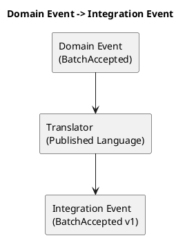

# Chương 21 — Domain Events & Consistency: đúng nghĩa, đúng chỗ, và không tự bắn vào chân

Khi một hệ thống chuyển sang event-driven, nó có thể trở nên mạnh mẽ hoặc trở thành cơn ác mộng. Sự khác biệt không nằm ở Kafka hay RabbitMQ. Nó nằm ở việc bạn hiểu đúng:

- Domain Event là gì (và khác Integration Event ra sao),
- Eventual consistency nghĩa là gì (và không có nghĩa là “chấp nhận bừa”),
- Saga/Process Manager dùng khi nào (và khi nào không),
- Versioning, idempotency, correlation IDs cần để workflow không vỡ âm thầm.

Trong ADLP, đây là phần “đắt tiền”: payout, export, review/escalation đều là workflow dài. Nếu event semantics sai, bạn sẽ trả tiền sai hoặc export sai — và đó là thiệt hại thật.

---

## Bạn sẽ nhận được gì sau chương này?

1) Phân biệt rõ Domain Event vs Integration Event.  
2) Hiểu eventual consistency bằng ví dụ đời thực (ADLP).  
3) Khi nào cần Saga/Process Manager, khi nào chỉ cần domain events.  
4) Best practices về schema versioning, idempotency, retry/DLQ, tracing.  
5) Anti-patterns: event như log, full-row payload, sync-everything.  
6) Exercise có hướng dẫn: thiết kế 1 flow event-driven cho payout/export trong ADLP.

---

## 1) Domain Event là gì? Integration Event là gì?

### 1.1 Domain Event
Domain Event là “điều đã xảy ra” trong domain, trong phạm vi một bounded context. Nó phản ánh một state change có ý nghĩa nghiệp vụ.

Ví dụ ADLP:
- `BatchAccepted` (Quality Assurance)
- `BatchAssigned` (Task Assignment)

Điểm quan trọng: domain event thuộc về ngôn ngữ của context.

### 1.2 Integration Event
Integration Event là thông điệp mà context phát ra để context khác tiêu thụ. Nó thường dựa trên domain event, nhưng được đóng gói như published language (schema versioned).

Trong thực tế, cùng một event type có thể vừa là domain event vừa là integration event nếu bạn dùng published language thống nhất. Nhưng bạn phải rõ: owner context là ai, semantics thuộc ai.

> **NOTE**  
> Domain event là “truth” của context. Integration event là “contract” cho thế giới bên ngoài.

### 1.3 Ví dụ schema: Domain Event vs Integration Event (ADLP)

**Domain Event (nội bộ Quality context)**

```python
@dataclass(frozen=True)
class BatchAccepted(DomainEvent):
    batch_id: str
    labeler_id: str
    policy_version: str
    decision_version: int
    accepted_at: str
```

**Integration Event (published language cho Wallet/Export)**

```json
{
  "event_id": "uuid",
  "event_type": "BatchAccepted",
  "occurred_at": "2025-12-20T10:20:30Z",
  "version": "1.0.0",
  "producer": "quality-assurance",
  "correlation_id": "uuid",
  "causation_id": "uuid",
  "payload": {
    "batch_id": "b-123",
    "labeler_id": "l-999",
    "policy_version": "2.1.0",
    "decision_version": 3
  }
}
```

Domain Event chỉ cần đúng trong context; Integration Event phải ổn định, versioned, và đủ dữ liệu để consumer chạy workflow mà không “gọi ngược DB”.



---

## 2) Eventual consistency: không phải “sai một lúc cũng được”

Eventual consistency nghĩa là:
- system chấp nhận rằng hai context không cập nhật cùng một thời điểm,
- nhưng cuối cùng sẽ hội tụ về trạng thái đúng,
- và bạn có cơ chế để xử lý duplicates/out-of-order/retry.

### Ví dụ ADLP: Quality → Payout

Quality quyết định `BatchAccepted`. Wallet/Payment credit payout dựa trên event đó.

Bạn không cần distributed transaction giữa Quality DB và Wallet DB. Bạn chấp nhận eventual consistency:
- `BatchAccepted` được publish,
- Wallet consume và credit.

Điều này “đúng” nếu:
- Wallet xử lý idempotent (không double credit),
- có DLQ/retry khi consumer fail,
- có audit trail.

Nếu bạn chỉ “bắn event” mà không idempotency, eventual consistency sẽ biến thành “random consistency”.

---

## 3) Saga và Process Manager: khi nào cần?

Saga/Process Manager dùng khi workflow chạy qua nhiều contexts và cần orchestrate các bước để đạt outcome đúng, đặc biệt khi có failure/compensation.

### 3.1 Khi nên dùng
- Workflow có nhiều bước và có failure modes phức tạp.
- Có cần compensation (hoàn tác/đền bù).
- Cần state machine dài.

ADLP: escalation workflow hoặc payout workflow có thể cần process manager nếu business yêu cầu hold period, dispute resolution, multiple approvals.

### 3.2 Khi không cần
Nếu workflow chỉ là “event triggers action”, và failure xử lý bằng retry/DLQ, bạn chưa cần saga.

Ví dụ: PrelabelCompleted → Assignment creates batch. Nếu fail, retry/ DLQ đủ.

> **BEST PRACTICE**  
> Đừng dùng saga để “có vẻ enterprise”. Dùng khi bạn thật sự cần stateful orchestration và compensation.

---

## 4) Schema versioning và published language: điều kiện để events không vỡ

Event schema là API public. Bạn cần:
- envelope chuẩn (event_id, version, correlation_id),
- semver rules,
- consumer tolerant unknown fields,
- deprecation plan.

ADLP: `BatchAccepted` schema phải ổn định vì nó ảnh hưởng payout/export.

### 4.1 Versioning strategy (V1 → V2 additive)

```python
# V1
@dataclass(frozen=True)
class BatchAssignedV1:
    batch_id: str
    labeler_id: str
    tier: str


# V2 (additive)
@dataclass(frozen=True)
class BatchAssignedV2:
    batch_id: str
    labeler_id: str
    tier: str
    priority: int  # new field

    @classmethod
    def from_v1(cls, v1: BatchAssignedV1) -> "BatchAssignedV2":
        priority_map = {"basic": 1, "premium": 2}
        return cls(
            batch_id=v1.batch_id,
            labeler_id=v1.labeler_id,
            tier=v1.tier,
            priority=priority_map.get(v1.tier, 1)
        )
```

---

## 5) Idempotency: kỹ thuật nhưng là vấn đề domain

Idempotency giúp bạn đảm bảo:
- retry không gây double effect,
- duplicate event không gây double payout,
- out-of-order không làm workflow sai.

Ví dụ ADLP:
- `BatchAccepted` consumed 2 lần → nếu wallet credit 2 lần, bạn mất tiền.

Idempotency key nên dựa trên “business identity” (batch_id, submission_id, policy_version), không dựa trên event_id (vì event_id đổi theo publish).

---

## 6) Best practices (kèm giải thích)

### 6.1 Event phải business-readable
Tránh `updated/changed`. Dùng `BatchAccepted`, `ReviewRequired`.

### 6.2 Payload tối thiểu nhưng đủ
Payload quá nhỏ → consumer phải call ngược DB nội bộ (xuyên tường).  
Payload quá lớn → coupling schema.

### 6.3 Retry/DLQ là bắt buộc
Event-driven không có DLQ là “chờ mất dữ liệu”.

### 6.4 Correlation/causation IDs để trace
Không trace được workflow thì debug sẽ rất đắt.

### 6.5 Event chain với correlation/causation

```text
Request: POST /batches/123/assign
  correlation_id: req-abc-123

Event 1: BatchAssigned
  event_id: evt-001
  correlation_id: req-abc-123
  causation_id: req-abc-123

Event 2: NotificationSent
  event_id: evt-002
  correlation_id: req-abc-123
  causation_id: evt-001

Event 3: WalletReserved
  event_id: evt-003
  correlation_id: req-abc-123
  causation_id: evt-001
```

---

## 7) Anti-patterns

### 7.1 Event như log DB
Full row payload, schema coupling.

### 7.2 Sync-everything
Downtime cascade.

### 7.3 Không idempotency
Double payout/export.

---

## 8) Exercise có hướng dẫn (45–60 phút): thiết kế flow payout/export cho ADLP

### Bước 1: Chọn event owner
Owner: Quality context phát `BatchAccepted`.

### Bước 2: Xác định consumers
Consumers: Export, Wallet/Payment.

### Bước 3: Định nghĩa idempotency keys
- Wallet: key = batch_id
- Export: key = batch_id + dataset_version

### Bước 4: Xác định failure handling
- retry policy + DLQ
- audit log on failure

### Đáp án tham khảo
`BatchAccepted` (quality) → `PayoutCredited` (wallet) và `DatasetExported` (export) với idempotency.

---

## 9) Artefacts/Deliverables sau chương này

- Event catalog cho workflow cross-context.
- Schema envelope + versioning rules.
- Idempotency key strategy cho events đắt tiền.
- Decision: saga/process manager có cần không.

---

## Checklist (dùng ngay)

> **CHECKLIST**
> - [ ] Bạn phân biệt rõ Domain Event vs Integration Event và owner context  
> - [ ] Events có schema/envelope + versioning rules (semver) + compatibility policy  
> - [ ] Consumer idempotent cho events đắt tiền (payout/export/accept)  
> - [ ] Retry/DLQ policy có owner + runbook (không “để production tự xử”)  
> - [ ] Nếu workflow thật sự stateful + cần compensation: bạn quyết định rõ saga/process manager  
