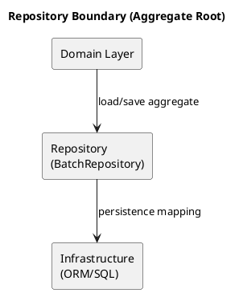

# Chương 22 — Repository & Factory: persistence ignorance và “đừng biến repository thành DAO”

Sau khi bạn có aggregate/invariants (chương 19) và phân loại entity/VO (chương 20), câu hỏi tiếp theo là: “lưu và tạo domain objects như thế nào mà không phá domain?”

Đây là nơi nhiều dự án trượt về data-driven design:
- Repository bị biến thành DAO (lộ schema, lộ query khắp nơi).
- Domain model phụ thuộc ORM (khó test, khó refactor).
- Factory bị bỏ qua, invariants bị phá khi tạo object.

Chương này giải thích repository và factory theo cách thực dụng, gắn với ADLP: Batch aggregate, QualityEvaluation aggregate, Money/QualityScore VO…

---

## Bạn sẽ nhận được gì sau chương này?

1) Hiểu repository là gì (và khác DAO thế nào).  
2) Hiểu persistence ignorance và vì sao nó giúp domain bền.  
3) Khi nào cần factory, khi nào không.  
4) Best practices về interface, transaction boundary, unit of work.  
5) Anti-patterns: query leak, anemic model, repository “toàn năng”.  
6) Exercise có hướng dẫn: thiết kế repository/factory cho Batch aggregate.

---

## 1) Repository là gì (theo DDD)?

Repository là một abstraction giúp domain nghĩ rằng nó đang làm việc với collection của aggregates, thay vì làm việc với DB.

Repository thường cung cấp:
- `get(id)` / `load(id)`
- `save(aggregate)`
- các truy vấn theo domain (không theo schema)

Repository phục vụ **aggregate roots**, không phục vụ mọi entity.

### Repository ≠ DAO
DAO tập trung vào data access và schema. Repository tập trung vào domain model.

Nếu repository của bạn expose “query by columns” tràn lan, nó đang trở thành DAO.



---

## 2) Persistence ignorance: vì sao domain không nên phụ thuộc ORM

Persistence ignorance không có nghĩa là “không quan tâm persistence”. Nó nghĩa là:
- domain model không bị buộc phải có annotation/ORM-specific,
- domain logic có thể test mà không cần DB,
- mapping persistence là chuyện của infrastructure layer.

Trong ADLP, nếu Batch aggregate phụ thuộc ORM session, bạn sẽ khó test concurrency/invariant và khó refactor.

### 2.1 Mapping layer: nơi “dịch” schema → domain

Bạn nên có một lớp mapping rõ ràng:
- từ DB row → aggregate (hydrate),
- từ aggregate → persistence model (dehydrate).

Khi mapping nằm ở infrastructure, domain model không bị “dính ORM” và bạn có thể test domain bằng in-memory objects.

---

## 3) Factory: vì sao tạo object cũng là “domain logic”

Factory dùng khi việc tạo object cần bảo vệ invariants hoặc cần phối hợp nhiều giá trị hợp lệ.

Ví dụ ADLP:
- Tạo Batch từ segments cần kiểm tra:
  - segments hợp lệ,
  - tier/deadline hợp lệ,
  - batch size theo policy.

Nếu bạn để mọi nơi “Batch(...)” tự tạo, invariants sẽ bị phá.

---

## 4) Unit of Work và transaction boundary

Repository thường đi với Unit of Work (UoW):
- UoW đảm bảo transaction boundary cho một use case.
- Aggregate bảo vệ invariants trong boundary đó.

Ví dụ ADLP:
- Use case `AssignBatch`:
  - load Batch aggregate
  - apply command `assignTo`
  - save Batch
  - commit transaction
  - publish event `BatchAssigned`

Nếu bạn commit ở giữa, invariants có thể bị phá.

```python
# Unit of Work Usage Example
def assign_batch_use_case(batch_id, labeler_id, uow: UnitOfWork):
    with uow:
        # 1. Load Aggregate
        batch = uow.batches.get(batch_id)
        labeler = uow.profiles.get(labeler_id)
        
        # 2. Domain Logic (Invariants protected here)
        batch.assign_to(labeler, uow.ttl_policy)
        
        # 3. Save (State change documented)
        uow.batches.save(batch)
        
        # 4. Commit (Transaction boundary)
        # Events will be published via Outbox here
        uow.commit()
```

### 4.1 UoW + Outbox: kỷ luật “commit rồi mới publish”

```python
class UnitOfWork(Protocol):
    batches: BatchRepository
    outbox: OutboxRepository

    def commit(self) -> None:
        ...


def submit_transcript(cmd, uow: UnitOfWork):
    with uow:
        batch = uow.batches.get(cmd.batch_id)
        batch.submit(cmd.labeler_id, cmd.payload)
        uow.batches.save(batch)

        for event in batch.pull_domain_events():
            uow.outbox.add(event.to_integration())

        uow.commit()
```

Outbox giúp bạn đảm bảo: state change và event publish là một transaction logic, không phải “cố gắng cho kịp”.

---

## 5) Best practices (kèm giải thích)

### 5.1 Repository chỉ trả aggregate roots
Đừng có `getAssignmentById()` nếu assignment là entity nội bộ của Batch.

```python
class BatchRepository(Protocol):
    def get(self, id: BatchId) -> Batch:
        """Returns Aggregate Root. Throws if not found."""
        ...

    def save(self, batch: Batch) -> None:
        """Persists the whole Aggregate."""
        ...
        
    # No find_assignment_by_id(id) exposed!
```


### 5.2 Query theo domain, không theo schema
Thay vì `findByStatusAndUpdatedAt`, hãy hỏi theo domain intent:
`findAvailableBatchFor(labeler_profile)` (và mapping ở infra).

### 5.3 Publish events sau commit (hoặc outbox)
Để tránh publish event cho transaction fail, cần outbox pattern hoặc publish-after-commit.

### 5.4 Factory chốt invariants khi create
Factory nên là nơi enforce “batch size”, “tier rules”, “deadline rules”.

```python
class BatchFactory:
    def create_batch(self, segments: List[Segment], tier: Tier) -> Batch:
        # Enforce creation invariants
        if len(segments) == 0:
            raise DomainError("Batch must have segments")
        
        if tier == Tier.PREMIUM and len(segments) > 50:
             raise DomainError("Premium batch size limit exceeded")
             
        return Batch(id=uuid.uuid4(), segments=segments, tier=tier)
```

### 5.4.1 Factory cho creation phức tạp (ADLP)

```python
class BatchFactory:
    def create_from_prelabel(self, segments, tier, deadline, policy_version):
        if not segments:
            raise DomainError("Segments required")
        if deadline <= datetime.utcnow():
            raise DomainError("Deadline must be in the future")
        if policy_version is None:
            raise DomainError("Policy version required")
        return Batch(
            id=uuid.uuid4(),
            segments=segments,
            tier=tier,
            deadline=deadline,
            policy_version=policy_version
        )
```

### 5.5 Query example: hỏi theo ngôn ngữ domain

```python
class BatchRepository(Protocol):
    def find_next_for(self, labeler_profile: LabelerProfile) -> Optional[Batch]:
        """Domain intent: pick best available batch for this labeler."""
        ...
```

Infrastructure có thể map thành query phức tạp, nhưng domain chỉ thấy “ý định”.

### 5.6 Optimistic locking: bảo vệ invariants dưới concurrency

Nếu bạn có invariant “one active assignment”, repository cần hỗ trợ optimistic lock:

```python
def save(self, batch: Batch) -> None:
    # raises ConcurrencyError if version mismatch
    ...
```

Không có optimistic lock, bạn sẽ thấy double-assign trong production.

### 5.7 Repository testing strategy (tối thiểu)

- **Roundtrip test:** save → load → aggregate state không đổi.  
- **Concurrency test:** save with stale version → raise ConcurrencyError.  
- **Outbox test:** commit state + outbox record trong cùng transaction.  

```python
def test_batch_roundtrip(repo):
    batch = BatchFactory().create_batch([Segment("s1")], Tier.PREMIUM)
    repo.save(batch)
    loaded = repo.get(batch.id)
    assert loaded.status == batch.status
```


---

## 6) Anti-patterns

### 6.1 Repository như “God DAO”
Repository có 50 methods query theo columns → domain bị lộ schema.

### 6.2 Domain model phụ thuộc ORM
Domain bị trói; test khó; refactor đau.

### 6.3 Bỏ qua factory
Create object ở mọi nơi → invariants bị phá từ lúc khởi tạo.

### 6.4 Repository trả DTO thay vì aggregate
Repository trả “partial data” làm domain không có đủ trạng thái để bảo vệ invariants.  
Nếu bạn cần view model, hãy tạo read model ở application/infrastructure (Chương 25/29).

---

## 7) Exercise có hướng dẫn (45 phút): thiết kế repository/factory cho Batch

### Bước 1: Viết responsibilities của Batch aggregate
- enforce one active assignment
- TTL unlock rule

### Bước 2: Thiết kế BatchRepository interface (domain-friendly)
- `get(batch_id)`
- `save(batch)`
- `findNextBatchFor(labeler_profile)` (optional)

### Bước 3: Thiết kế BatchFactory
- `createFromPrelabel(segments, tier, deadline, policy_version)`

### Bước 4: Gắn UoW
Use case `AssignBatch` dùng UoW để load/apply/save/commit.

**Câu hỏi tự kiểm**
1) Repository có leak schema không?  
2) Factory có bảo vệ invariants khi create không?  
3) Events publish có an toàn với transaction không?  

---

## 8) Artefacts/Deliverables sau chương này

- Repository interface cho 1–2 aggregates core.
- Factory cho creation logic “đắt tiền”.
- Quy ước UoW + publish events (outbox strategy).
- Mapping rules (schema ↔ domain) cho 1 aggregate.

---

## Checklist (dùng ngay)

> **CHECKLIST**
> - [ ] Repository phục vụ aggregate roots, không biến thành DAO query theo cột  
> - [ ] Domain không phụ thuộc ORM/framework (persistence ignorance)  
> - [ ] Transaction boundary/UoW rõ cho mỗi use case (commit ở một nơi)  
> - [ ] Publish events an toàn (after-commit hoặc outbox)  
> - [ ] Factory được dùng cho creation có invariants/policy (không tạo object bừa)  
