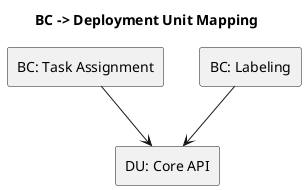
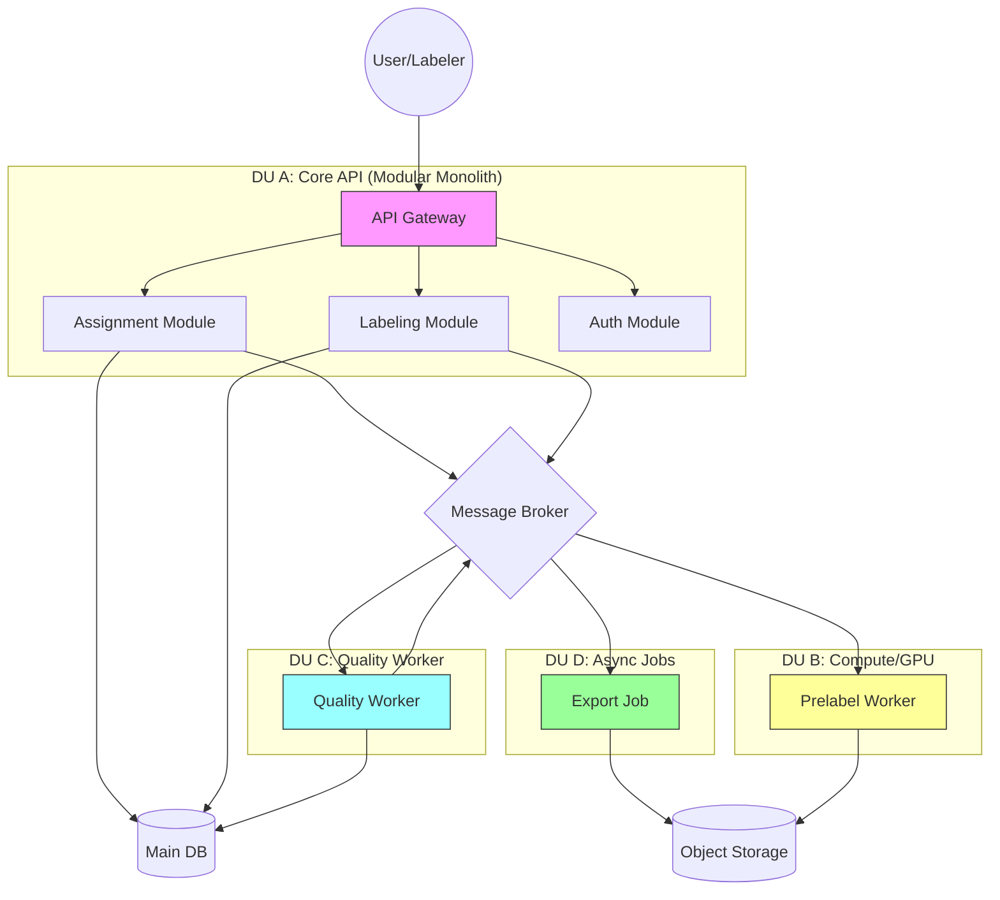

# Chương 23 — Từ Domain Model sang kiến trúc hệ thống: BC ↔ Deployment Unit, Microservices vs Modular Monolith

Nếu Strategic/Tactical Design là “bản đồ đúng”, thì System/Solution Design là “con đường chạy được”. Ở chương 23, ta sẽ làm một việc mà nhiều team làm ngược: **dịch domain model sang kiến trúc** một cách có lý do.

Sai lầm phổ biến là:
- thấy 9 bounded contexts → lập tức tách 9 microservices,
- hoặc ngược lại: sợ microservices → nhét mọi thứ vào một monolith bừa.

DDD thực dụng không đứng về phe nào. Nó bắt bạn đặt câu hỏi đúng:

> “Điểm nào cần cô lập rủi ro? điểm nào cần scale độc lập? điểm nào cần ownership rõ? và điểm nào nên giữ chung để ship nhanh?”

Ví dụ xuyên suốt: ADLP theo Strategic Design v0.2 (`design/docs/2.StrategicDesign/DDD_STRATEGIC_DESIGN_V0.2.md`).

---

## Bạn sẽ nhận được gì sau chương này?

1) Một bộ driver để quyết định BC nào nên tách/gộp thành deployment unit (không theo cảm tính).  
2) Một cách nhìn thực dụng về microservices vs modular monolith (không “tôn giáo”).  
3) Cách tránh distributed monolith (kẻ thù số 1 khi tách service).  
4) Áp dụng vào ADLP: đề xuất topology triển khai theo phases.  
5) Best practices + anti-patterns.  
6) Exercise có hướng dẫn: chọn topology cho workflow “premium 48h”.

---

## 1) BC là ranh giới ngôn ngữ; Deployment Unit là ranh giới triển khai

Bounded Context là ranh giới của:
- ngôn ngữ (ubiquitous language),
- trách nhiệm (responsibilities),
- ownership (team/policy owner).

Deployment Unit (DU) là ranh giới của:
- deploy/release,
- scaling,
- failure isolation (blast radius),
- observability boundaries,
- operational ownership.

BC và DU có quan hệ mạnh, nhưng không bắt buộc 1–1 ngay từ ngày đầu. DDD thực dụng hay dùng mô hình:
- BC là module boundaries trong code,
- sau đó tách DU theo driver thực tế.

> **NOTE**  
> Nếu bạn tách DU trước khi BC chín, bạn thường tạo distributed monolith. Nếu bạn có BC rõ nhưng không bao giờ nghĩ DU, bạn sẽ kẹt ở “diagram đẹp”.

---

## 2) 6 driver quyết định “tách hay gộp”

Đây là bộ driver thực dụng để bạn ra quyết định:

### 2.1 Scale driver (tải và kiểu tải khác nhau)
Nếu một phần cần scale GPU/compute khác hẳn phần còn lại, đó là tín hiệu mạnh để tách DU.

ADLP: Prelabeling inference (GPU/SageMaker) khác hoàn toàn Labeling API (I/O + web).

### 2.2 Change-rate driver (tốc độ thay đổi khác nhau)
Core domain đổi nhanh; generic domain đổi chậm. Tách DU giúp bạn deploy độc lập mà không kéo nhau.

ADLP: Quality policy có thể đổi thường xuyên; Identity/Auth ít đổi.

### 2.3 Ownership driver (team boundary)
Nếu ownership tách, DU nên tách để giảm phối hợp release.

### 2.4 Risk driver (blast radius và compliance)
Phần nào sai là “toang” (payout, export) thường cần cô lập và audit rõ. Tách DU giúp kiểm soát rủi ro và quyền.

ADLP: Wallet/Payment và Export thường cần isolation và audit.

### 2.5 Latency driver (đường user-facing vs async)
Đường user-facing cần p95 thấp, còn worker pipeline chấp nhận async. Tách DU giúp tối ưu runtime và scaling.

### 2.6 Data boundary driver (data ownership và migrations)
DB per service không phải mục tiêu tự thân, nhưng tách DU thường đi kèm tách schema ownership để tránh “schema coupling”.

---

## 3) Microservices vs Modular Monolith: chọn theo giai đoạn

### 3.1 Modular Monolith (DDD boundaries inside one deploy)
Modular monolith là lựa chọn mạnh khi:
- team nhỏ,
- domain còn tiến hóa nhanh (cần refactor rẻ),
- muốn ship nhanh mà vẫn giữ boundaries.

Điều kiện bắt buộc để modular monolith “không thối”:
- module boundaries thật (không xuyên tường),
- contracts rõ (internal events/interfaces),
- tests theo module,
- không share persistence model tùy tiện.

### 3.2 Microservices (BC as deploy units)
Microservices mạnh khi:
- scaling/availability/ownership cần độc lập,
- domain chín hơn,
- bạn có năng lực ops (CI/CD, observability, runbooks).

Microservices thất bại khi:
- tách theo DB/UI/CRUD,
- thiếu contract governance,
- thiếu idempotency/tracing,
- thiếu đội ops tương ứng.

> **WARNING — Distributed monolith**  
> Dấu hiệu: service A gọi service B gọi service C cho mỗi request; downtime cascade; schema changes phá nhiều service. Đây là “tách sai”.

---

## 4) Áp dụng vào ADLP: topology theo phases (thực dụng)

Strategic Design v0.2 có 9 BC. Nhưng topology triển khai có thể theo phase:

### Phase 1 (ship đúng workflow, MVP)
Giữ modular monolith cho API-facing (gateway/labeling/assignment) nhưng tách worker/inference:
- DU A: “Core API” (Assignment + Labeling + Auth thin gateway) — để ship nhanh UI và workflow.
- DU B: Prelabeling worker/orchestrator (scale riêng).
- DU C: Quality worker (scale riêng, policy-driven).
- DU D: Export job (có thể gộp với quality nếu tải nhẹ).

Mục tiêu: chạy được premium 48h end-to-end, chốt semantics Accepted/Submitted.

**Phase 1 Deployment Topology**

### Phase 2 (enterprise hardening)
Tách theo ownership và risk:
- Identity/Auth thành DU riêng hoặc dùng managed service.
- Wallet/Payment tách DU riêng (audit + compliance + idempotency).
- Export tách DU riêng nếu có SLA/throughput riêng.

### Phase 3 (scale & governance)
Tách rõ 9 DU nếu driver đủ mạnh:
scale, ownership, and reliability justify.

> **NOTE**  
> Đây không phải “kịch bản duy nhất”. Nó là ví dụ cách dùng driver để ra quyết định.

---

## 5) Best practices (kèm giải thích)

### 5.1 Tách theo driver, không tách theo “cảm giác microservices”
Nếu bạn không viết ra driver, bạn đang tách theo trend. Driver giúp bạn defend decision trước leadership.

### 5.2 Tách workflow-critical boundaries trước
Trong ADLP, boundary “Submitted vs Accepted” và “Accepted triggers export/payout” là critical. Dù deploy thế nào, semantics phải thuộc đúng context (Quality).

### 5.3 Contract-first ở ranh giới
Tách DU mà thiếu contract governance (event schema, API versioning) là tự sát.

### 5.4 Observability phải đi cùng tách DU
Nếu bạn tách DU mà không có correlation_id/tracing/log structure, debug sẽ rất đắt.

---

## 6) Anti-patterns

### 6.1 “Microservices-first”
Tách 20 service khi domain chưa rõ → distributed monolith.

### 6.2 “Monolith-bừa”
Không boundary, ai cũng gọi ai → refactor không nổi khi scale.

### 6.3 “DB-first”
Thiết kế schema chung, rồi tách service quanh schema → coupling dữ liệu.

---

## 7) Exercise có hướng dẫn (45–60 phút): chọn topology cho workflow đắt tiền

### Bước 1: Chọn workflow
Premium order 48h (hoặc workflow tương đương).

### Bước 2: Liệt kê 6 drivers
Scale, change-rate, ownership, risk, latency, data boundary.

### Bước 3: Chọn 2–4 DU cho phase 1
Mục tiêu: ship đúng workflow, giữ ability refactor.

### Bước 4: Ghi 3 rủi ro nếu tách sai
Downtime cascade, schema coupling, double payout.

### Đáp án tham khảo (ADLP)
- DU API core + DU prelabel worker + DU quality worker + DU export/payout (tùy).

---

## 8) Artefacts/Deliverables sau chương này

- Bảng “BC → Deployment Unit” theo phase (v0).
- Danh sách drivers và lý do tách/gộp.
- Danh sách contract obligations (events/API) theo boundary.

---

## Checklist (dùng ngay)

> **CHECKLIST**
> - [ ] Bạn phân biệt BC (ngôn ngữ/ownership) và deployment unit (deploy/scale/blast radius)  
> - [ ] Bạn chọn topology theo drivers (risk isolation, scale, ownership), không theo “trend”  
> - [ ] Bạn có kế hoạch tránh distributed monolith (giảm call chain, contracts rõ, ownership rõ)  
> - [ ] Bạn có roadmap theo phase (MVP → tách dần) thay vì tách 9 services ngày 1  
> - [ ] Quyết định đắt tiền được ghi ADR (vì sao, trade-off, cách đo)  
