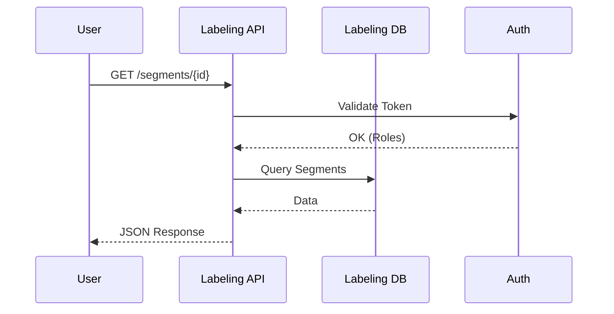
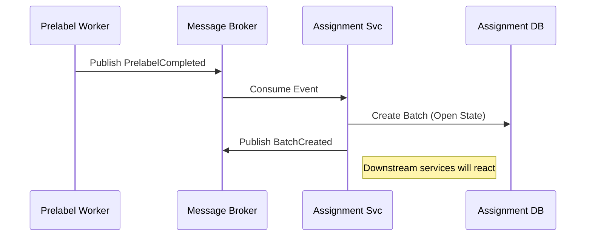
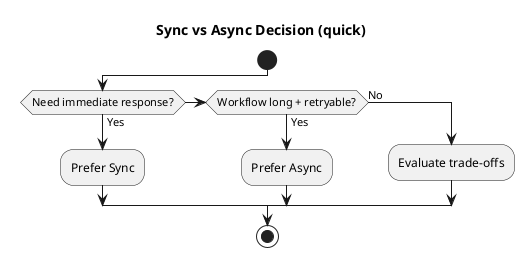

# Chương 24 — Integration Design: Sync vs Async, REST vs Events, Saga vs Orchestration, Contracts, Idempotency & Retries

Hầu hết coupling thật của hệ thống nằm ở integration. Bạn có thể chia bounded contexts đúng, nhưng nếu chọn integration sai, bạn vẫn tạo distributed monolith.

Chương này là “cẩm nang chiến đấu” cho integration design trong DDD:
- khi nào dùng synchronous (REST/gRPC),
- khi nào dùng asynchronous (events),
- saga (choreography/orchestration) dùng khi nào,
- contract và schema governance ra sao,
- idempotency/retries/DLQ cần gì để workflow không vỡ âm thầm.

Ví dụ xuyên suốt: ADLP (premium order 48h), nơi integration quyết định trực tiếp: batch assignment, quality gate, export/payout.

---

## Bạn sẽ nhận được gì sau chương này?

1) Một khung quyết định sync vs async theo loại coupling và workflow.  
2) Cách thiết kế contracts cho REST và events (payload tối thiểu nhưng đủ).  
3) Cách thiết kế idempotency, retries, DLQ và outbox theo “điểm đắt tiền”.  
4) Khi nào cần saga/process manager và cách chọn choreography vs orchestration.  
5) Anti-patterns phổ biến và cách tránh.  
6) Exercise có hướng dẫn: thiết kế integration cho `BatchAccepted → Export/Payout` trong ADLP.

---

## 1) Sync vs Async: chọn theo loại coupling, không chọn theo sở thích

### 1.1 Khi sync là đúng (REST/gRPC)
Sync phù hợp khi:
- cần response ngay (user-facing),
- query data cần tính tức thời,
- failure có thể hiển thị rõ cho user,
- upstream ổn định và bạn chấp nhận coupling thời gian.

Ví dụ ADLP:
- Labeling UI cần lấy segments + signed URLs → sync API là hợp lý.
- Assignment cần query user profile skills/rating (nếu không có cache/read model) → sync query có thể hợp lý ở MVP.

### 1.2 Khi async là đúng (events)
Async phù hợp khi:
- workflow dài, eventual consistency chấp nhận,
- muốn decouple temporal (producer không cần consumer online),
- throughput cao,
- cần audit trail và retry.

Ví dụ ADLP:
- PrelabelCompleted → Assignment tạo batch (async).
- BatchAccepted → Export/Payout (async).

### 1.3 Trade-off thực tế
- Sync: dễ debug, nhưng downtime cascade và coupling thời gian.
- Async: resilient hơn, nhưng cần governance (schema versioning, idempotency, tracing).

> **BEST PRACTICE**  
> Nếu một bước có thể retry an toàn và không cần phản hồi ngay cho user, ưu tiên async.

---

## 2) REST vs Events: khác nhau ở “hợp đồng” và “trách nhiệm”

REST contract thường là “request/response”, trong khi event contract là “published language”.

### 2.1 REST contract: điều cần chốt
- versioning (path `/v1`),
- error model (4xx/5xx + error codes),
- timeout/retry policy,
- pagination/filtering,
- auth scopes.

### 2.2 Event contract: điều cần chốt
- owner context,
- schema envelope (event_id, version, correlation_id),
- payload tối thiểu,
- compatibility rules,
- idempotency keys,
- ordering assumptions (nếu có).

ADLP: `BatchAccepted` event phải có policy_version và decision_id để audit và idempotency.

---

## 3) Payload tối thiểu nhưng đủ: tránh 2 cực đoan

### 3.1 Payload quá nhỏ → xuyên tường
Nếu consumer phải gọi ngược DB nội bộ của producer để làm việc, bạn tạo coupling ngầm và phá BC boundary.

### 3.2 Payload quá lớn → schema coupling
Nếu event chứa full row DB, consumer phụ thuộc schema nội bộ và vỡ khi producer refactor.

### 3.3 Kỹ thuật chọn payload
Hỏi: “Consumer cần gì để tiếp tục workflow mà không xuyên tường?”

Ví dụ ADLP:
- Export cần batch_id + dataset_version + signed URL generation inputs? (hoặc export service tự query accepted read model).
- Wallet cần batch_id + amount + reference để credit transaction (hoặc wallet tự tính amount từ pricing policy?).

> **NOTE**  
> Nếu payload thiếu, hãy tạo read model hoặc query API dedicated, thay vì join DB.

---

## 4) Idempotency, retries, DLQ: bắt buộc cho workflow đắt tiền

### 4.1 Idempotency
Idempotency đảm bảo retry/duplicate không gây double effect.

Trong ADLP, các điểm bắt buộc idempotency:
- payout credit,
- export generation,
- accept decision.

Idempotency key nên dựa trên business identity:
- payout: `batch_id`,
- export: `batch_id + dataset_version`,
- evaluate: `batch_id + submission_id + policy_version`.

### 4.2 Retries
Retries phải có backoff/jitter và giới hạn attempts.

### 4.3 DLQ
DLQ là nơi “mất mát có kiểm soát”. Không DLQ = mất dữ liệu hoặc kẹt workflow.

> **BEST PRACTICE**  
> Tất cả consumer của event “đắt tiền” phải có idempotency + DLQ + alerting.

---

## 5) Outbox: publish events an toàn với transaction

Nếu bạn commit DB rồi publish event trực tiếp, bạn có thể:
- publish event cho transaction fail,
- hoặc commit thành công nhưng publish fail.

Outbox pattern giải quyết bằng cách:
- ghi event vào outbox table trong cùng transaction,
- worker/outbox relay publish event,
- đảm bảo at-least-once publish và consumer idempotent.

ADLP: `BatchAccepted` nên dùng outbox để tránh “accepted nhưng không payout” vì publish fail.

---

## 6) Saga / Process Manager: choreography vs orchestration

### 6.1 Choreography
Mỗi service phản ứng theo events. Dễ mở rộng, nhưng khó nhìn “toàn cục”.

### 6.2 Orchestration
Một orchestrator giữ state và gọi/ra lệnh các bước. Dễ kiểm soát, nhưng tạo coupling trung tâm.

### Khi nào cần saga?
Khi workflow:
- có nhiều bước,
- có compensation,
- cần stateful tracking.

ADLP: escalation workflow nhiều level có thể cần process manager; prelabel → assignment thường chỉ cần events.

---

## 7) Anti-patterns

### 7.1 Sync-everything
Downtime cascade và coupling thời gian.

### 7.2 Event như log
`entity.updated` + full row payload → schema coupling.

### 7.3 Không governance
Schema đổi tùy hứng → consumer vỡ âm thầm.

### 7.4 Không idempotency
Double payout/export.

---

## 8) Exercise có hướng dẫn (45–60 phút): thiết kế integration cho BatchAccepted

### Bước 1: Xác định owner và consumers
Owner: Quality. Consumers: Export, Wallet.

### Bước 2: Chốt semantics
`BatchAccepted` nghĩa là exportable/payoutable.

### Bước 3: Chốt idempotency keys
- Wallet: batch_id
- Export: batch_id + dataset_version

### Bước 4: Chọn publish strategy
Outbox cho `BatchAccepted`.

### Bước 5: Chọn failure handling
Retry + DLQ + alerting.

---

## 9) Artefacts/Deliverables sau chương này

- Integration decision sheet: sync/async per edge.
- Contract list: API specs + event schemas.
- Idempotency/DLQ policy cho events đắt tiền.
- Decision: saga/process manager có cần không.

---

## Checklist (dùng ngay)

> **CHECKLIST**
> - [ ] Mỗi integration edge có quyết định sync/async với lý do (coupling loại nào)  
> - [ ] Contracts được coi như API public: schema versioning + deprecation plan  
> - [ ] Producer/consumer idempotent cho workflows đắt tiền (payout/export/accept)  
> - [ ] Retry có backoff+jitter+max attempts; có DLQ + owner + runbook  
> - [ ] Có correlation_id/causation_id để trace end-to-end  
