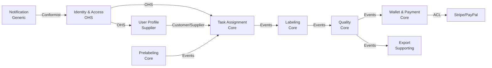

# DDD Practical Handbook — Review V3 (Chi tiết từng chương với action items cụ thể)

**Ngày review:** 2025-12-20
**Reviewer:** Architecture & Content Quality Team
**Phạm vi:** Review sau khi đã sửa theo v2, tập trung vào các chương ngắn/sơ sài
**Mục tiêu:** Đưa ra nhận xét chi tiết để có thể sửa, cải thiện, bổ sung ngay

---

## Executive Summary

Sau khi review v2, handbook đã được cải thiện đáng kể. Review v3 này tập trung vào:
1. **Các chương ngắn** (< 220 dòng) cần mở rộng
2. **Các chương thiếu code examples** cụ thể
3. **Các chương thiếu diagrams** quan trọng
4. **Nhận xét chi tiết** với action items cụ thể để có thể thực hiện ngay

### Tổng quan tình trạng

**Chương xuất sắc (không cần sửa nhiều):**
- Chương 1, 2, 3: Foundation rất tốt
- Chương 26: NFR by Design (17KB) - xuất sắc
- Chương 27-30: Implementation chapters - structure tốt
- Chương 31-32: Operations & Anti-patterns - rất đắt giá

**Chương cần cải thiện (review chi tiết bên dưới):**
- Chương 6, 7: Event Storming foundation - thiếu visuals
- Chương 15, 17: Context Map & ADR - thiếu examples đầy đủ
- Chương 18: Tactical readiness - thiếu checklist chi tiết
- Chương 20, 21: Entity/VO, Events - thiếu code comparison
- Chương 22: Repository/Factory - đã có code nhưng cần mở rộng
- Chương 25: Data & Infrastructure - đã tốt nhưng cần thêm patterns

---

## PHẦN I: Các chương ngắn nhất cần mở rộng (< 210 dòng)

### Chương 6 — Event Storming là gì (207 dòng) ⚠️

**Tình trạng hiện tại:**
- ✅ Concept rõ ràng, story mở đầu tốt
- ✅ Phân biệt Event vs Command tốt
- ✅ Exercise có hướng dẫn
- ❌ Thiếu visualization cho timeline
- ❌ Thiếu photo/diagram sticky notes layout
- ❌ Thiếu comparison table Event Storming vs các phương pháp khác

**Action items cụ thể:**

1. **Thêm ASCII art hoặc Mermaid diagram cho timeline** (sau dòng 133)
```
Timeline visualization:
[DataItemUploaded] → [DataItemNormalized] → [PrelabelCompleted] →
[BatchCreated] → [BatchAssigned] → [BatchSubmitted] →
[QualityEvaluated] → [ReviewRequired?] → [BatchAccepted] → [DatasetExported]
```

2. **Thêm comparison table** (sau section 3):
```markdown
| Phương pháp | Focus | Output | Khi nào dùng |
|-------------|-------|--------|--------------|
| Event Storming | Business events | Timeline + Hotspots | Discovery, shared understanding |
| Use Case Diagram | Actor actions | Use cases | Requirements gathering |
| Flowchart | Process flow | Decision tree | Technical implementation |
| User Story Mapping | User journey | Story backlog | Agile planning |
```

3. **Thêm section "Sticky notes color coding"** (sau section 4):
- Orange: Domain Events (đã xảy ra)
- Blue: Commands (ý định)
- Yellow: Actors
- Pink: Hotspots/Questions
- Green: Policies
- Purple: External Systems

4. **Mở rộng section 6 với step-by-step workshop flow** (chi tiết hơn):
- Minute 0-10: Giới thiệu rules
- Minute 10-40: Brainstorm events (silent writing)
- Minute 40-60: Timeline ordering
- Minute 60-80: Hotspots identification
- Minute 80-90: Glossary seed extraction

**Estimate:** +40-50 dòng → target 250-260 dòng

---

### Chương 7 — Các cấp độ Event Storming (196 dòng) ⚠️

**Tình trạng hiện tại:**
- ✅ Phân biệt 3 cấp độ rõ ràng
- ✅ Trade-offs cho từng cấp độ
- ✅ ADLP examples tốt
- ❌ Thiếu visual comparison 3 cấp độ
- ❌ Thiếu "transition criteria" giữa các cấp độ
- ❌ Thiếu "output artifacts" cụ thể cho từng cấp độ

**Action items cụ thể:**

1. **Thêm comparison table 3 cấp độ** (sau section 1):
```markdown
| Cấp độ | Thời gian | Participants | Output | Khi dừng |
|--------|-----------|--------------|--------|----------|
| Big Picture | 2-3h | All stakeholders | 10-20 events, hotspots | Khi có shared understanding |
| Process-level | 4-6h | Domain experts + leads | Commands, policies, actors | Khi policies rõ |
| Design-level | 2-3h per context | Tech leads + architects | Aggregates, invariants | Khi sẵn sàng code |
```

2. **Thêm "Transition Checklist"** (sau section 5):
```markdown
### Checklist: Sẵn sàng từ Big Picture → Process-level?
- [ ] Timeline có 10-20 events nghiệp vụ rõ ràng
- [ ] Glossary seed có 15-30 terms được chốt nghĩa v0
- [ ] Top 5 hotspots đã được ghi lại và có owner
- [ ] Stakeholders đồng ý "đây là workflow chính"

### Checklist: Sẵn sàng từ Process-level → Design-level?
- [ ] Policies quan trọng đã được chốt (TTL, thresholds, escalation)
- [ ] Actors và ownership rõ ràng
- [ ] External systems đã được xác định
- [ ] Bounded context candidates đã xuất hiện
```

3. **Thêm "Output Artifacts Template"** cho từng cấp độ:

**Big Picture Output:**
- Event timeline (Mermaid diagram)
- Hotspots list (table: hotspot | owner | priority | resolution plan)
- Glossary seed (table: term | definition v0 | context | conflicts)

**Process-level Output:**
- Process cards (template: Event | Actor | Command | Policy | External System)
- Policy documentation (template: Policy name | Rule | Exception | Owner)
- Actor-Context mapping

**Design-level Output:**
- Aggregate candidates (template: Name | Invariants | Commands | Events)
- Command-Event flow (sequence diagram)
- Invariants list

4. **Thêm visual: "Zoom levels analogy"**:
```
Big Picture    = Google Maps (toàn cảnh thành phố)
Process-level  = Street view (nhìn thấy building, traffic)
Design-level   = Floor plan (chi tiết phòng, cửa, tường)
```

**Estimate:** +50-60 dòng → target 250-260 dòng

---


### Chương 17 — ADRs (264 dòng) ✅ → ⚠️

**Tình trạng hiện tại:**
- ✅ Concept và importance rõ ràng
- ✅ Template tốt
- ✅ Có 1 ADR example (Payout trigger)
- ❌ Thiếu 2-3 ADR examples đầy đủ khác
- ❌ Thiếu "ADR workflow" (propose → review → accept)
- ❌ Thiếu "ADR linking strategy" (link với code, issues, PRs)

**Action items cụ thể:**

1. **Thêm 2 ADR examples đầy đủ**:

**ADR-001: Event-driven architecture cho workflow async**
```markdown
# ADR-001: Event-driven Architecture cho Workflow Async

**Status:** Accepted
**Owner:** Platform Team
**Date:** 2024-02-10
**Supersedes:** None
**Related:** ADR-002 (Payout), ADR-005 (Outbox)

## Context
ADLP workflow có nhiều bước async (prelabel → assignment → labeling → quality → export).
Ban đầu cân nhắc giữa:
1. Sync REST calls giữa services
2. Event-driven với message queue
3. Hybrid (sync cho user-facing, async cho background)

Constraints:
- Workflow có thể mất 2-48h (không thể sync)
- Cần audit trail đầy đủ
- Cần retry/idempotency
- Cần scale độc lập từng bước

## Decision
Chọn event-driven architecture với Kafka làm event backbone.

Core workflow events:
- PrelabelCompleted → BatchCreated
- BatchAssigned → BatchSubmitted
- QualityEvaluated → BatchAccepted → PayoutTriggered

Sync REST chỉ cho:
- User queries (search, view)
- Real-time validation

## Consequences

**Positive:**
- Decoupling: contexts evolve độc lập
- Resilience: retry/replay tự nhiên
- Audit: event log là source of truth
- Scale: consumer scale độc lập

**Negative:**
- Complexity: eventual consistency
- Debugging: distributed tracing cần thiết
- Ordering: cần correlation_id/causation_id
- Duplicate: cần idempotency

## Mitigations
- Outbox pattern (ADR-005) cho at-least-once delivery
- Correlation ID mandatory cho mọi event
- Event schema versioning (ADR-006)
- Distributed tracing (Jaeger/Tempo)

## Metrics
- Event processing latency p95 < 5s
- Event delivery success rate > 99.9%
- Duplicate event rate < 0.1%
```

**ADR-003: Database per Service với Logical Schema Separation**
```markdown
# ADR-003: Database per Service Strategy

**Status:** Accepted
**Owner:** Platform + Data Team
**Date:** 2024-02-15

## Context
9 bounded contexts cần data isolation. Cân nhắc:
1. 1 Postgres cluster, 1 schema chung → coupling cao
2. 9 Postgres instances riêng → cost cao, ops phức tạp
3. 1 Postgres cluster, 9 schemas riêng → middle ground

Constraints:
- Budget: không đủ cho 9 RDS instances
- Compliance: cần audit trail per context
- Evolution: schema change không được phá contexts khác

## Decision
1 Postgres cluster (RDS), 9 schemas riêng, access control theo context.

Rules:
- Mỗi context sở hữu schema của mình
- NO foreign keys xuyên schema
- Logical references + events/API thay vì joins
- Read models cho cross-context queries

## Consequences

**Positive:**
- Cost: 1 RDS thay vì 9
- Ops: backup/monitoring đơn giản hơn
- Isolation: schema ownership rõ ràng

**Negative:**
- Temptation: dev có thể join xuyên schema
- Performance: read models cần maintain
- Migration: schema change cần coordination

## Mitigations
- DB roles: context chỉ có quyền trên schema của mình
- Code review: reject joins xuyên schema
- Read models: CQRS-lite cho dashboard/reports
- Schema migration: Flyway per context

## Metrics
- Zero cross-schema foreign keys
- Read model lag < 10s p95
```

2. **Thêm "ADR Workflow"**:
```markdown
## ADR Lifecycle

### 1. Propose (Draft)
- Tạo ADR draft trong `design/adrs/`
- Format: `ADR-XXX-short-title.md`
- Status: Proposed
- Gửi PR với label `adr-review`

### 2. Review
- Tech leads review trong 3 ngày
- Discussion trong PR comments
- Có thể request changes hoặc alternatives

### 3. Decision
- Accept: merge PR, status → Accepted
- Reject: close PR, status → Rejected (giữ file để tránh propose lại)
- Defer: status → Deferred (chưa đủ info)

### 4. Implement
- Link ADR trong code comments
- Link ADR trong related PRs
- Update ADR nếu implementation khác decision

### 5. Supersede (nếu cần)
- Tạo ADR mới supersede ADR cũ
- ADR cũ status → Superseded by ADR-XXX
- Giữ ADR cũ để hiểu lịch sử
```

3. **Thêm "ADR Linking Strategy"**:
```python
# Code linking example
class EventPublisher:
    """
    Publish domain events to Kafka.

    Architecture Decision: ADR-001 (Event-driven architecture)
    Related: ADR-005 (Outbox pattern)
    """
    def publish(self, event: DomainEvent):
        # Implementation follows ADR-001 decisions
        pass
```

```markdown
# PR description template
## Changes
- Implement payout trigger on BatchAccepted

## Architecture Decisions
- Follows ADR-002: Payout trigger ở BatchAccepted
- Implements ADR-005: Outbox pattern for reliable delivery

## Metrics
- ADR-002 metric: Payout latency p95 < 30s ✅
```

**Estimate:** +80-90 dòng → target 350-360 dòng

---

### Chương 18 — Khi nào bắt đầu Tactical (209 dòng) ⚠️

**Tình trạng hiện tại:**
- ✅ Concept rõ ràng về tactical readiness
- ✅ 5-step process tốt
- ✅ ADLP examples
- ❌ Thiếu "Tactical Readiness Checklist" chi tiết
- ❌ Thiếu "Tactical Depth Matrix" (core vs supporting)
- ❌ Thiếu "Warning Signs" khi tactical quá sớm/quá muộn

**Action items cụ thể:**

1. **Thêm "Tactical Readiness Checklist" chi tiết** (sau section 2):
```markdown
## Tactical Readiness Checklist (Chi tiết)

### ✅ Strategic Foundation
- [ ] **Bounded contexts đã xác định**
  - [ ] Context map có ít nhất 5-7 contexts
  - [ ] Relationships (upstream/downstream) rõ ràng
  - [ ] Core vs Supporting vs Generic đã phân loại

- [ ] **Event Storming đã hoàn thành**
  - [ ] Big Picture: 10-20 events cho workflow chính
  - [ ] Process-level: policies và actors rõ ràng
  - [ ] Design-level: aggregate candidates đã xuất hiện

### ✅ Domain Understanding
- [ ] **Glossary v0 đã có**
  - [ ] 20-40 terms nghiệp vụ đã chốt nghĩa
  - [ ] Conflicts/synonyms đã được giải quyết
  - [ ] Owner cho từng term rõ ràng

- [ ] **Invariants đã xác định**
  - [ ] Liệt kê được 3-5 invariants "đắt nhất"
  - [ ] Biết invariant nào thuộc aggregate nào
  - [ ] Hiểu hậu quả nếu invariant bị phá

### ✅ Team & Ownership
- [ ] **Domain expert available**
  - [ ] Có thể hỏi trong vòng 24h
  - [ ] Có quyền quyết định business rules

- [ ] **Tech ownership rõ**
  - [ ] Biết team nào sở hữu context nào
  - [ ] Có architect/lead cho core contexts

### ✅ Scope & Slice
- [ ] **Chọn được 1 slice để bắt đầu**
  - [ ] Slice có 3-5 events
  - [ ] Slice đủ nhỏ để code trong 2-3 tuần
  - [ ] Slice đủ đắt để đáng làm đúng

### ⚠️ Warning Signs (CHƯA sẵn sàng)
- ❌ Vẫn tranh luận nghĩa của terms chính
- ❌ Chưa biết context nào là core
- ❌ Hotspots chưa có owner
- ❌ Muốn model toàn bộ hệ thống một lần
- ❌ Đang thiết kế theo database schema
```

2. **Thêm "Tactical Depth Matrix"**:
```markdown
## Tactical Depth Matrix: Đầu tư bao nhiêu cho từng context?

| Context | Type | Tactical Depth | Investment | Rationale |
|---------|------|----------------|------------|-----------|
| **Task Assignment** | Core | ⭐⭐⭐⭐⭐ Deep | High | Locking, TTL, fairness - rủi ro cao |
| **Quality Assurance** | Core | ⭐⭐⭐⭐⭐ Deep | High | Quality gate, audit, policy versioning |
| **Prelabeling** | Core | ⭐⭐⭐⭐ Medium-Deep | Medium | Model versioning, confidence semantics |
| **Labeling** | Core | ⭐⭐⭐ Medium | Medium | Transcript versioning, autosave |
| **Wallet & Payment** | Core | ⭐⭐⭐⭐ Medium-Deep | Medium-High | Financial accuracy, audit |
| **Export** | Supporting | ⭐⭐ Lite | Low-Medium | Correctness > complexity |
| **Identity & Access** | Generic | ⭐ Minimal | Low | Dùng off-the-shelf, focus integration |
| **Notification** | Generic | ⭐ Minimal | Low | Integration only |
| **Data Ingestion** | Supporting | ⭐⭐ Lite | Low-Medium | Validation, deduplication |

### Tactical Depth Levels:

**⭐⭐⭐⭐⭐ Deep (Core, High Risk)**
- Full aggregate modeling với invariants
- Domain events + integration events
- Comprehensive unit tests cho domain logic
- Repository + Factory patterns
- Optimistic locking cho concurrency
- Audit trail đầy đủ

**⭐⭐⭐⭐ Medium-Deep**
- Aggregate cho entities chính
- Domain events cho workflow quan trọng
- Unit tests cho business rules
- Repository pattern
- Basic audit

**⭐⭐⭐ Medium**
- Entity/VO phân biệt rõ
- Domain logic trong entities
- Integration events
- Basic repository

**⭐⭐ Lite**
- Anemic model chấp nhận được
- Focus vào integration correctness
- Validation ở service layer ok

**⭐ Minimal**
- Dùng off-the-shelf hoặc thin wrapper
- Focus vào configuration và integration
```

3. **Thêm "Warning Signs" section**:
```markdown
## Warning Signs: Tactical quá sớm vs quá muộn

### 🚨 Tactical quá sớm (Premature Tactical Design)

**Triệu chứng:**
- Team đang tranh luận "Batch là aggregate hay entity?"... nhưng chưa chốt "Batch là gì?"
- Vẽ UML class diagram trước khi có event timeline
- Bàn về Repository pattern nhưng chưa biết invariants
- Muốn "design toàn bộ domain model" trong 1 tuần

**Hậu quả:**
- Model sai → refactor đau
- Aggregate boundaries sai → concurrency bugs
- Invariants không rõ → logic rò rỉ

**Cách fix:**
- Quay lại Event Storming
- Chốt glossary v0
- Chọn 1 slice nhỏ thay vì model toàn bộ

### 🐌 Tactical quá muộn (Analysis Paralysis)

**Triệu chứng:**
- Đã có 50 trang strategic design nhưng chưa có dòng code nào
- Vẫn đang "refine" context map tuần thứ 6
- Sợ "sai" nên không dám bắt đầu code
- Muốn "hoàn hảo" strategic trước khi tactical

**Hậu quả:**
- Không validate assumptions
- Team mất động lực
- Strategic design "đẹp trên giấy" nhưng không khả thi

**Cách fix:**
- Chọn 1 slice và code (walking skeleton)
- Chấp nhận "strategic sẽ evolve"
- Feedback loop: code → learn → refine strategic
```

**Estimate:** +100-110 dòng → target 310-320 dòng

---

## PHẦN II: Các chương cần code examples chi tiết

### Chương 20 — Entity, VO, Domain Service (224 dòng) ⚠️

**Tình trạng hiện tại:**
- ✅ Concept rõ ràng
- ✅ Có 1 code example (BatchId vs Batch)
- ❌ Thiếu side-by-side comparison nhiều examples
- ❌ Thiếu Value Object với behavior (không chỉ data)
- ❌ Thiếu Domain Service examples

**Action items cụ thể:**

1. **Thêm Value Object với behavior** (sau section 1.3):
```python
# Value Object: QualityScore (ADLP)
@dataclass(frozen=True)
class QualityScore:
    """
    Value Object với behavior, không chỉ data holder.
    Immutable, so sánh theo giá trị, đóng gói validation.
    """
    overall: Decimal
    wer_after: Decimal
    agreement: Decimal
    policy_version: str

    def __post_init__(self):
        # Validation là domain logic
        if not (0 <= self.overall <= 1):
            raise ValueError("Overall score must be 0-1")
        if not (0 <= self.wer_after <= 1):
            raise ValueError("WER must be 0-1")
        if not (0 <= self.agreement <= 1):
            raise ValueError("Agreement must be 0-1")

    def meets_threshold(self, tier: Tier) -> bool:
        """Behavior: domain logic trong VO"""
        thresholds = {
            Tier.BASIC: Decimal("0.7"),
            Tier.PREMIUM: Decimal("0.85"),
            Tier.ENTERPRISE: Decimal("0.95")
        }
        return self.overall >= thresholds[tier]

    def is_acceptable(self) -> bool:
        """Composite rule"""
        return (
            self.overall >= Decimal("0.8") and
            self.wer_after <= Decimal("0.15") and
            self.agreement >= Decimal("0.9")
        )

    def __str__(self) -> str:
        return f"QualityScore(overall={self.overall:.2f}, policy={self.policy_version})"


# Usage
score = QualityScore(
    overall=Decimal("0.92"),
    wer_after=Decimal("0.08"),
    agreement=Decimal("0.95"),
    policy_version="v2.1"
)

if score.meets_threshold(Tier.PREMIUM):
    # Accept batch
    pass
```

2. **Thêm Money Value Object** (financial domain):
```python
@dataclass(frozen=True)
class Money:
    """
    Classic VO example: encapsulates currency logic.
    """
    amount: Decimal
    currency: str

    def __post_init__(self):
        if self.amount < 0:
            raise ValueError("Amount cannot be negative")
        if self.currency not in ["USD", "VND"]:
            raise ValueError(f"Unsupported currency: {self.currency}")

    def add(self, other: 'Money') -> 'Money':
        """Cannot add different currencies"""
        if self.currency != other.currency:
            raise ValueError("Cannot add different currencies")
        return Money(self.amount + other.amount, self.currency)

    def multiply(self, factor: Decimal) -> 'Money':
        return Money(self.amount * factor, self.currency)

    def __eq__(self, other) -> bool:
        """Value equality"""
        return (
            isinstance(other, Money) and
            self.amount == other.amount and
            self.currency == other.currency
        )

    def __str__(self) -> str:
        return f"{self.amount:.2f} {self.currency}"


# Usage in Wallet context
base_rate = Money(Decimal("0.50"), "USD")  # per segment
bonus = Money(Decimal("0.10"), "USD")
total = base_rate.add(bonus)  # Money(0.60, USD)
```

3. **Thêm Domain Service example**:
```python
# Domain Service: khi logic không thuộc về 1 aggregate
class BatchAssignmentService:
    """
    Domain Service: orchestrates logic across multiple aggregates.

    Khi nào cần Domain Service?
    - Logic liên quan nhiều aggregates
    - Logic không "thuộc về" aggregate nào
    - Stateless operation
    """

    def __init__(
        self,
        eligibility_policy: EligibilityPolicy,
        fairness_policy: FairnessPolicy
    ):
        self._eligibility = eligibility_policy
        self._fairness = fairness_policy

    def find_best_match(
        self,
        batch: Batch,
        candidates: List[LabelerProfile]
    ) -> Optional[LabelerProfile]:
        """
        Domain logic: matching batch to labeler.
        Không thuộc Batch (vì cần biết candidates).
        Không thuộc LabelerProfile (vì cần biết batch requirements).
        → Domain Service
        """
        # 1. Filter eligible
        eligible = [
            c for c in candidates
            if self._eligibility.is_eligible(c, batch)
        ]

        if not eligible:
            return None

        # 2. Apply fairness (domain logic)
        return self._fairness.select_best(eligible, batch)


# Usage in Application Service
class AssignBatchUseCase:
    def __init__(
        self,
        batch_repo: BatchRepository,
        profile_repo: ProfileRepository,
        assignment_service: BatchAssignmentService  # Domain Service
    ):
        self._batches = batch_repo
        self._profiles = profile_repo
        self._assignment = assignment_service

    def execute(self, batch_id: str) -> AssignmentResult:
        batch = self._batches.get(batch_id)
        candidates = self._profiles.find_available()

        # Domain Service does the matching
        best_match = self._assignment.find_best_match(batch, candidates)

        if best_match:
            batch.assign_to(best_match.id)
            self._batches.save(batch)
            return AssignmentResult.success(best_match.id)
        else:
            return AssignmentResult.no_match()
```

4. **Thêm comparison table**:
```markdown
## Entity vs VO vs Domain Service: Khi nào dùng gì?

| Tiêu chí | Entity | Value Object | Domain Service |
|----------|--------|--------------|----------------|
| **Identity** | Có (ID) | Không | N/A (stateless) |
| **Mutability** | Mutable | Immutable | N/A |
| **Equality** | By ID | By value | N/A |
| **Lifecycle** | Create/Update/Delete | Create only | N/A |
| **Behavior** | State + behavior | Behavior on values | Orchestration logic |
| **Example (ADLP)** | Batch, Review | QualityScore, Money | BatchAssignmentService |
| **Khi nào dùng** | Cần track identity | Cần encapsulate values + rules | Logic không thuộc 1 aggregate |
```

**Estimate:** +120-130 dòng → target 350-360 dòng

---

### Chương 21 — Domain Events & Consistency (220 dòng) ⚠️

**Tình trạng hiện tại:**
- ✅ Concept rõ ràng
- ✅ Phân biệt Domain Event vs Integration Event
- ❌ Thiếu event schema examples
- ❌ Thiếu envelope structure (correlation_id, causation_id)
- ❌ Thiếu versioning strategy

**Action items cụ thể:**

1. **Thêm Domain Event example đầy đủ**:
```python
# Domain Event (internal to context)
@dataclass(frozen=True)
class BatchAssigned:
    """
    Domain Event: điều đã xảy ra trong Task Assignment context.
    Internal event, không publish ra ngoài.
    """
    batch_id: str
    labeler_id: str
    assigned_at: datetime
    ttl_minutes: int
    locked_until: datetime

    # Domain events thường simple, focus vào "what happened"
    def __post_init__(self):
        if self.ttl_minutes <= 0:
            raise ValueError("TTL must be positive")


# Aggregate emits domain events
class Batch:
    def __init__(self, batch_id: str):
        self.id = batch_id
        self.status = "AVAILABLE"
        self._events: List[DomainEvent] = []

    def assign_to(self, labeler_id: str, ttl_minutes: int):
        if self.status != "AVAILABLE":
            raise DomainError("Batch not available")

        self.status = "ASSIGNED"
        self.labeler_id = labeler_id
        self.locked_until = datetime.now() + timedelta(minutes=ttl_minutes)

        # Emit domain event
        self._events.append(BatchAssigned(
            batch_id=self.id,
            labeler_id=labeler_id,
            assigned_at=datetime.now(),
            ttl_minutes=ttl_minutes,
            locked_until=self.locked_until
        ))

    def pull_domain_events(self) -> List[DomainEvent]:
        """Collect and clear events"""
        events = self._events.copy()
        self._events.clear()
        return events
```

2. **Thêm Integration Event với envelope**:
```python
# Integration Event (external, versioned)
@dataclass(frozen=True)
class BatchAssignedV1:
    """
    Integration Event: published to other contexts.
    Versioned (V1), stable schema, backward compatible.
    """
    # Event metadata (envelope)
    event_id: str  # UUID
    event_type: str = "task_assignment.batch.assigned.v1"
    event_version: str = "1.0"
    occurred_at: datetime = field(default_factory=datetime.now)

    # Correlation tracking
    correlation_id: str  # Request ID (trace across contexts)
    causation_id: str    # Previous event ID (event chain)

    # Payload (business data)
    batch_id: str
    labeler_id: str
    tier: str
    deadline: datetime
    segment_count: int

    # Metadata
    source_context: str = "task_assignment"
    schema_url: str = "https://adlp.io/schemas/batch-assigned-v1.json"

    def to_dict(self) -> dict:
        """Serialize for Kafka/queue"""
        return {
            "event_id": self.event_id,
            "event_type": self.event_type,
            "event_version": self.event_version,
            "occurred_at": self.occurred_at.isoformat(),
            "correlation_id": self.correlation_id,
            "causation_id": self.causation_id,
            "payload": {
                "batch_id": self.batch_id,
                "labeler_id": self.labeler_id,
                "tier": self.tier,
                "deadline": self.deadline.isoformat(),
                "segment_count": self.segment_count
            },
            "metadata": {
                "source_context": self.source_context,
                "schema_url": self.schema_url
            }
        }


# Translator: Domain Event → Integration Event
class EventTranslator:
    def to_integration(
        self,
        domain_event: BatchAssigned,
        correlation_id: str,
        causation_id: str
    ) -> BatchAssignedV1:
        """Translate internal event to external event"""
        return BatchAssignedV1(
            event_id=str(uuid.uuid4()),
            correlation_id=correlation_id,
            causation_id=causation_id,
            batch_id=domain_event.batch_id,
            labeler_id=domain_event.labeler_id,
            # ... map other fields
        )
```

3. **Thêm Event Versioning Strategy**:
```python
# Event Schema Evolution: V1 → V2

# V1: Original schema
@dataclass(frozen=True)
class BatchAssignedV1:
    batch_id: str
    labeler_id: str
    tier: str  # "basic", "premium", "enterprise"


# V2: Added priority field
@dataclass(frozen=True)
class BatchAssignedV2:
    batch_id: str
    labeler_id: str
    tier: str
    priority: int  # NEW FIELD

    @classmethod
    def from_v1(cls, v1: BatchAssignedV1) -> 'BatchAssignedV2':
        """Backward compatibility: upgrade V1 to V2"""
        # Default priority based on tier
        priority_map = {"basic": 1, "premium": 2, "enterprise": 3}
        return cls(
            batch_id=v1.batch_id,
            labeler_id=v1.labeler_id,
            tier=v1.tier,
            priority=priority_map.get(v1.tier, 1)
        )


# Consumer handles multiple versions
class BatchAssignedHandler:
    def handle(self, event_data: dict):
        version = event_data["event_version"]

        if version == "1.0":
            v1 = BatchAssignedV1(**event_data["payload"])
            v2 = BatchAssignedV2.from_v1(v1)  # Upgrade
            self._process(v2)
        elif version == "2.0":
            v2 = BatchAssignedV2(**event_data["payload"])
            self._process(v2)
        else:
            raise ValueError(f"Unsupported version: {version}")

    def _process(self, event: BatchAssignedV2):
        # Process latest version
        pass
```

4. **Thêm Correlation/Causation tracking diagram**:
```markdown
## Event Chain với Correlation/Causation

```
Request: POST /batches/123/assign
  ↓ correlation_id: req-abc-123

Event 1: BatchAssigned
  event_id: evt-001
  correlation_id: req-abc-123
  causation_id: req-abc-123
  ↓

Event 2: NotificationSent
  event_id: evt-002
  correlation_id: req-abc-123  (same request)
  causation_id: evt-001         (caused by BatchAssigned)
  ↓

Event 3: WalletReserved
  event_id: evt-003
  correlation_id: req-abc-123  (same request)
  causation_id: evt-001         (caused by BatchAssigned)
```

**Lợi ích:**
- Correlation ID: trace toàn bộ request flow
- Causation ID: hiểu event chain (evt-002, evt-003 do evt-001 trigger)
- Debugging: query logs by correlation_id
- Audit: rebuild event chain
```

**Estimate:** +100-110 dòng → target 320-330 dòng

---

### Chương 22 — Repository & Factory (263 dòng) ✅ → Cần mở rộng

**Tình trạng hiện tại:**
- ✅ Đã có code examples tốt (UoW, Outbox)
- ✅ Best practices rõ ràng
- ❌ Thiếu "Repository query patterns" chi tiết
- ❌ Thiếu "Factory for complex creation" examples
- ❌ Thiếu "Testing strategy" cho repository

**Action items cụ thể:**

1. **Thêm Repository Query Patterns**:
```python
# Anti-pattern: Query leak
class BadBatchRepository:
    def find_by_status_and_tier_and_created_after(
        self, status: str, tier: str, created_after: datetime
    ):
        # Leaking schema details
        pass


# Good: Query theo domain intent
class GoodBatchRepository(Protocol):
    def find_available_for_tier(self, tier: Tier) -> List[Batch]:
        """Domain intent: available batches for a tier"""
        pass

    def find_expiring_soon(self, within_minutes: int) -> List[Batch]:
        """Domain intent: batches about to expire"""
        pass

    def find_stuck_in_review(self, threshold_hours: int) -> List[Batch]:
        """Domain intent: batches stuck in review"""
        pass


# Implementation (Infrastructure layer)
class PostgresBatchRepository:
    def find_available_for_tier(self, tier: Tier) -> List[Batch]:
        # SQL query hidden in infrastructure
        rows = self._db.execute("""
            SELECT * FROM batches
            WHERE status = 'AVAILABLE'
              AND tier = %s
              AND deleted_at IS NULL
            ORDER BY created_at ASC
        """, [tier.value])

        return [self._to_aggregate(row) for row in rows]
```

2. **Thêm Factory for Complex Creation**:
```python
class BatchFactory:
    """
    Factory: encapsulates complex creation logic.
    Ensures invariants from the start.
    """
    def __init__(
        self,
        segmentation_policy: SegmentationPolicy,
        tier_policy: TierPolicy
    ):
        self._segmentation = segmentation_policy
        self._tier = tier_policy

    def create_from_prelabel(
        self,
        prelabel_result: PrelabelResult,
        tier: Tier,
        deadline: datetime
    ) -> Batch:
        """
        Complex creation:
        1. Validate prelabel result
        2. Apply segmentation policy
        3. Apply tier-specific rules
        4. Create batch with invariants
        """
        # 1. Validate
        if not prelabel_result.is_complete():
            raise DomainError("Prelabel not complete")

        # 2. Segment according to policy
        segments = self._segmentation.create_segments(
            prelabel_result.segments,
            tier
        )

        # 3. Validate tier rules
        if tier == Tier.PREMIUM and len(segments) > 50:
            raise DomainError("Premium batch size limit: 50")

        if tier == Tier.ENTERPRISE and len(segments) > 20:
            raise DomainError("Enterprise batch size limit: 20")

        # 4. Create with invariants
        batch = Batch(
            id=BatchId(str(uuid.uuid4())),
            tier=tier,
            segments=segments,
            deadline=deadline,
            policy_version=self._tier.current_version()
        )

        # Emit creation event
        batch._events.append(BatchCreated(
            batch_id=batch.id.value,
            tier=tier.value,
            segment_count=len(segments),
            deadline=deadline
        ))

        return batch
```

3. **Thêm Testing Strategy**:
```python
# In-memory repository for testing
class InMemoryBatchRepository:
    """
    Fake repository for unit tests.
    No DB needed, fast, deterministic.
    """
    def __init__(self):
        self._batches: Dict[str, Batch] = {}
        self._version_check = True  # Simulate optimistic locking

    def get(self, batch_id: str) -> Batch:
        if batch_id not in self._batches:
            raise NotFoundError(f"Batch {batch_id} not found")
        return self._batches[batch_id]

    def save(self, batch: Batch) -> None:
        # Simulate optimistic locking
        if self._version_check and batch.id.value in self._batches:
            existing = self._batches[batch.id.value]
            if existing.version != batch.version - 1:
                raise ConcurrencyError("Version mismatch")

        self._batches[batch.id.value] = batch

    def find_available_for_tier(self, tier: Tier) -> List[Batch]:
        return [
            b for b in self._batches.values()
            if b.status == "AVAILABLE" and b.tier == tier
        ]


# Unit test using in-memory repo
def test_assign_batch_enforces_one_active_assignment():
    # Arrange
    repo = InMemoryBatchRepository()
    batch = Batch(BatchId("batch-1"), Tier.PREMIUM)
    repo.save(batch)

    # Act
    batch = repo.get("batch-1")
    batch.assign_to("labeler-1", ttl_minutes=240)
    repo.save(batch)

    # Try to assign again (should fail)
    batch = repo.get("batch-1")
    with pytest.raises(DomainError, match="already assigned"):
        batch.assign_to("labeler-2", ttl_minutes=240)
```

**Estimate:** +80-90 dòng → target 350-360 dòng

---

### Chương 25 — Data & Infrastructure (310 dòng) ✅ → Cần thêm patterns

**Tình trạng hiện tại:**
- ✅ Đã có code examples tốt (schemas, read models, event store)
- ✅ ADLP data ownership map rõ ràng
- ❌ Thiếu "Data migration strategy"
- ❌ Thiếu "Read model rebuild strategy"
- ❌ Thiếu "Performance patterns" cụ thể

**Action items cụ thể:**

1. **Thêm Data Migration Strategy**:
```markdown
## Data Migration Strategy: Schema Evolution

### Pattern 1: Expand-Contract (Zero-downtime)

**Scenario:** Thêm field mới vào table

**Phase 1: Expand (Week 1)**
```sql
-- Add new column (nullable)
ALTER TABLE batches ADD COLUMN priority INT NULL;

-- Backfill existing data
UPDATE batches SET priority =
  CASE tier
    WHEN 'basic' THEN 1
    WHEN 'premium' THEN 2
    WHEN 'enterprise' THEN 3
  END
WHERE priority IS NULL;
```

**Phase 2: Dual-write (Week 2)**
```python
# Code writes to both old and new schema
def create_batch(tier: Tier):
    priority = tier_to_priority(tier)  # New logic
    db.execute("""
        INSERT INTO batches (tier, priority)
        VALUES (%s, %s)
    """, [tier, priority])
```

**Phase 3: Contract (Week 3)**
```sql
-- Make column NOT NULL
ALTER TABLE batches ALTER COLUMN priority SET NOT NULL;

-- Remove old tier column (if needed)
-- ALTER TABLE batches DROP COLUMN tier;
```

### Pattern 2: Blue-Green Deployment (Big schema change)

**Scenario:** Restructure schema (e.g., split table)

1. **Blue (old schema):** batches table
2. **Green (new schema):** batches + batch_segments tables
3. **Dual-write:** Write to both schemas
4. **Backfill:** Migrate old data to new schema
5. **Switch:** Route reads to green
6. **Cleanup:** Drop blue after validation

### Pattern 3: Event Sourcing Migration

**Scenario:** Migrate from state-based to event-sourced

1. **Snapshot current state:** Export all aggregates
2. **Replay events:** Build event store from snapshots
3. **Dual-write:** Write to both old DB and event store
4. **Validate:** Compare projections
5. **Switch:** Read from event store
6. **Cleanup:** Archive old DB
```

2. **Thêm Read Model Rebuild Strategy**:
```python
# Read model với rebuild capability
class OpsViewProjection:
    """
    Read model projection với rebuild strategy.
    """
    def __init__(self, db, event_store):
        self._db = db
        self._event_store = event_store

    def handle_event(self, event: IntegrationEvent):
        """Handle single event (incremental update)"""
        if isinstance(event, BatchAssignedV1):
            self._db.execute("""
                INSERT INTO ops_view (batch_id, status, assigned_at)
                VALUES (%s, %s, %s)
                ON CONFLICT (batch_id) DO UPDATE
                SET status = EXCLUDED.status,
                    assigned_at = EXCLUDED.assigned_at
            """, [event.batch_id, "ASSIGNED", event.occurred_at])

    def rebuild_from_scratch(self):
        """Rebuild entire read model from events"""
        # 1. Clear current projection
        self._db.execute("TRUNCATE TABLE ops_view")

        # 2. Replay all events
        events = self._event_store.get_all_events(
            event_types=[
                "BatchAssigned",
                "BatchSubmitted",
                "QualityEvaluated",
                "BatchAccepted"
            ]
        )

        for event in events:
            self.handle_event(event)

        # 3. Validate
        count = self._db.execute("SELECT COUNT(*) FROM ops_view")[0][0]
        print(f"Rebuilt {count} records")

    def rebuild_for_batch(self, batch_id: str):
        """Rebuild single batch (partial rebuild)"""
        # Delete current
        self._db.execute("DELETE FROM ops_view WHERE batch_id = %s", [batch_id])

        # Replay events for this batch
        events = self._event_store.get_events_for_stream(batch_id)
        for event in events:
            self.handle_event(event)
```

3. **Thêm Performance Patterns**:
```markdown
## Performance Patterns

### Pattern 1: Materialized View cho Complex Queries

```sql
-- Expensive query (joins across contexts)
SELECT
    b.batch_id,
    b.tier,
    l.labeler_name,
    q.quality_score,
    w.payout_amount
FROM batches b
LEFT JOIN labelers l ON b.labeler_id = l.id
LEFT JOIN quality_evaluations q ON b.batch_id = q.batch_id
LEFT JOIN wallet_transactions w ON b.batch_id = w.batch_id
WHERE b.status = 'ACCEPTED';

-- Solution: Materialized view (updated by events)
CREATE MATERIALIZED VIEW batch_summary AS
SELECT
    batch_id,
    tier,
    labeler_name,
    quality_score,
    payout_amount,
    updated_at
FROM ops_view;  -- Already denormalized by event handlers

-- Refresh strategy
REFRESH MATERIALIZED VIEW CONCURRENTLY batch_summary;
```

### Pattern 2: Caching với Invalidation

```python
class CachedBatchRepository:
    def __init__(self, repo: BatchRepository, cache: Redis):
        self._repo = repo
        self._cache = cache

    def get(self, batch_id: str) -> Batch:
        # Try cache first
        cached = self._cache.get(f"batch:{batch_id}")
        if cached:
            return deserialize(cached)

        # Cache miss: load from DB
        batch = self._repo.get(batch_id)
        self._cache.setex(
            f"batch:{batch_id}",
            ttl=300,  # 5 minutes
            value=serialize(batch)
        )
        return batch

    def save(self, batch: Batch) -> None:
        # Write-through: save to DB and invalidate cache
        self._repo.save(batch)
        self._cache.delete(f"batch:{batch_id}")
```

### Pattern 3: Database Indexing Strategy

```sql
-- Index cho query patterns thường dùng

-- 1. Find available batches for tier
CREATE INDEX idx_batches_available_tier
ON batches(tier, created_at)
WHERE status = 'AVAILABLE' AND deleted_at IS NULL;

-- 2. Find expiring batches
CREATE INDEX idx_batches_expiring
ON batches(locked_until)
WHERE status = 'ASSIGNED';

-- 3. Find batches by labeler
CREATE INDEX idx_batches_labeler
ON batches(labeler_id, status);

-- 4. Audit queries (time-range)
CREATE INDEX idx_quality_decisions_time
ON quality_decision_audit(decided_at DESC);
```
```

**Estimate:** +100-110 dòng → target 410-420 dòng

---

## PHẦN III: Tổng hợp Action Items theo Priority

### 🔴 CRITICAL (Phải có trước khi publish v1.0)

**Code Examples (Tactical/Implementation):**
1. ✅ Chương 22: Repository/Factory - đã có, cần mở rộng testing (+80 dòng)
2. ❌ Chương 20: Entity/VO/Domain Service - cần full examples (+120 dòng)
3. ❌ Chương 21: Domain Events - cần event schema + versioning (+100 dòng)

**Diagrams & Visuals:**
4. ❌ Chương 6: Event Storming timeline visualization (+40 dòng)
5. ❌ Chương 7: 3-level comparison table + transition checklist (+50 dòng)
6. ❌ Chương 15: ADLP Context Map diagram (Mermaid) (+60 dòng)

**Templates & Examples:**
7. ❌ Chương 17: 2 ADR examples đầy đủ (Event-driven, DB per service) (+80 dòng)
8. ❌ Chương 18: Tactical Readiness Checklist chi tiết (+100 dòng)

**Total estimate:** ~630 dòng cần thêm

---

### 🟡 IMPORTANT (Nên có để tăng chất lượng)

**Checklists & Workflows:**
9. ❌ Chương 6: Sticky notes color coding + workshop flow (+30 dòng)
10. ❌ Chương 7: Output artifacts templates (+40 dòng)
11. ❌ Chương 17: ADR workflow (propose → review → accept) (+30 dòng)

**Code Patterns:**
12. ❌ Chương 15: Code examples cho strategic patterns (+50 dòng)
13. ❌ Chương 22: Repository query patterns (+40 dòng)
14. ❌ Chương 25: Data migration + rebuild strategies (+100 dòng)

**Total estimate:** ~290 dòng cần thêm

---

### 🟢 NICE TO HAVE (Iteration v1.1)

**Advanced Topics:**
15. ❌ Chương 25: Performance patterns (caching, indexing) (+60 dòng)
16. ❌ Chương 15: Relationship evolution strategy (+30 dòng)
17. ❌ Chương 18: Warning signs (tactical quá sớm/muộn) (+50 dòng)

**Total estimate:** ~140 dòng cần thêm

---

## PHẦN IV: Roadmap thực hiện

### Week 1-2: Critical Code Examples
- [ ] Chương 20: Entity/VO/Domain Service examples
- [ ] Chương 21: Event schema + versioning
- [ ] Chương 22: Testing strategy

**Deliverable:** Tactical chapters có đủ code để copy-paste-adapt

### Week 2-3: Critical Diagrams & Templates
- [ ] Chương 6, 7: Event Storming visuals
- [ ] Chương 15: Context Map diagram
- [ ] Chương 17: ADR examples
- [ ] Chương 18: Tactical Readiness Checklist

**Deliverable:** Strategic chapters có đủ artifacts để dùng ngay

### Week 3-4: Important Enhancements
- [ ] Checklists mở rộng (6, 7, 17)
- [ ] Code patterns (15, 22, 25)

**Deliverable:** Handbook v1.0 production-ready

### Week 5+: Nice to Have (v1.1)
- [ ] Advanced patterns
- [ ] Warning signs
- [ ] Evolution strategies

**Deliverable:** Handbook v1.1 complete

---

## Kết luận

### Tình trạng tổng thể
Handbook đã đạt **~85% completion** với foundation xuất sắc. Cần thêm **~1,060 dòng** (critical + important) để đạt production-ready.

### Điểm mạnh duy trì
- ✅ Problem-first approach xuyên suốt
- ✅ ADLP integration consistent
- ✅ Anti-patterns ngang hàng best practices
- ✅ Structure theo workflow thực tế

### Cải thiện chính (v3)
- 🎯 Code examples chi tiết hơn (không chỉ snippets)
- 🎯 Diagrams/visuals cho concepts quan trọng
- 🎯 Checklists actionable hơn (chi tiết từng bước)
- 🎯 Templates với examples đầy đủ (không chỉ trống)

### Next Steps
1. Review và approve roadmap 4 tuần
2. Assign owners cho từng chương cần sửa
3. Setup review process (PR-based)
4. Track progress theo week

---

**Reviewer sign-off:**
Review v3 này cung cấp **action items cụ thể** để có thể thực hiện ngay. Mỗi action item có:
- Code examples đầy đủ
- Estimate số dòng cần thêm
- Vị trí chèn trong chương
- Rationale rõ ràng

Handbook sẵn sàng cho phase implementation.

**Date:** 2025-12-20
**Reviewed by:** Architecture & Content Quality Team
- ✅ Trade-offs rõ ràng
- ✅ Sync vs Async guidance tốt
- ❌ Thiếu Context Map diagram cho ADLP
- ❌ Thiếu code/config examples cho từng pattern
- ❌ Thiếu "evolution strategy" khi relationship thay đổi

**Action items cụ thể:**

1. **Thêm ADLP Context Map diagram** (sau section 1, trước section 2):


2. **Thêm code examples cho từng pattern**:

**Partnership example:**
```python
# Ingestion ↔ Prelabeling (Partnership)
# Cùng team, coordinated release
class IngestionToPrelabelingContract:
    """Shared contract, both sides can influence"""
    def publish_normalized_item(self, item: NormalizedItem):
        # Both contexts agree on schema
        pass
```

**Customer/Supplier example:**
```python
# Task Assignment (Customer) ← User Profile (Supplier)
class LabelerSearchAPI:
    """Supplier provides API theo nhu cầu Customer"""
    def find_eligible_labelers(
        self,
        skills: List[str],
        min_rating: int,
        availability: TimeWindow
    ) -> List[LabelerProfile]:
        # Contract driven by Assignment needs
        pass
```

**ACL example:**
```python
# Wallet ↔ Stripe (ACL)
class StripePaymentAdapter:
    """Protect domain from external changes"""
    def __init__(self, stripe_client):
        self._stripe = stripe_client

    def process_payout(self, payout: DomainPayout) -> PayoutResult:
        # Translate domain → Stripe
        stripe_transfer = self._to_stripe_transfer(payout)
        result = self._stripe.create_transfer(stripe_transfer)
        # Translate Stripe → domain
        return self._to_domain_result(result)
```

**OHS example:**
```python
# Identity & Access (OHS)
class IdentityAPI:
    """Versioned, stable API for multiple consumers"""
    @version("v1")
    def get_user(self, user_id: str) -> UserV1:
        pass

    @version("v2")  # New version, v1 still supported
    def get_user(self, user_id: str) -> UserV2:
        pass
```

3. **Thêm "Relationship Evolution Strategy"**:
```markdown
### Khi nào cần thay đổi relationship pattern?

| Trigger | From | To | Reason |
|---------|------|-----|--------|
| Team tách | Partnership | Customer/Supplier | Cần contract rõ |
| Upstream không ổn định | Conformist | ACL | Bảo vệ domain |
| Nhiều consumers | Customer/Supplier | OHS | Giảm coupling |
| Shared kernel phình to | Shared Kernel | Separate contexts | Tránh coupling toàn hệ thống |
```

**Estimate:** +60-70 dòng → target 280-290 dòng

---


